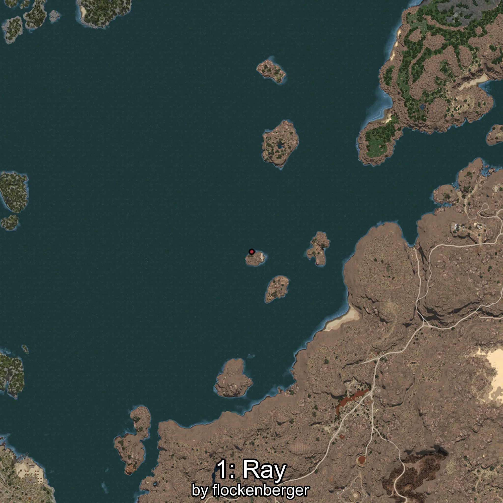
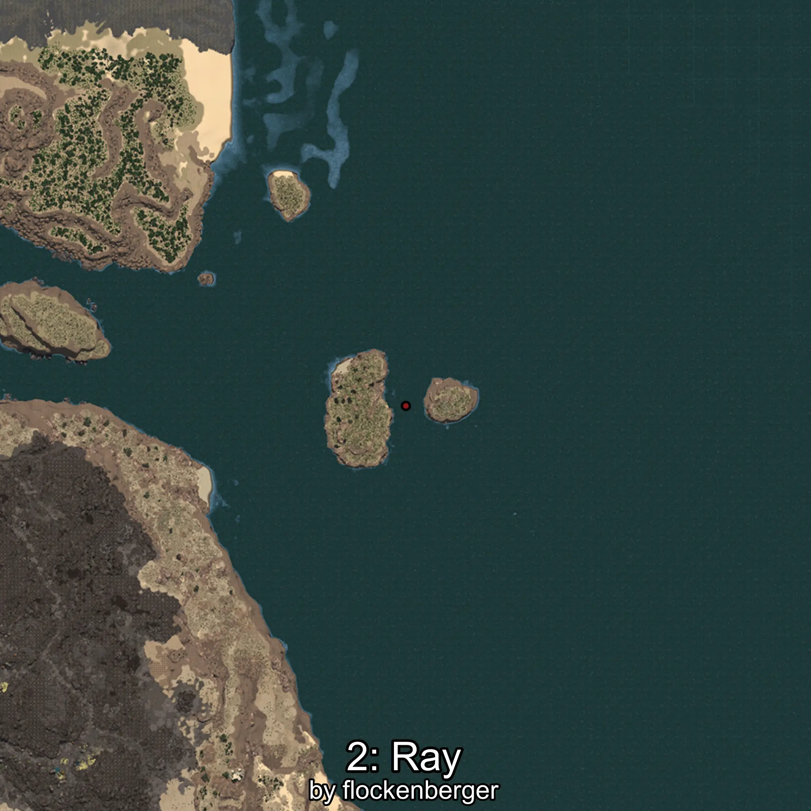
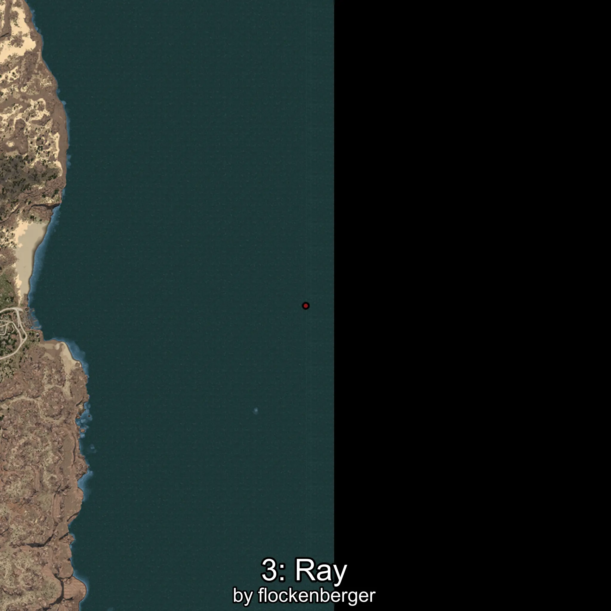

# Mantarraya
Created by **flockenberger**

## ⚠️ Disclaimer:
Waypoints are generated based on your __**character’s position**__ — __not__ where your fishing float lands.
In ocean spots especially, the direction you cast your rod can place your float in a **different fishing zone**, which may result in catching the wrong type of fish.
This only happens in rare cases — when the position is right on the **edge of a zone** and you cast to the “wrong” side.

- To verify that your float you can use the guide [HERE](https://flockenberger.github.io/bdo-fish-position/)
- Or watch the guide [HERE](https://youtu.be/t-VXcRoNojk)

## Waypoints
```xml
<!--
    Waypoints for: Mantarraya
    Created by: flockenberger
-->
<WorldmapBookMark>
    <BookMark BookMarkName="0: Mantarraya" PosX="1420683.0" PosY="-7775.0" PosZ="261588.0" />
    <BookMark BookMarkName="1: Mantarraya" PosX="405433.0" PosY="-8075.0" PosZ="260571.0" />
    <BookMark BookMarkName="2: Mantarraya" PosX="1262875.0" PosY="-7909.0" PosZ="550010.0" />
    <BookMark BookMarkName="3: Mantarraya" PosX="1419332.0" PosY="-7753.0" PosZ="187229.0" />
    <BookMark BookMarkName="4: Mantarraya" PosX="1264254.0" PosY="-7910.0" PosZ="560560.0" />
</WorldmapBookMark>
```

     