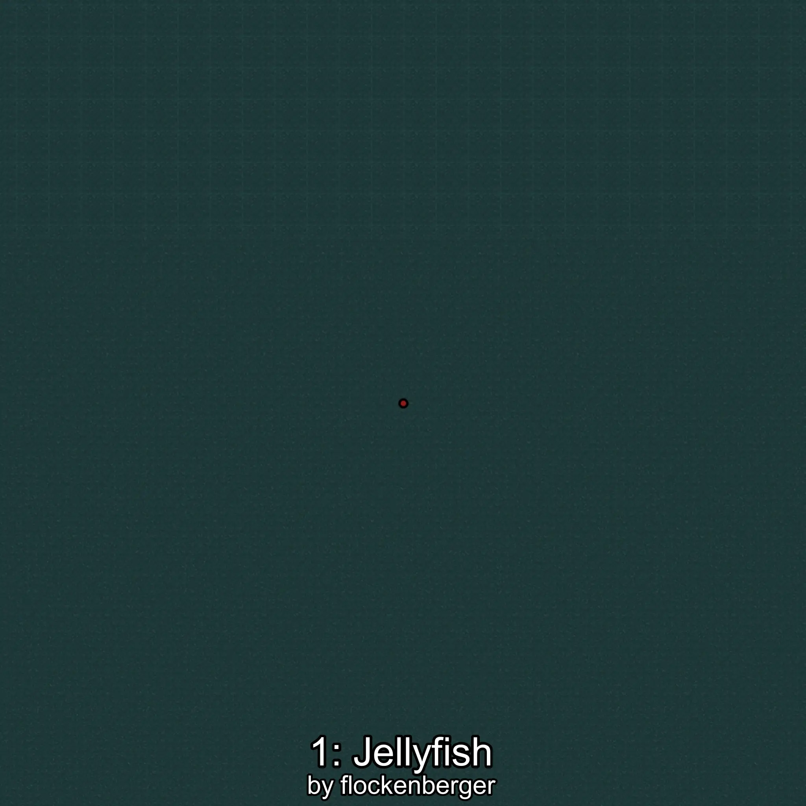
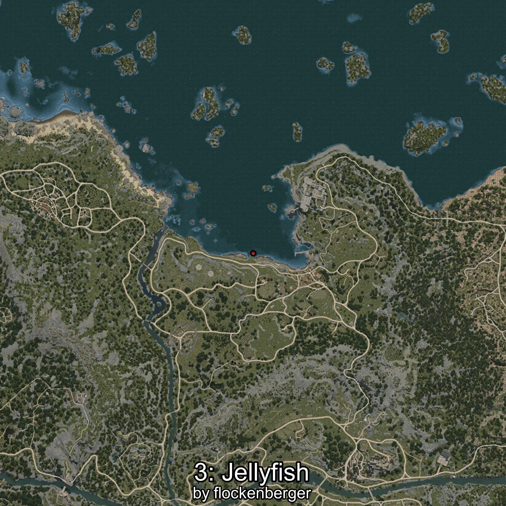

# Medusa
Created by **flockenberger**

## ⚠️ Disclaimer:
Waypoints are generated based on your __**character’s position**__ — __not__ where your fishing float lands.
In ocean spots especially, the direction you cast your rod can place your float in a **different fishing zone**, which may result in catching the wrong type of fish.
This only happens in rare cases — when the position is right on the **edge of a zone** and you cast to the “wrong” side.

- To verify that your float you can use the guide [HERE](https://flockenberger.github.io/bdo-fish-position/)
- Or watch the guide [HERE](https://youtu.be/t-VXcRoNojk)

## Waypoints
```xml
<!--
    Waypoints for: Medusa
    Created by: flockenberger
-->
<WorldmapBookMark>
    <BookMark BookMarkName="0: Medusa" PosX="-135087.0" PosY="-7745.0" PosZ="746279.0" />
    <BookMark BookMarkName="1: Medusa" PosX="-97199.0" PosY="-7591.0" PosZ="895106.0" />
    <BookMark BookMarkName="2: Medusa" PosX="-18887.0" PosY="-8120.0" PosZ="93507.0" />
    <BookMark BookMarkName="3: Medusa" PosX="-19030.0" PosY="-7841.0" PosZ="93123.0" />
    <BookMark BookMarkName="4: Medusa" PosX="-145688.0" PosY="-7826.0" PosZ="948974.0" />
</WorldmapBookMark>
```

     