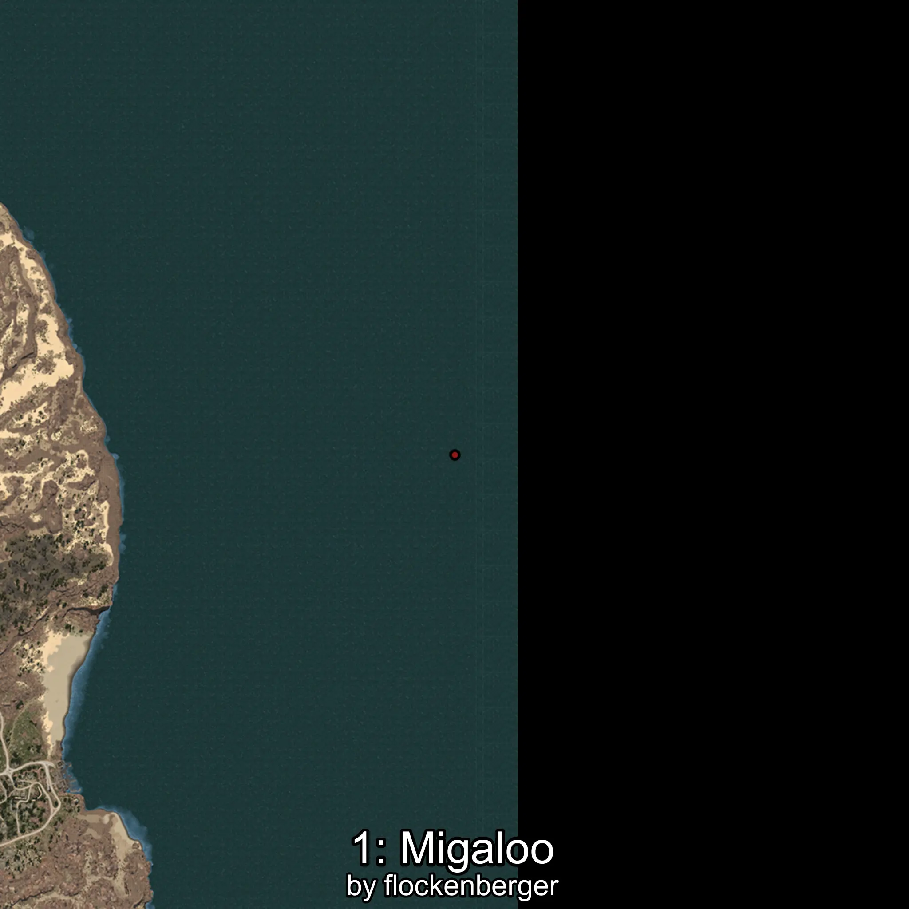
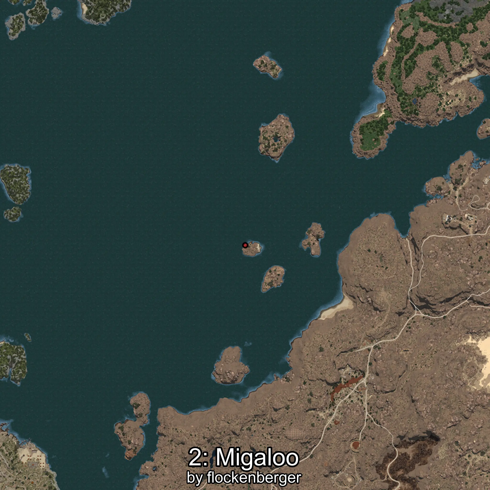

# Migaloo
Created by **flockenberger**

## ⚠️ Disclaimer:
Waypoints are generated based on your __**character’s position**__ — __not__ where your fishing float lands.
In ocean spots especially, the direction you cast your rod can place your float in a **different fishing zone**, which may result in catching the wrong type of fish.
This only happens in rare cases — when the position is right on the **edge of a zone** and you cast to the “wrong” side.

- To verify that your float you can use the guide [HERE](https://flockenberger.github.io/bdo-fish-position/)
- Or watch the guide [HERE](https://youtu.be/t-VXcRoNojk)

## Waypoints
```xml
<!--
    Waypoints for: Migaloo
    Created by: flockenberger
-->
<WorldmapBookMark>
    <BookMark BookMarkName="0: Migaloo" PosX="403713.0" PosY="-7874.0" PosZ="261520.0" />
    <BookMark BookMarkName="1: Migaloo" PosX="1412373.0" PosY="-8160.1304" PosZ="290323.6" />
    <BookMark BookMarkName="2: Migaloo" PosX="403312.0" PosY="-7919.0" PosZ="258891.0" />
    <BookMark BookMarkName="3: Migaloo" PosX="403254.0" PosY="-7910.0" PosZ="258803.0" />
    <BookMark BookMarkName="4: Migaloo" PosX="403325.0" PosY="-7864.0" PosZ="258773.0" />
</WorldmapBookMark>
```

     