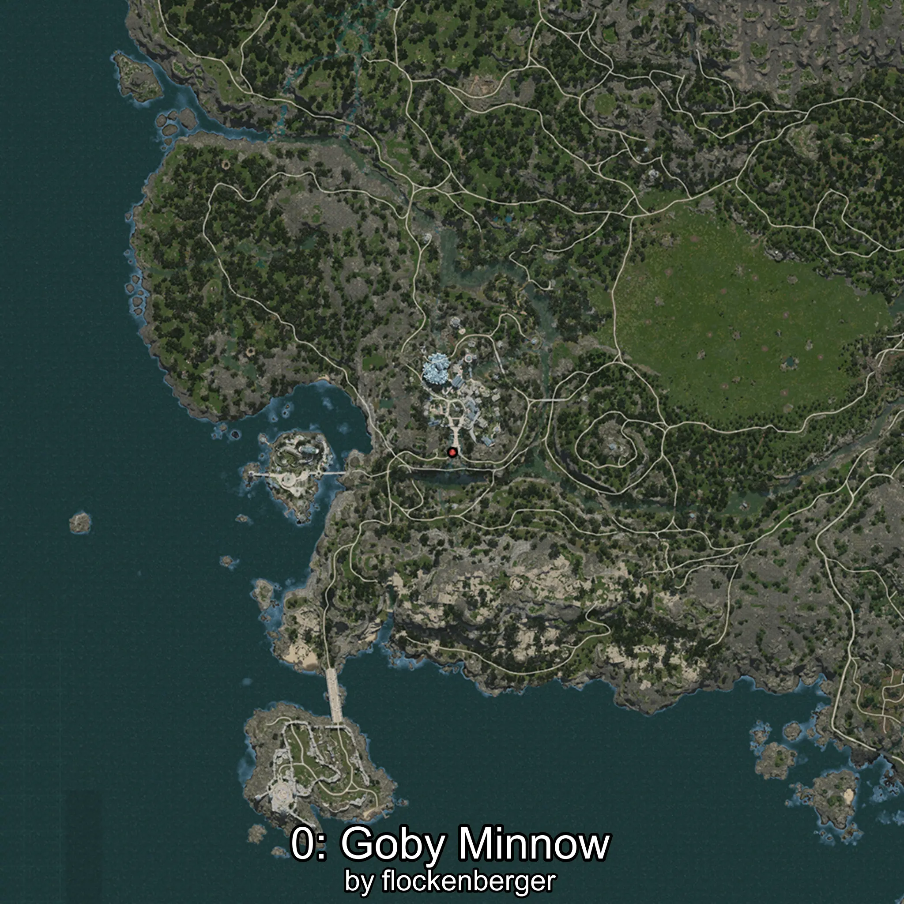
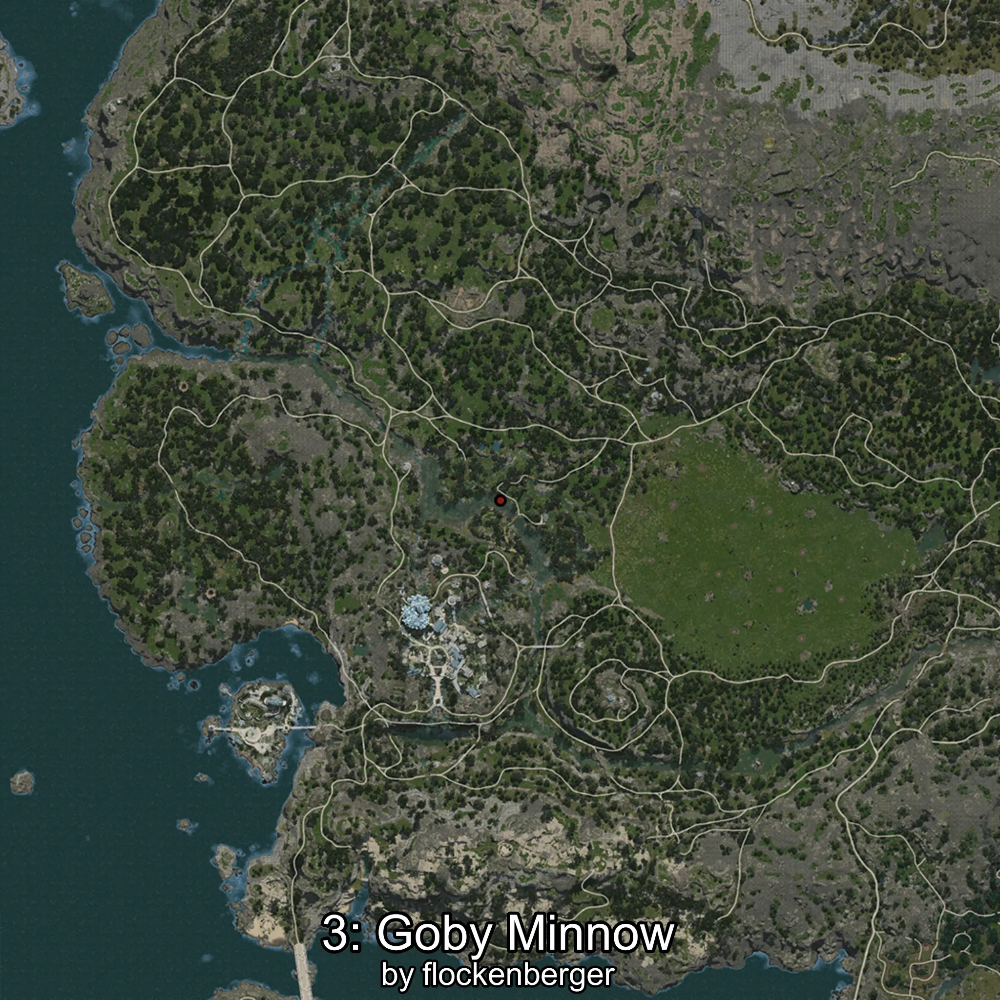
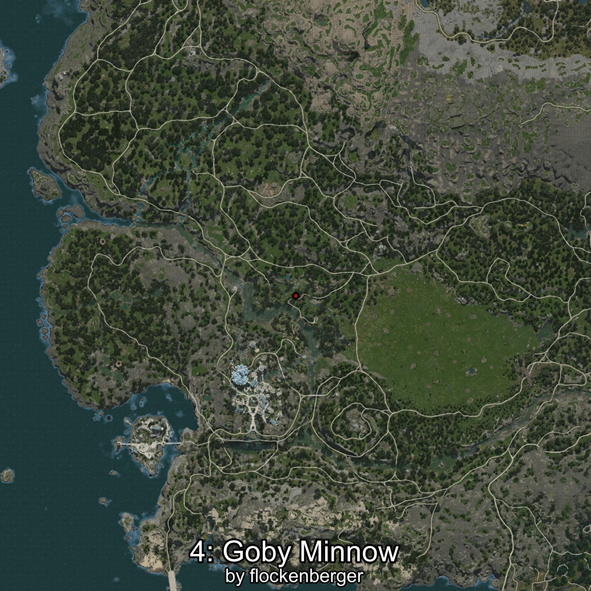

# Minnow
Created by **flockenberger**

## ⚠️ Disclaimer:
Waypoints are generated based on your __**character’s position**__ — __not__ where your fishing float lands.
In ocean spots especially, the direction you cast your rod can place your float in a **different fishing zone**, which may result in catching the wrong type of fish.
This only happens in rare cases — when the position is right on the **edge of a zone** and you cast to the “wrong” side.

- To verify that your float you can use the guide [HERE](https://flockenberger.github.io/bdo-fish-position/)
- Or watch the guide [HERE](https://youtu.be/t-VXcRoNojk)

## Waypoints
```xml
<!--
    Waypoints for: Minnow
    Created by: flockenberger
-->
<WorldmapBookMark>
    <BookMark BookMarkName="0: Minnow" PosX="-506336.0" PosY="5879.0" PosZ="-473724.0" />
    <BookMark BookMarkName="1: Minnow" PosX="-506139.0" PosY="6668.0" PosZ="-474029.0" />
    <BookMark BookMarkName="2: Minnow" PosX="-474021.0" PosY="-4783.0" PosZ="-421376.0" />
    <BookMark BookMarkName="3: Minnow" PosX="-485866.0" PosY="-4801.0" PosZ="-410785.0" />
    <BookMark BookMarkName="4: Minnow" PosX="-482836.0" PosY="-4819.0" PosZ="-403718.0" />
</WorldmapBookMark>
```

     