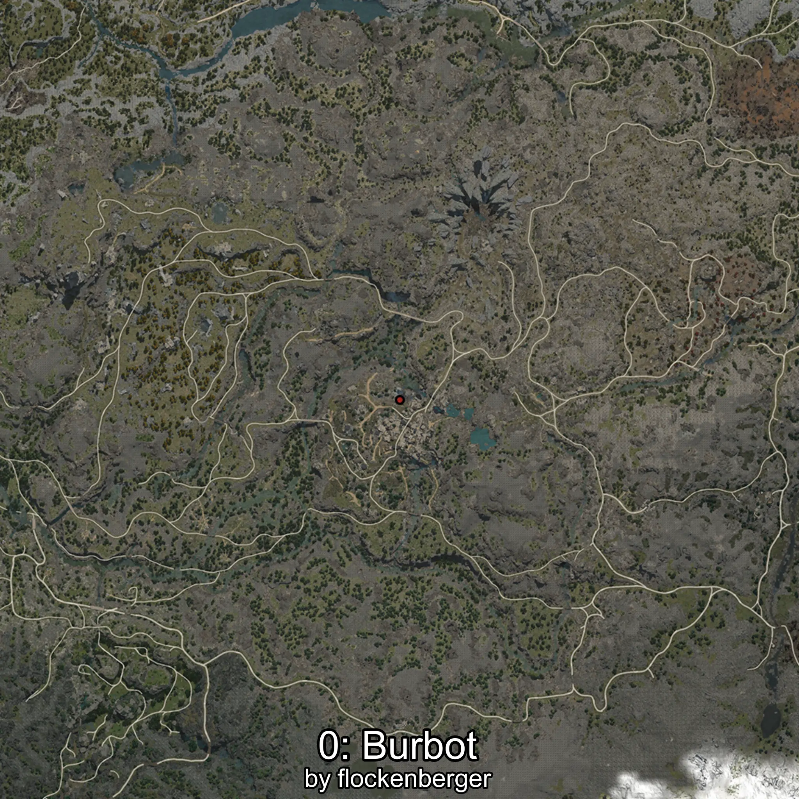
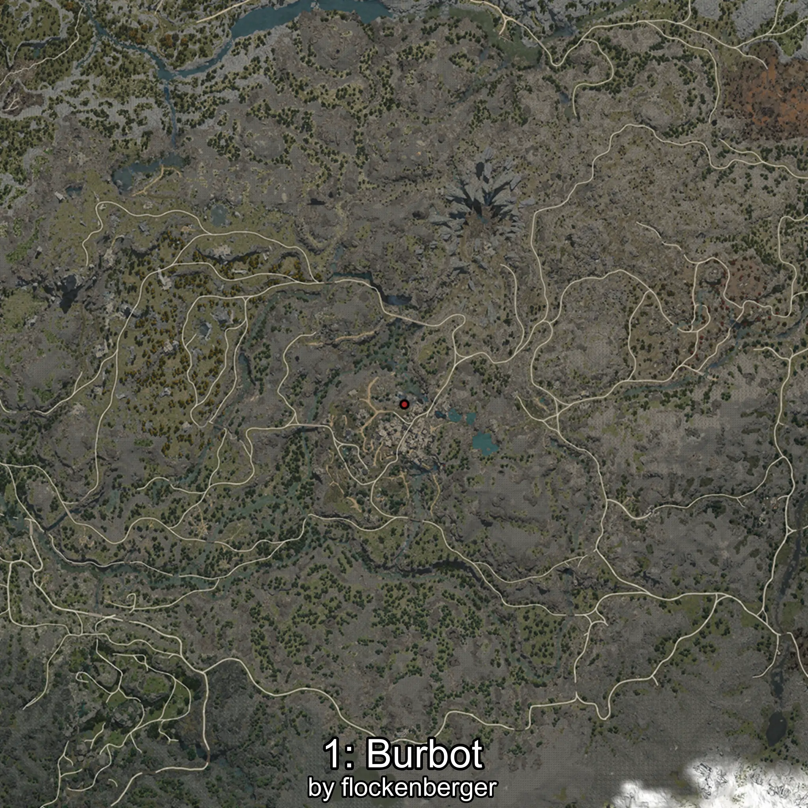

# Mokae
Created by **flockenberger**

## ⚠️ Disclaimer:
Waypoints are generated based on your __**character’s position**__ — __not__ where your fishing float lands.
In ocean spots especially, the direction you cast your rod can place your float in a **different fishing zone**, which may result in catching the wrong type of fish.
This only happens in rare cases — when the position is right on the **edge of a zone** and you cast to the “wrong” side.

- To verify that your float you can use the guide [HERE](https://flockenberger.github.io/bdo-fish-position/)
- Or watch the guide [HERE](https://youtu.be/t-VXcRoNojk)

## Waypoints
```xml
<!--
    Waypoints for: Mokae
    Created by: flockenberger
-->
<WorldmapBookMark>
    <BookMark BookMarkName="0: Mokae" PosX="-51500.0" PosY="19821.0" PosZ="-396162.0" />
    <BookMark BookMarkName="1: Mokae" PosX="-50226.0" PosY="19853.0" PosZ="-396232.0" />
    <BookMark BookMarkName="2: Mokae" PosX="-50146.0" PosY="19739.0" PosZ="-395862.0" />
    <BookMark BookMarkName="3: Mokae" PosX="-49723.0" PosY="19852.0" PosZ="-396268.0" />
    <BookMark BookMarkName="4: Mokae" PosX="-51159.0" PosY="19746.0" PosZ="-396202.0" />
</WorldmapBookMark>
```

     