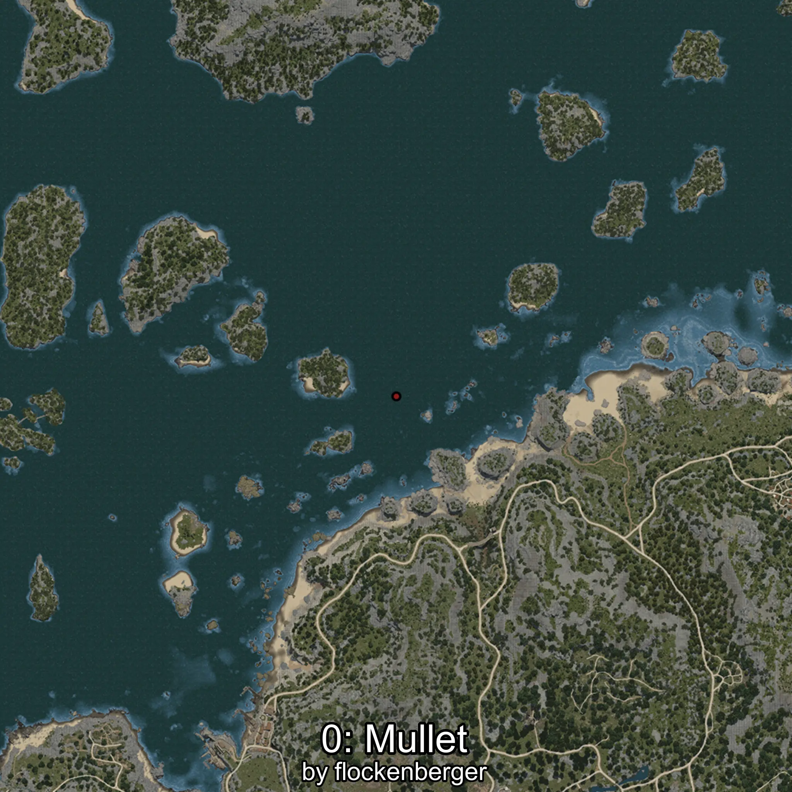
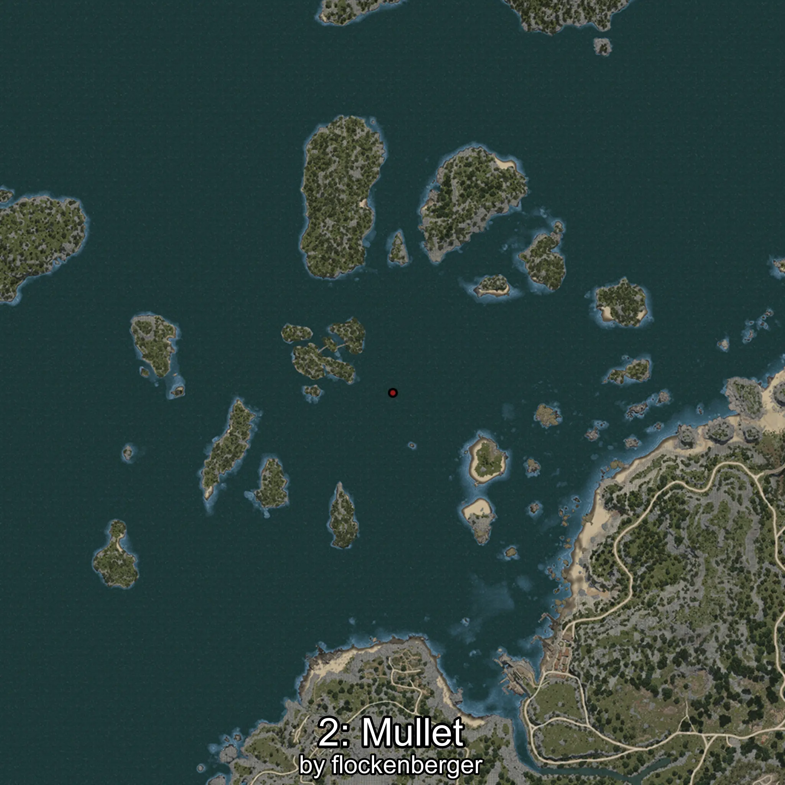
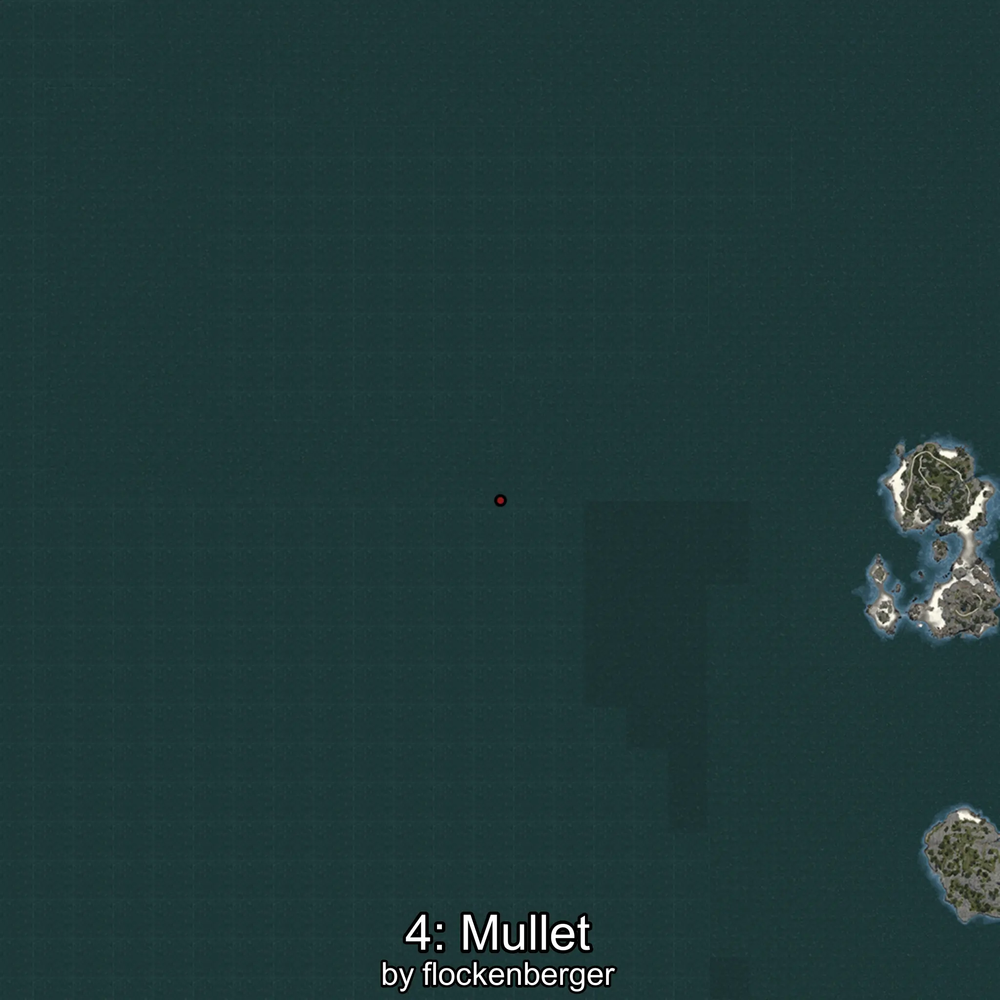

# Mújol
Created by **flockenberger**

## ⚠️ Disclaimer:
Waypoints are generated based on your __**character’s position**__ — __not__ where your fishing float lands.
In ocean spots especially, the direction you cast your rod can place your float in a **different fishing zone**, which may result in catching the wrong type of fish.
This only happens in rare cases — when the position is right on the **edge of a zone** and you cast to the “wrong” side.

- To verify that your float you can use the guide [HERE](https://flockenberger.github.io/bdo-fish-position/)
- Or watch the guide [HERE](https://youtu.be/t-VXcRoNojk)

## Waypoints
```xml
<!--
    Waypoints for: Mújol
    Created by: flockenberger
-->
<WorldmapBookMark>
    <BookMark BookMarkName="0: Mújol" PosX="-300952.0" PosY="-7924.0" PosZ="163413.0" />
    <BookMark BookMarkName="1: Mújol" PosX="-430528.0" PosY="-7601.0" PosZ="173975.0" />
    <BookMark BookMarkName="2: Mújol" PosX="-419156.0" PosY="-7914.0" PosZ="136798.0" />
    <BookMark BookMarkName="3: Mújol" PosX="-288482.44" PosY="-8177.862" PosZ="235639.67" />
    <BookMark BookMarkName="4: Mújol" PosX="-792662.0" PosY="-7745.0" PosZ="-166377.0" />
</WorldmapBookMark>
```

     