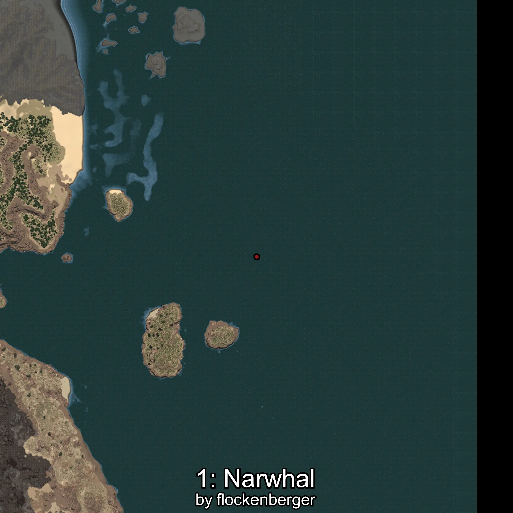

# Narval
Created by **flockenberger**

## ⚠️ Disclaimer:
Waypoints are generated based on your __**character’s position**__ — __not__ where your fishing float lands.
In ocean spots especially, the direction you cast your rod can place your float in a **different fishing zone**, which may result in catching the wrong type of fish.
This only happens in rare cases — when the position is right on the **edge of a zone** and you cast to the “wrong” side.

- To verify that your float you can use the guide [HERE](https://flockenberger.github.io/bdo-fish-position/)
- Or watch the guide [HERE](https://youtu.be/t-VXcRoNojk)

## Waypoints
```xml
<!--
    Waypoints for: Narval
    Created by: flockenberger
-->
<WorldmapBookMark>
    <BookMark BookMarkName="0: Narval" PosX="356148.0" PosY="-8184.0" PosZ="195610.0" />
    <BookMark BookMarkName="1: Narval" PosX="1301360.0" PosY="-8124.0" PosZ="599149.0" />
    <BookMark BookMarkName="2: Narval" PosX="1389234.0" PosY="-7868.0" PosZ="552709.0" />
    <BookMark BookMarkName="3: Narval" PosX="408646.0" PosY="-7889.0" PosZ="347711.0" />
    <BookMark BookMarkName="4: Narval" PosX="475699.0" PosY="-8170.0" PosZ="292315.0" />
</WorldmapBookMark>
```

     