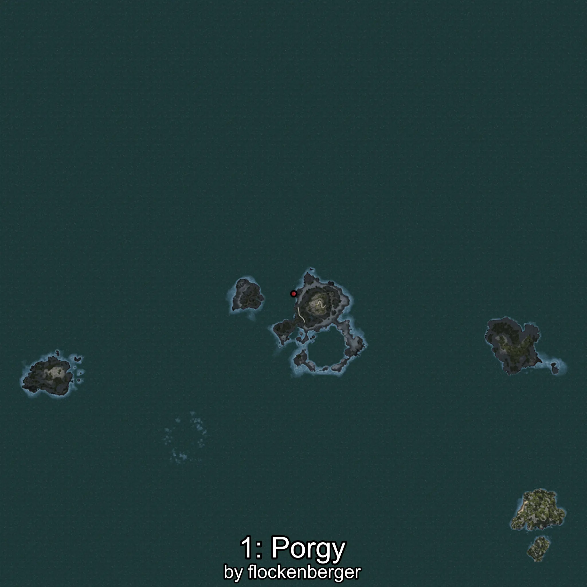
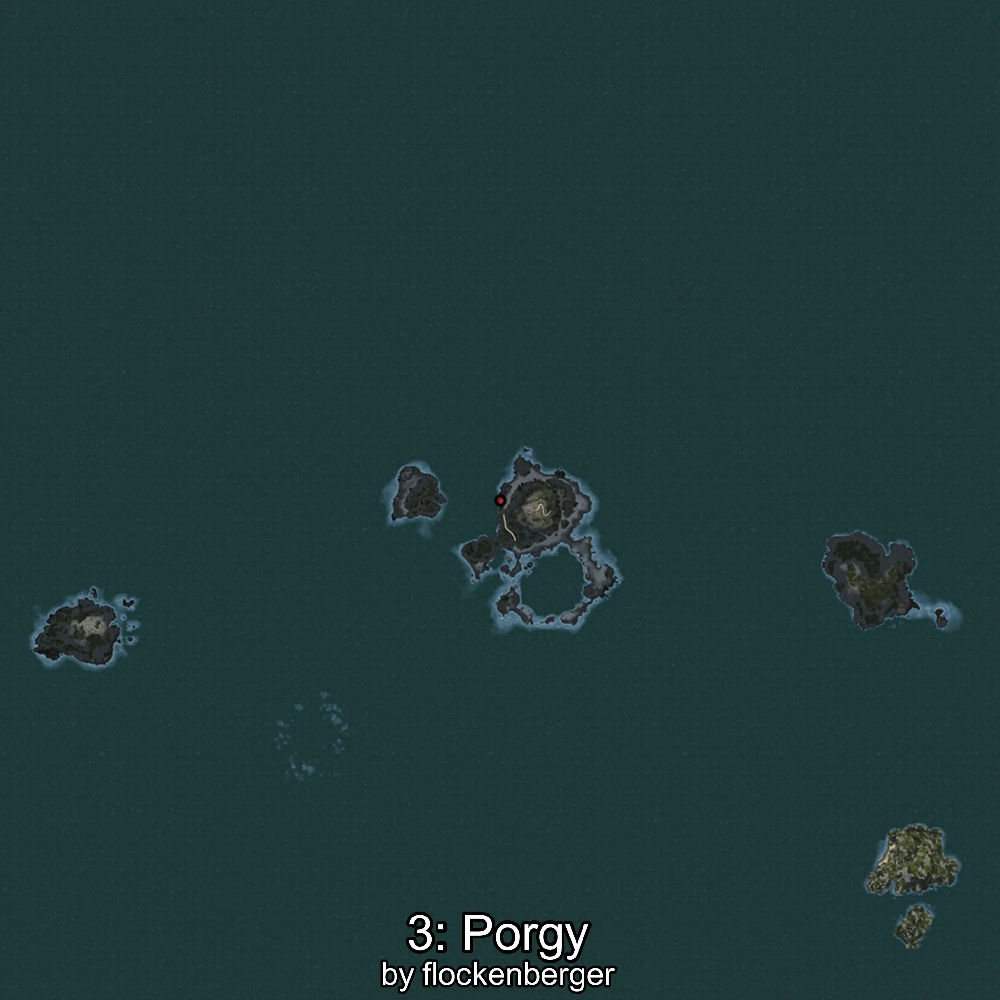
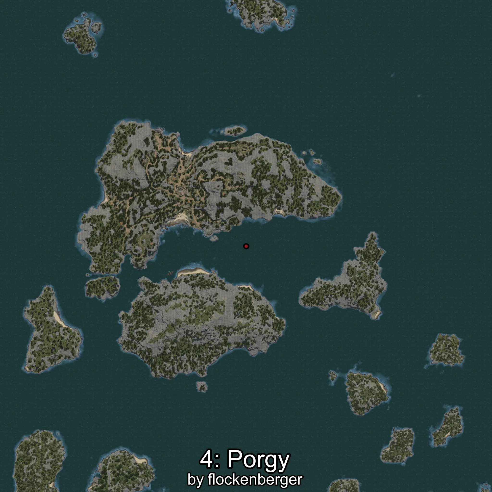

# Pargo
Created by **flockenberger**

## ⚠️ Disclaimer:
Waypoints are generated based on your __**character’s position**__ — __not__ where your fishing float lands.
In ocean spots especially, the direction you cast your rod can place your float in a **different fishing zone**, which may result in catching the wrong type of fish.
This only happens in rare cases — when the position is right on the **edge of a zone** and you cast to the “wrong” side.

- To verify that your float you can use the guide [HERE](https://flockenberger.github.io/bdo-fish-position/)
- Or watch the guide [HERE](https://youtu.be/t-VXcRoNojk)

## Waypoints
```xml
<!--
    Waypoints for: Pargo
    Created by: flockenberger
-->
<WorldmapBookMark>
    <BookMark BookMarkName="0: Pargo" PosX="-105610.0" PosY="-8133.0" PosZ="628583.0" />
    <BookMark BookMarkName="1: Pargo" PosX="-106688.0" PosY="-7640.0" PosZ="630970.0" />
    <BookMark BookMarkName="2: Pargo" PosX="-105801.0" PosY="-8266.0" PosZ="628899.0" />
    <BookMark BookMarkName="3: Pargo" PosX="-105662.0" PosY="-8141.0" PosZ="628446.0" />
    <BookMark BookMarkName="4: Pargo" PosX="-308774.97" PosY="-7731.7476" PosZ="360860.0" />
</WorldmapBookMark>
```

     