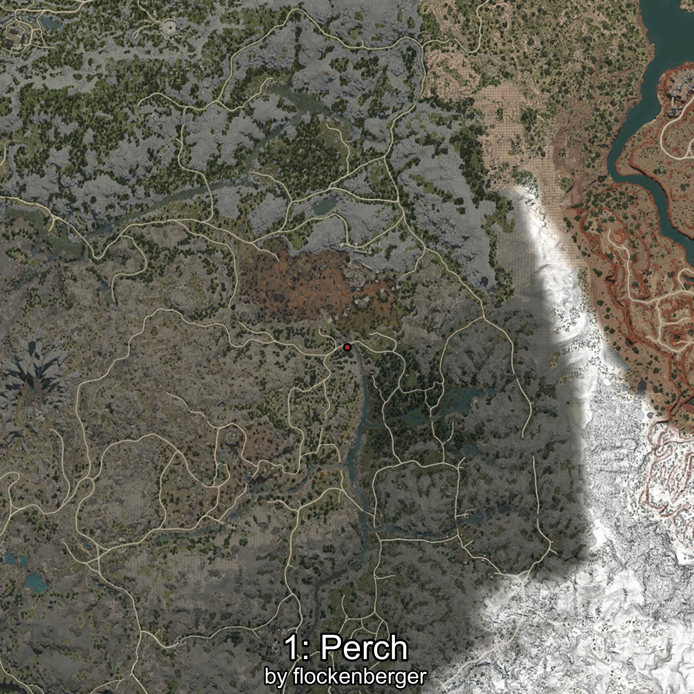
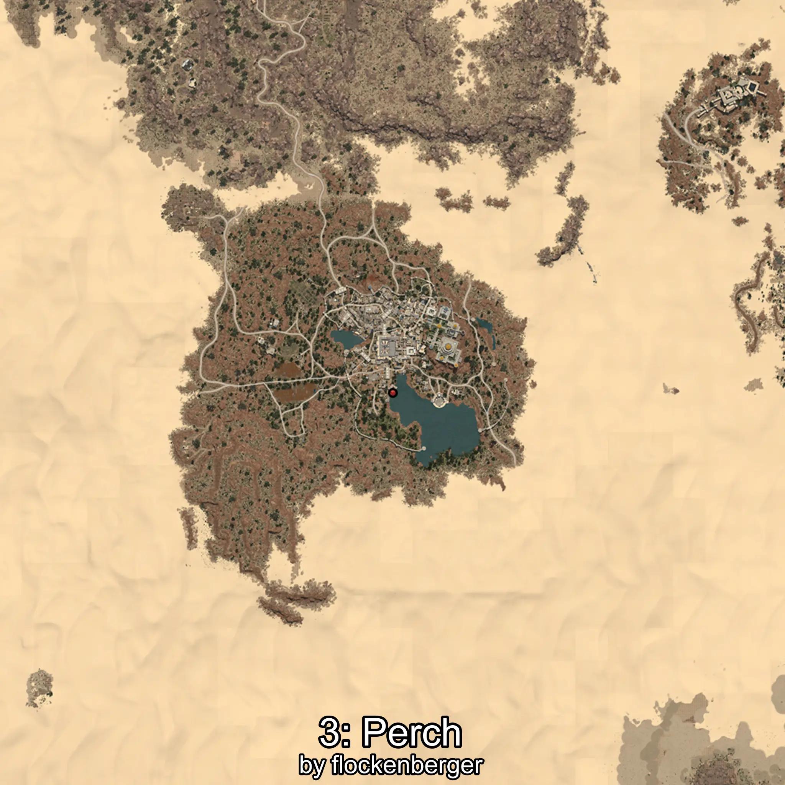
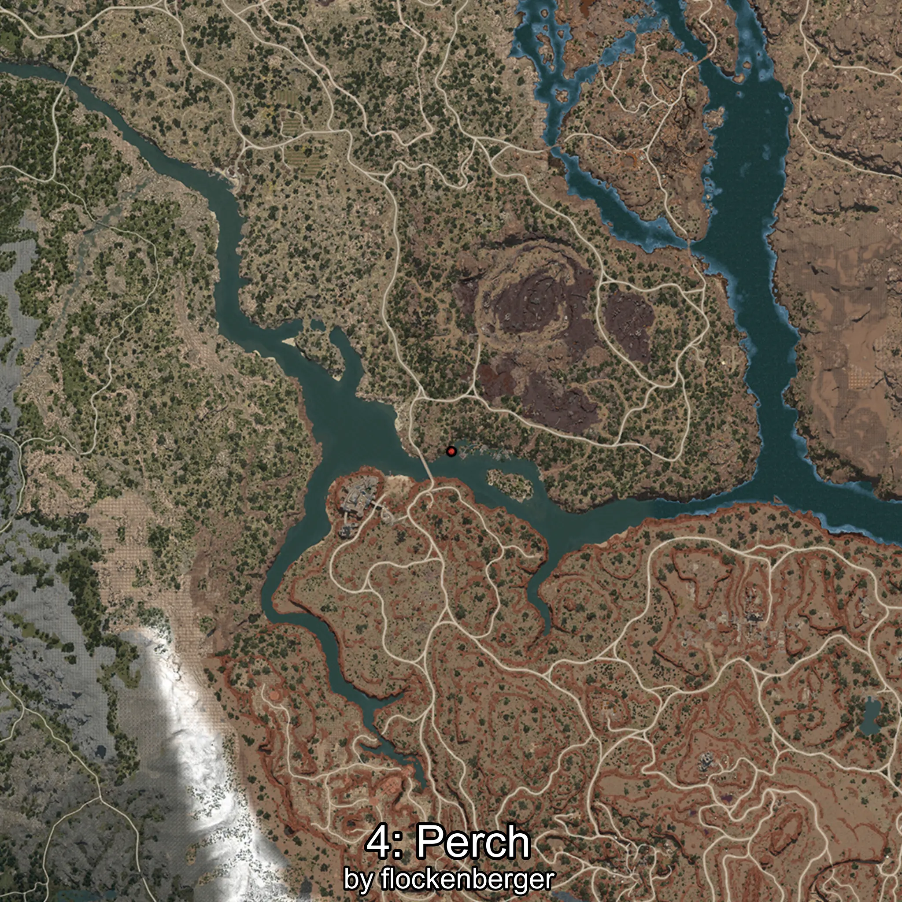

# Perca
Created by **flockenberger**

## ⚠️ Disclaimer:
Waypoints are generated based on your __**character’s position**__ — __not__ where your fishing float lands.
In ocean spots especially, the direction you cast your rod can place your float in a **different fishing zone**, which may result in catching the wrong type of fish.
This only happens in rare cases — when the position is right on the **edge of a zone** and you cast to the “wrong” side.

- To verify that your float you can use the guide [HERE](https://flockenberger.github.io/bdo-fish-position/)
- Or watch the guide [HERE](https://youtu.be/t-VXcRoNojk)

## Waypoints
```xml
<!--
    Waypoints for: Perca
    Created by: flockenberger
-->
<WorldmapBookMark>
    <BookMark BookMarkName="0: Perca" PosX="1031120.0" PosY="10483.0" PosZ="187113.0" />
    <BookMark BookMarkName="1: Perca" PosX="118721.0" PosY="4879.0" PosZ="-306410.0" />
    <BookMark BookMarkName="2: Perca" PosX="104835.0" PosY="6111.0" PosZ="-246296.0" />
    <BookMark BookMarkName="3: Perca" PosX="1028588.0" PosY="10439.0" PosZ="181594.0" />
    <BookMark BookMarkName="4: Perca" PosX="299640.0" PosY="-7255.0" PosZ="-174543.0" />
</WorldmapBookMark>
```

     