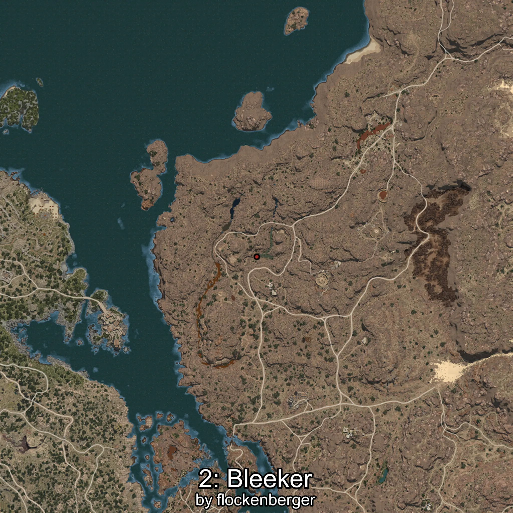
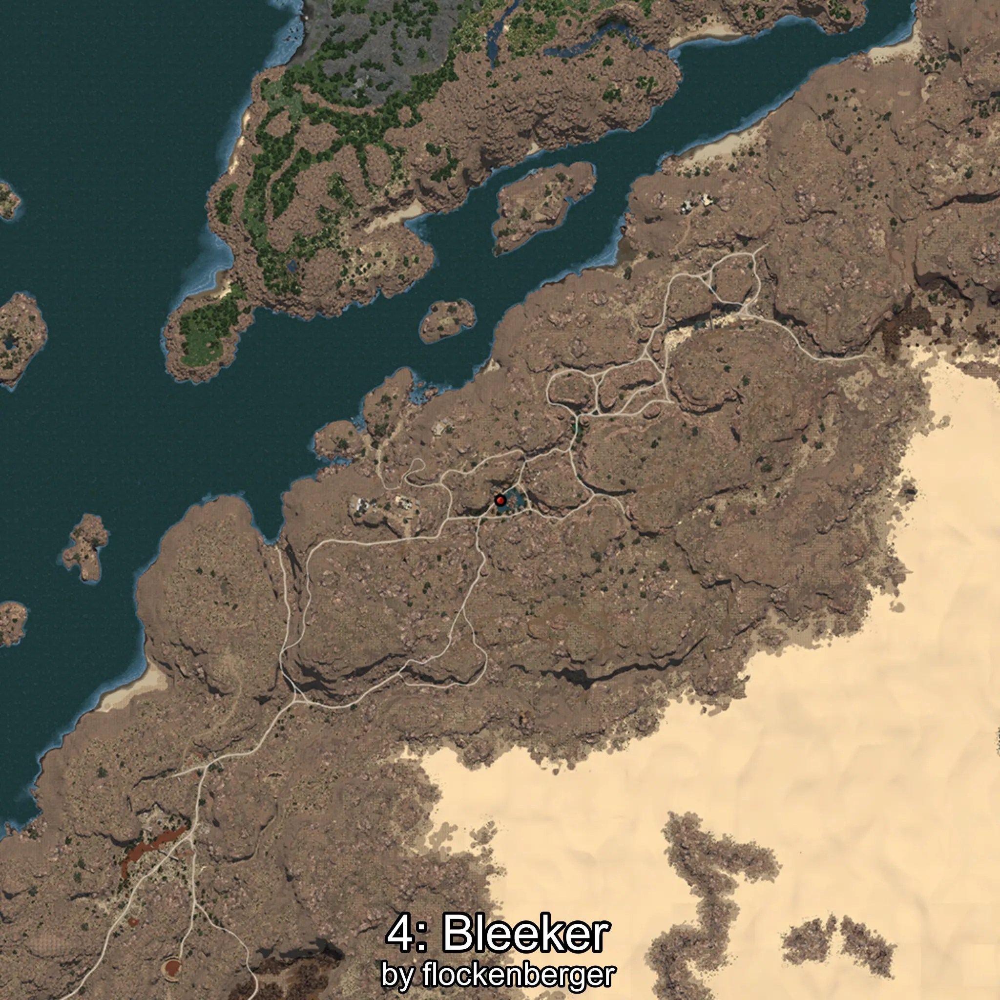

# Phoxinus
Created by **flockenberger**

## ⚠️ Disclaimer:
Waypoints are generated based on your __**character’s position**__ — __not__ where your fishing float lands.
In ocean spots especially, the direction you cast your rod can place your float in a **different fishing zone**, which may result in catching the wrong type of fish.
This only happens in rare cases — when the position is right on the **edge of a zone** and you cast to the “wrong” side.

- To verify that your float you can use the guide [HERE](https://flockenberger.github.io/bdo-fish-position/)
- Or watch the guide [HERE](https://youtu.be/t-VXcRoNojk)

## Waypoints
```xml
<!--
    Waypoints for: Phoxinus
    Created by: flockenberger
-->
<WorldmapBookMark>
    <BookMark BookMarkName="0: Phoxinus" PosX="1015085.0" PosY="9296.0" PosZ="204034.0" />
    <BookMark BookMarkName="1: Phoxinus" PosX="1028528.0" PosY="10457.0" PosZ="181543.0" />
    <BookMark BookMarkName="2: Phoxinus" PosX="397068.0" PosY="-7060.0" PosZ="95945.0" />
    <BookMark BookMarkName="3: Phoxinus" PosX="319565.0" PosY="-7296.0" PosZ="-177012.0" />
    <BookMark BookMarkName="4: Phoxinus" PosX="574340.0" PosY="-794.0" PosZ="277103.0" />
</WorldmapBookMark>
```

     