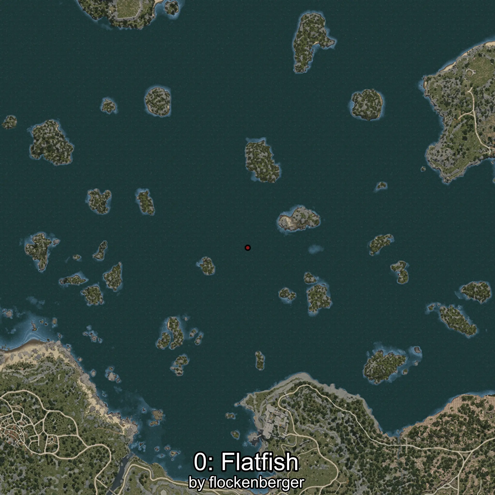
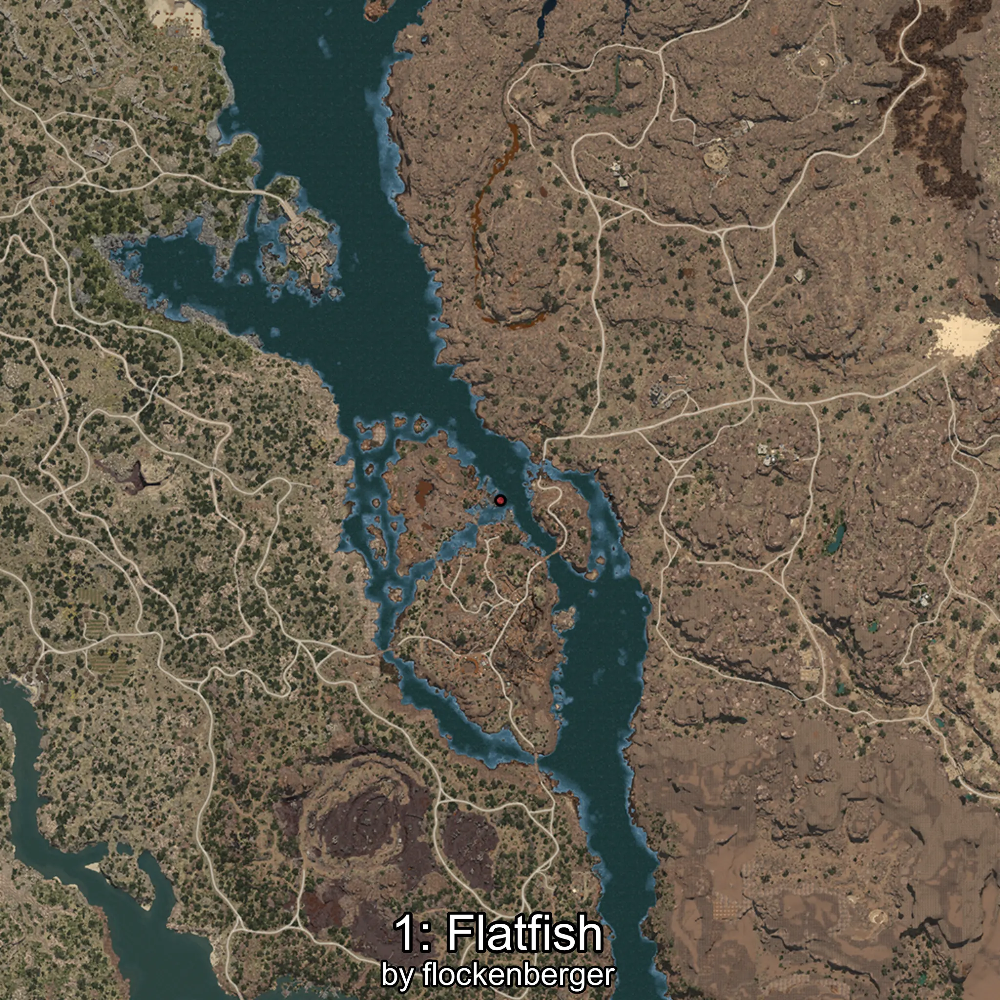
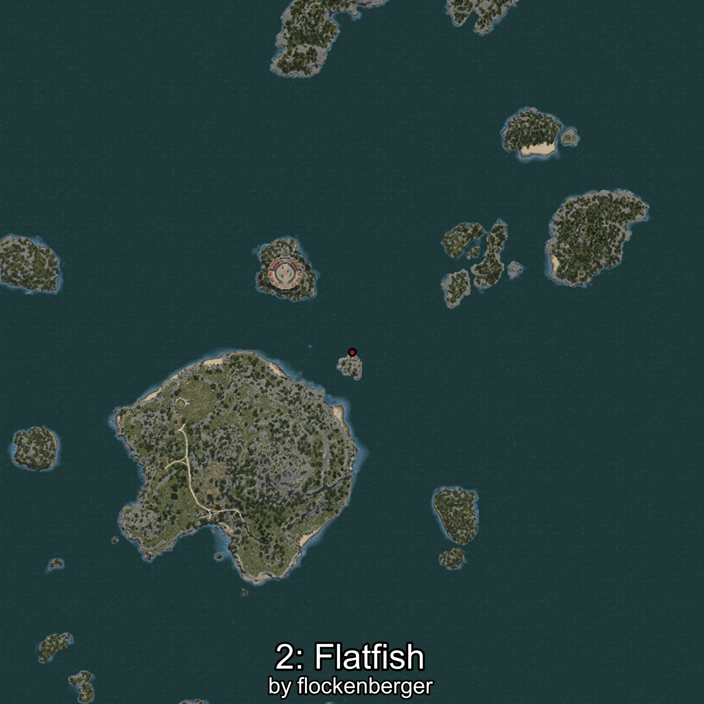
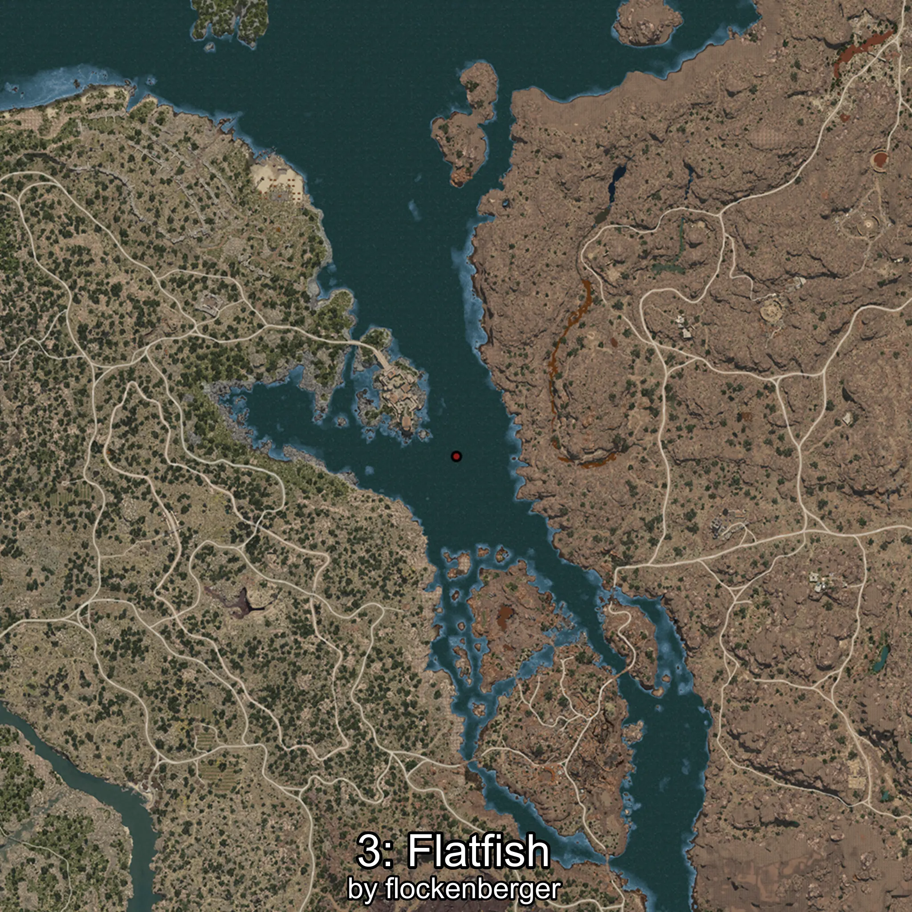
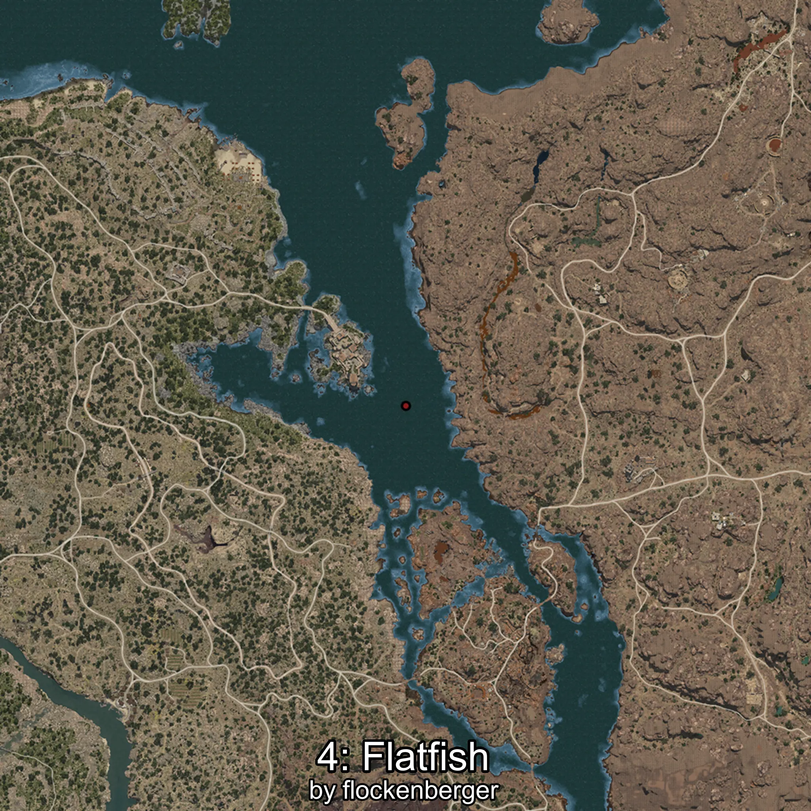

# Platija
Created by **flockenberger**

## ⚠️ Disclaimer:
Waypoints are generated based on your __**character’s position**__ — __not__ where your fishing float lands.
In ocean spots especially, the direction you cast your rod can place your float in a **different fishing zone**, which may result in catching the wrong type of fish.
This only happens in rare cases — when the position is right on the **edge of a zone** and you cast to the “wrong” side.

- To verify that your float you can use the guide [HERE](https://flockenberger.github.io/bdo-fish-position/)
- Or watch the guide [HERE](https://youtu.be/t-VXcRoNojk)

## Waypoints
```xml
<!--
    Waypoints for: Platija
    Created by: flockenberger
-->
<WorldmapBookMark>
    <BookMark BookMarkName="0: Platija" PosX="222.0" PosY="-7479.0" PosZ="237477.0" />
    <BookMark BookMarkName="1: Platija" PosX="369807.0" PosY="-8201.0" PosZ="-24054.0" />
    <BookMark BookMarkName="2: Platija" PosX="213392.4" PosY="-8057.989" PosZ="368739.5" />
    <BookMark BookMarkName="3: Platija" PosX="329531.0" PosY="-7761.0" PosZ="32537.0" />
    <BookMark BookMarkName="4: Platija" PosX="332561.0" PosY="-8165.0" PosZ="34023.0" />
</WorldmapBookMark>
```

     