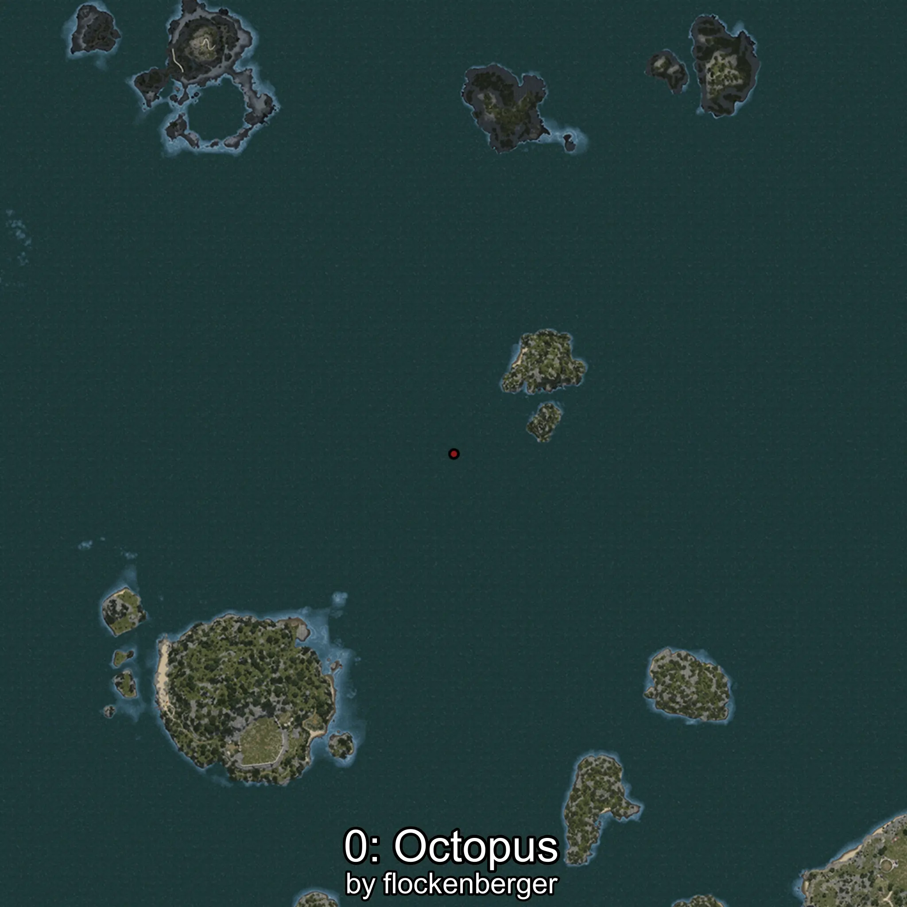
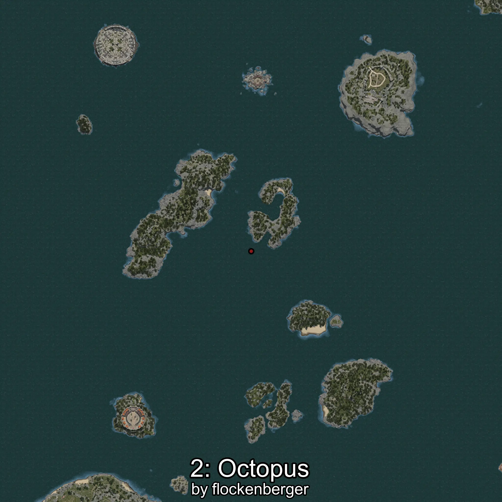
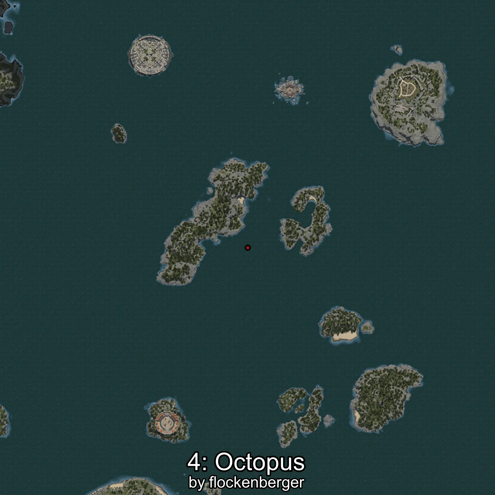

# Pulpo
Created by **flockenberger**

## ⚠️ Disclaimer:
Waypoints are generated based on your __**character’s position**__ — __not__ where your fishing float lands.
In ocean spots especially, the direction you cast your rod can place your float in a **different fishing zone**, which may result in catching the wrong type of fish.
This only happens in rare cases — when the position is right on the **edge of a zone** and you cast to the “wrong” side.

- To verify that your float you can use the guide [HERE](https://flockenberger.github.io/bdo-fish-position/)
- Or watch the guide [HERE](https://youtu.be/t-VXcRoNojk)

## Waypoints
```xml
<!--
    Waypoints for: Pulpo
    Created by: flockenberger
-->
<WorldmapBookMark>
    <BookMark BookMarkName="0: Pulpo" PosX="-8940.0" PosY="-7419.0" PosZ="486156.0" />
    <BookMark BookMarkName="1: Pulpo" PosX="50886.0" PosY="-7436.0" PosZ="553405.0" />
    <BookMark BookMarkName="2: Pulpo" PosX="256340.0" PosY="-7579.0" PosZ="506272.0" />
    <BookMark BookMarkName="3: Pulpo" PosX="290803.0" PosY="-7710.0" PosZ="347252.0" />
    <BookMark BookMarkName="4: Pulpo" PosX="234053.22" PosY="-7404.171" PosZ="512678.56" />
</WorldmapBookMark>
```

     