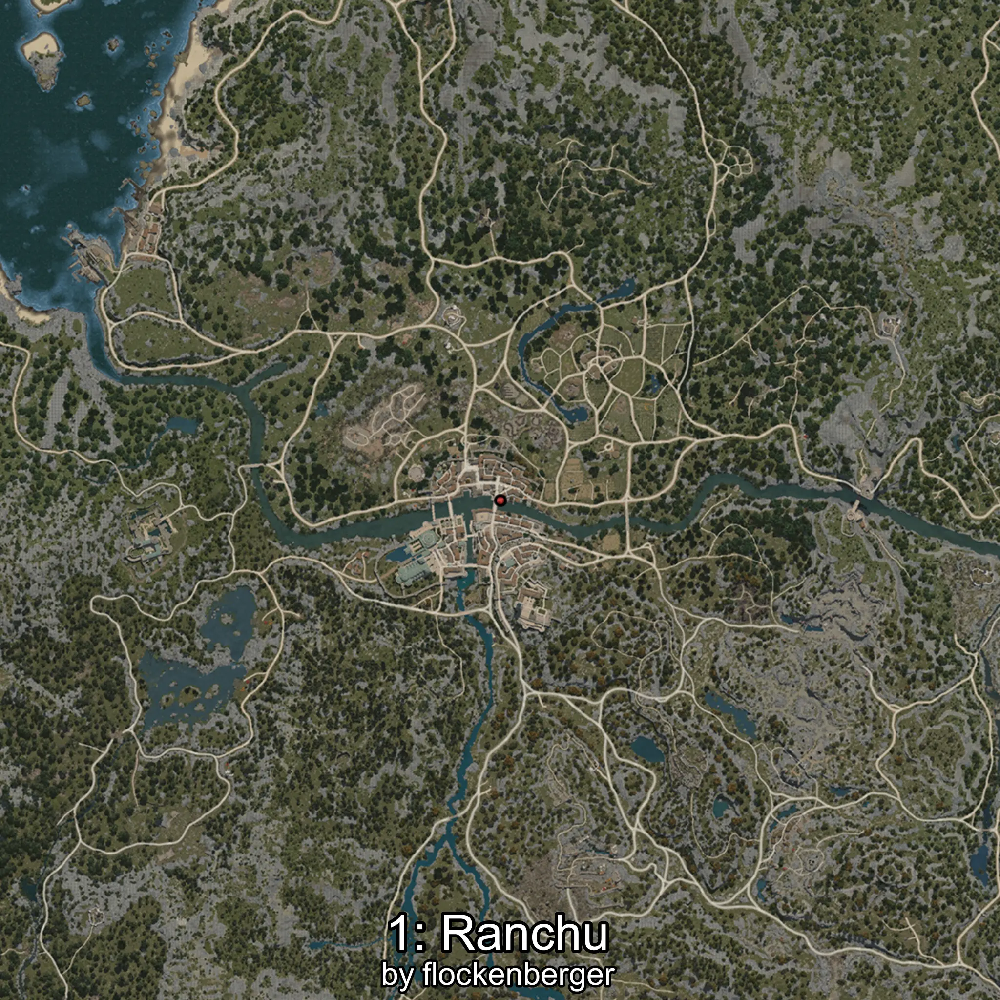
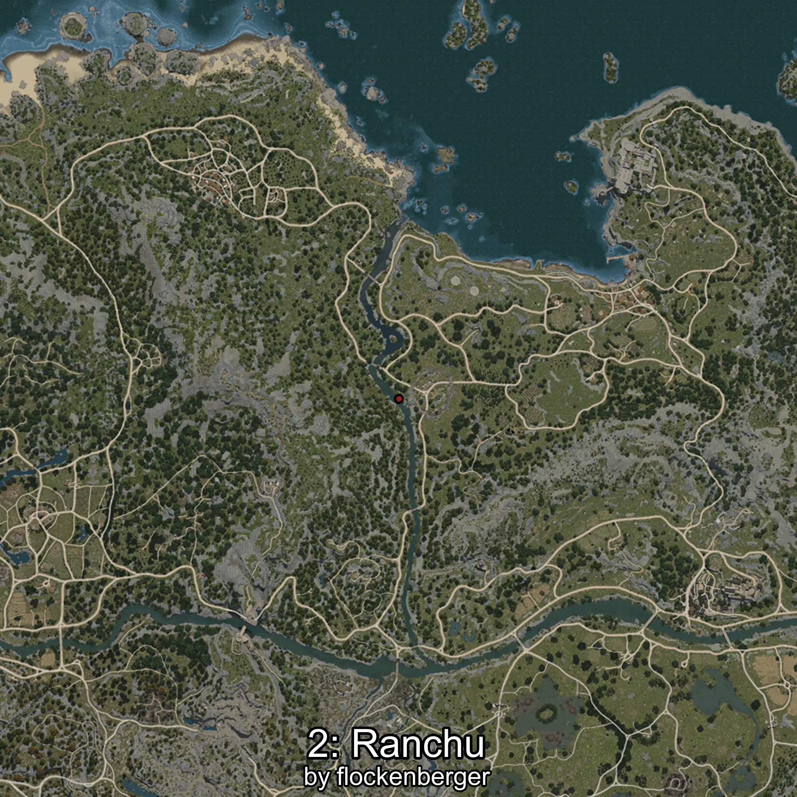
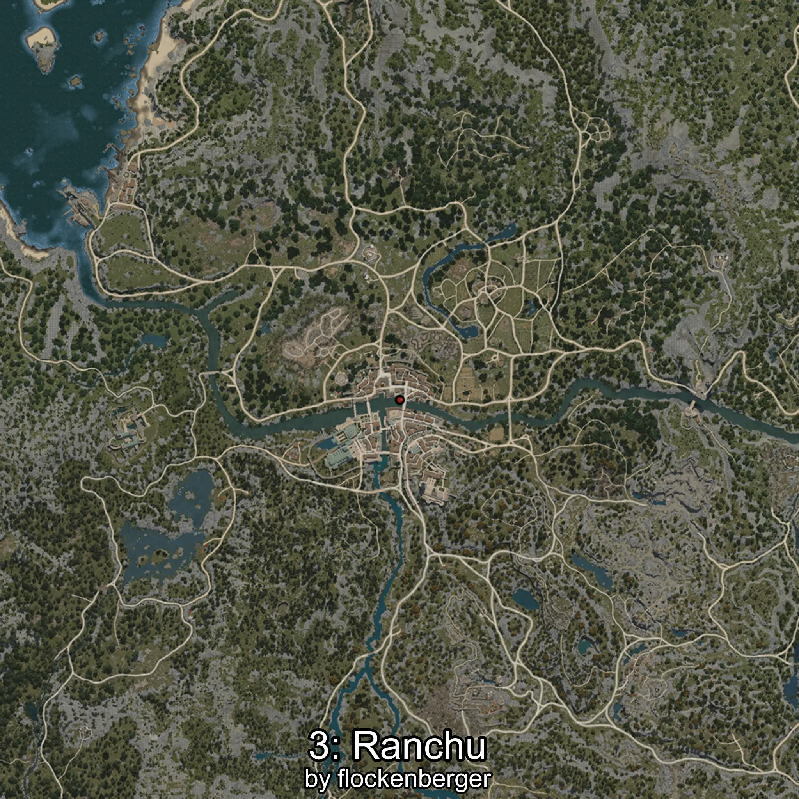
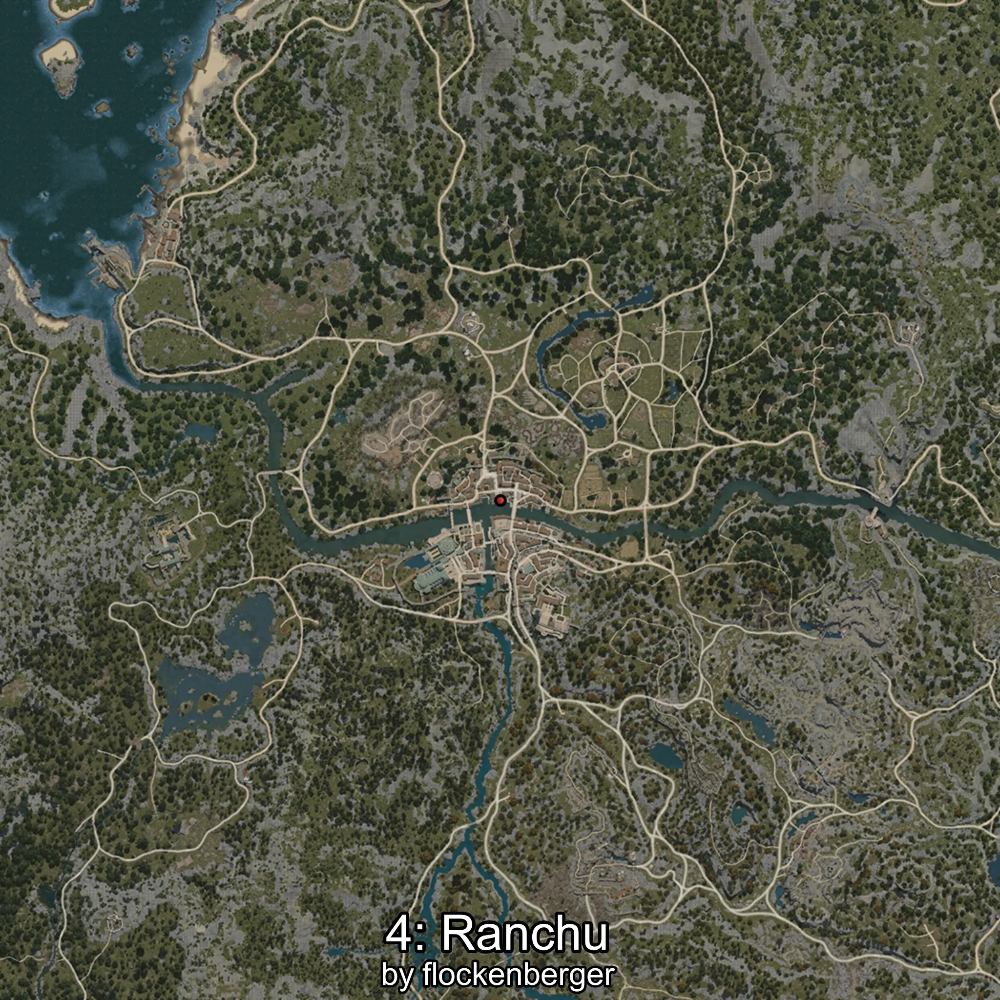

# Ranchu
Created by **flockenberger**

## ⚠️ Disclaimer:
Waypoints are generated based on your __**character’s position**__ — __not__ where your fishing float lands.
In ocean spots especially, the direction you cast your rod can place your float in a **different fishing zone**, which may result in catching the wrong type of fish.
This only happens in rare cases — when the position is right on the **edge of a zone** and you cast to the “wrong” side.

- To verify that your float you can use the guide [HERE](https://flockenberger.github.io/bdo-fish-position/)
- Or watch the guide [HERE](https://youtu.be/t-VXcRoNojk)

## Waypoints
```xml
<!--
    Waypoints for: Ranchu
    Created by: flockenberger
-->
<WorldmapBookMark>
    <BookMark BookMarkName="0: Ranchu" PosX="-332479.0" PosY="-1787.0" PosZ="-100192.0" />
    <BookMark BookMarkName="1: Ranchu" PosX="-244077.0" PosY="-4069.0" PosZ="-48820.0" />
    <BookMark BookMarkName="2: Ranchu" PosX="-74153.0" PosY="-4383.0" PosZ="38977.0" />
    <BookMark BookMarkName="3: Ranchu" PosX="-247364.0" PosY="-3940.0" PosZ="-48512.0" />
    <BookMark BookMarkName="4: Ranchu" PosX="-249698.0" PosY="-3939.0" PosZ="-46982.0" />
</WorldmapBookMark>
```

     