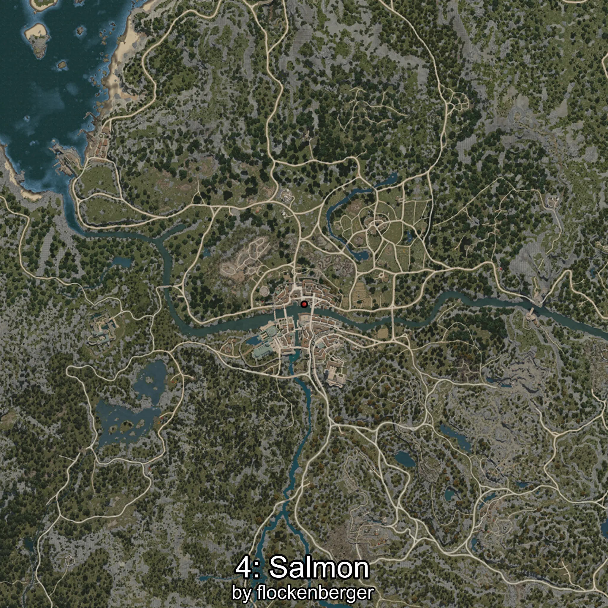

# Salmón
Created by **flockenberger**

## ⚠️ Disclaimer:
Waypoints are generated based on your __**character’s position**__ — __not__ where your fishing float lands.
In ocean spots especially, the direction you cast your rod can place your float in a **different fishing zone**, which may result in catching the wrong type of fish.
This only happens in rare cases — when the position is right on the **edge of a zone** and you cast to the “wrong” side.

- To verify that your float you can use the guide [HERE](https://flockenberger.github.io/bdo-fish-position/)
- Or watch the guide [HERE](https://youtu.be/t-VXcRoNojk)

## Waypoints
```xml
<!--
    Waypoints for: Salmón
    Created by: flockenberger
-->
<WorldmapBookMark>
    <BookMark BookMarkName="0: Salmón" PosX="101295.0" PosY="6216.0" PosZ="-134130.0" />
    <BookMark BookMarkName="1: Salmón" PosX="-244170.0" PosY="-4069.0" PosZ="-48887.0" />
    <BookMark BookMarkName="2: Salmón" PosX="-159235.0" PosY="-2006.0" PosZ="-148308.0" />
    <BookMark BookMarkName="3: Salmón" PosX="-235333.0" PosY="-3891.0" PosZ="-50423.0" />
    <BookMark BookMarkName="4: Salmón" PosX="-249878.0" PosY="-4059.0" PosZ="-47150.0" />
</WorldmapBookMark>
```

     