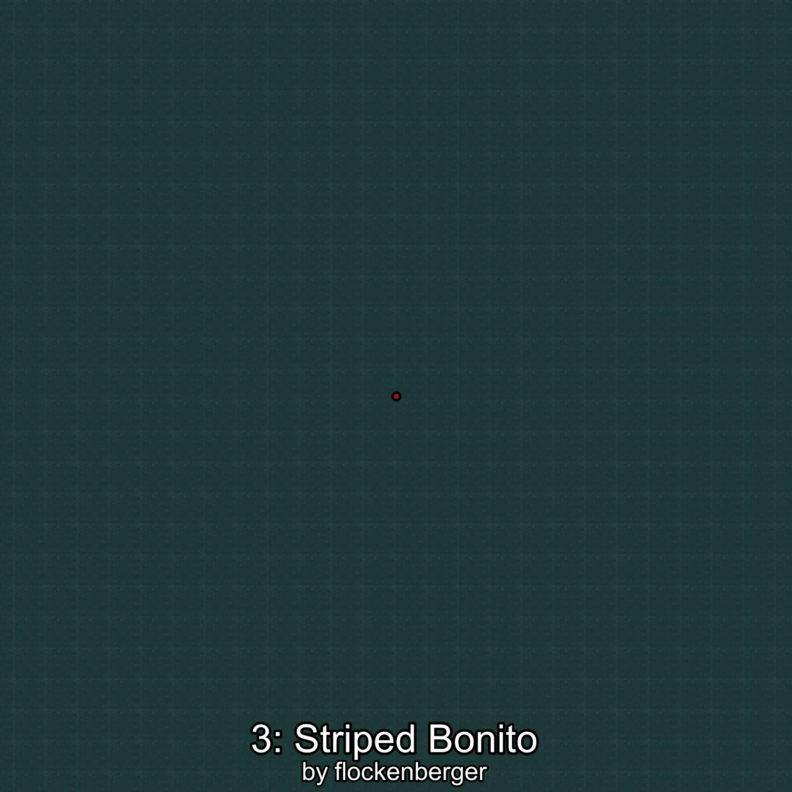

# Sarda
Created by **flockenberger**

## ⚠️ Disclaimer:
Waypoints are generated based on your __**character’s position**__ — __not__ where your fishing float lands.
In ocean spots especially, the direction you cast your rod can place your float in a **different fishing zone**, which may result in catching the wrong type of fish.
This only happens in rare cases — when the position is right on the **edge of a zone** and you cast to the “wrong” side.

- To verify that your float you can use the guide [HERE](https://flockenberger.github.io/bdo-fish-position/)
- Or watch the guide [HERE](https://youtu.be/t-VXcRoNojk)

## Waypoints
```xml
<!--
    Waypoints for: Sarda
    Created by: flockenberger
-->
<WorldmapBookMark>
    <BookMark BookMarkName="0: Sarda" PosX="-106689.0" PosY="-7635.0" PosZ="631049.0" />
    <BookMark BookMarkName="1: Sarda" PosX="-659570.0" PosY="-8051.0" PosZ="799730.0" />
    <BookMark BookMarkName="2: Sarda" PosX="-714374.0" PosY="-7640.0" PosZ="331377.0" />
    <BookMark BookMarkName="3: Sarda" PosX="-1195281.0" PosY="-7589.0" PosZ="97605.0" />
    <BookMark BookMarkName="4: Sarda" PosX="-364153.1" PosY="-7779.0405" PosZ="1251866.5" />
</WorldmapBookMark>
```

     