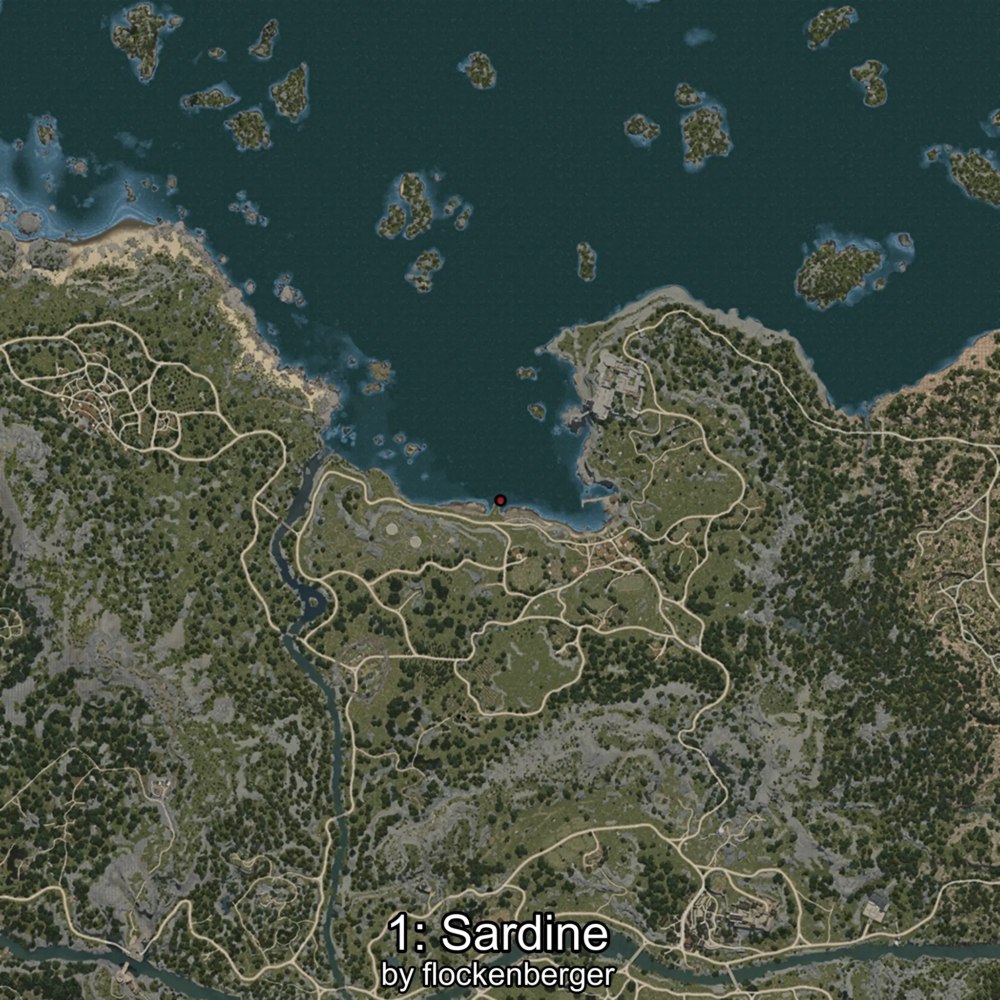

# Sardina
Created by **flockenberger**

## ⚠️ Disclaimer:
Waypoints are generated based on your __**character’s position**__ — __not__ where your fishing float lands.
In ocean spots especially, the direction you cast your rod can place your float in a **different fishing zone**, which may result in catching the wrong type of fish.
This only happens in rare cases — when the position is right on the **edge of a zone** and you cast to the “wrong” side.

- To verify that your float you can use the guide [HERE](https://flockenberger.github.io/bdo-fish-position/)
- Or watch the guide [HERE](https://youtu.be/t-VXcRoNojk)

## Waypoints
```xml
<!--
    Waypoints for: Sardina
    Created by: flockenberger
-->
<WorldmapBookMark>
    <BookMark BookMarkName="0: Sardina" PosX="-18987.0" PosY="-7951.0" PosZ="93305.0" />
    <BookMark BookMarkName="1: Sardina" PosX="-18796.0" PosY="-8128.0" PosZ="93528.0" />
    <BookMark BookMarkName="2: Sardina" PosX="-18813.0" PosY="-8090.0" PosZ="93433.0" />
    <BookMark BookMarkName="3: Sardina" PosX="-22537.0" PosY="-7916.0" PosZ="89819.0" />
    <BookMark BookMarkName="4: Sardina" PosX="-18864.0" PosY="-8096.0" PosZ="93446.0" />
</WorldmapBookMark>
```

     