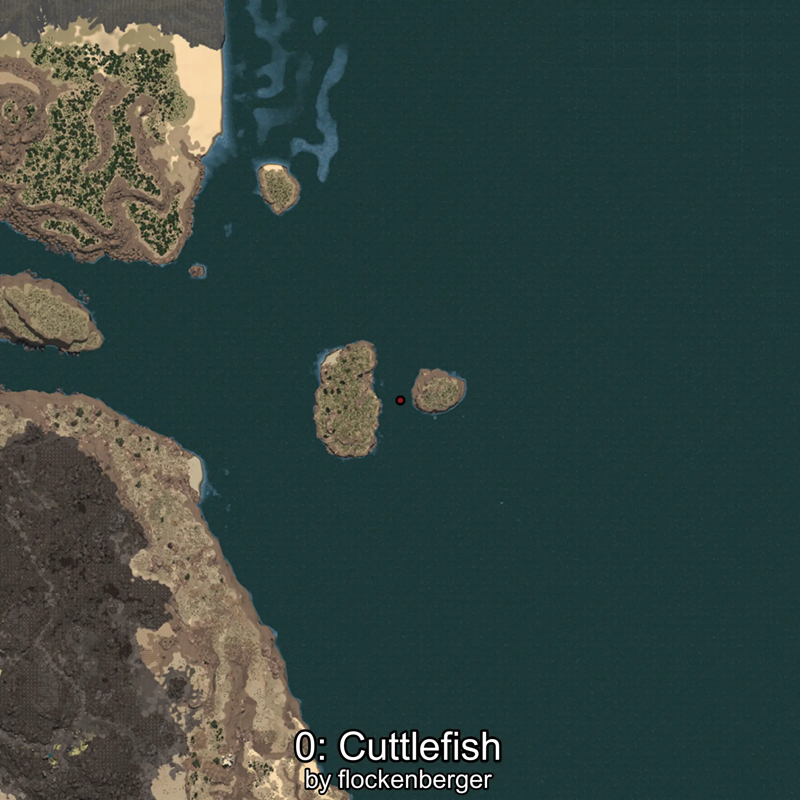
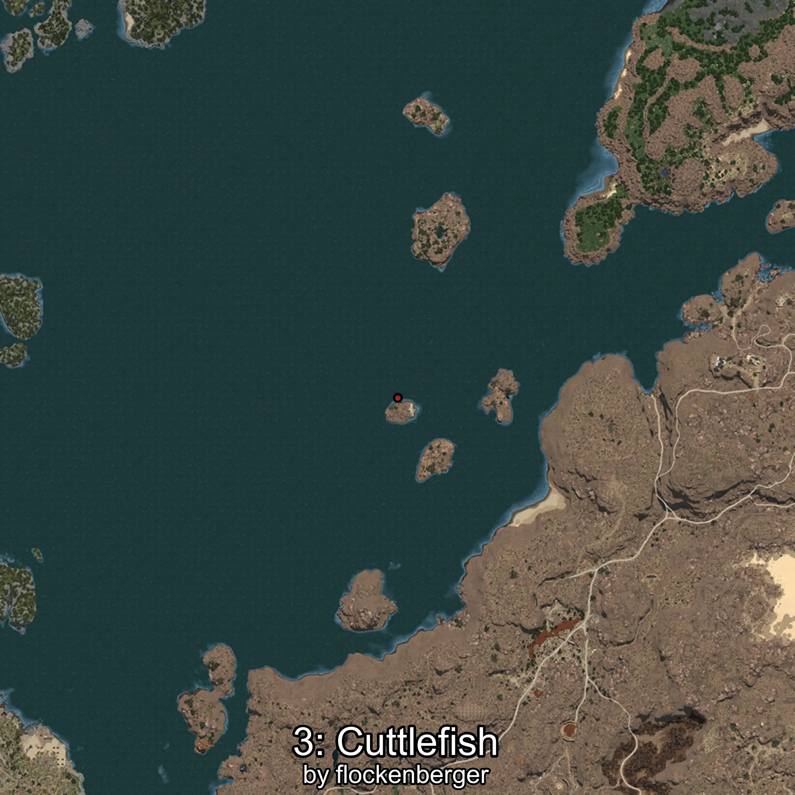

# Sepia
Created by **flockenberger**

## ⚠️ Disclaimer:
Waypoints are generated based on your __**character’s position**__ — __not__ where your fishing float lands.
In ocean spots especially, the direction you cast your rod can place your float in a **different fishing zone**, which may result in catching the wrong type of fish.
This only happens in rare cases — when the position is right on the **edge of a zone** and you cast to the “wrong” side.

- To verify that your float you can use the guide [HERE](https://flockenberger.github.io/bdo-fish-position/)
- Or watch the guide [HERE](https://youtu.be/t-VXcRoNojk)

## Waypoints
```xml
<!--
    Waypoints for: Sepia
    Created by: flockenberger
-->
<WorldmapBookMark>
    <BookMark BookMarkName="0: Sepia" PosX="1265430.0" PosY="-7870.0" PosZ="548467.0" />
    <BookMark BookMarkName="1: Sepia" PosX="1415240.0" PosY="-7910.0" PosZ="290589.0" />
    <BookMark BookMarkName="2: Sepia" PosX="403931.0" PosY="-7988.0" PosZ="259647.0" />
    <BookMark BookMarkName="3: Sepia" PosX="406503.0" PosY="-8173.0" PosZ="261761.0" />
    <BookMark BookMarkName="4: Sepia" PosX="-105299.0" PosY="-7977.0" PosZ="634306.0" />
</WorldmapBookMark>
```

     