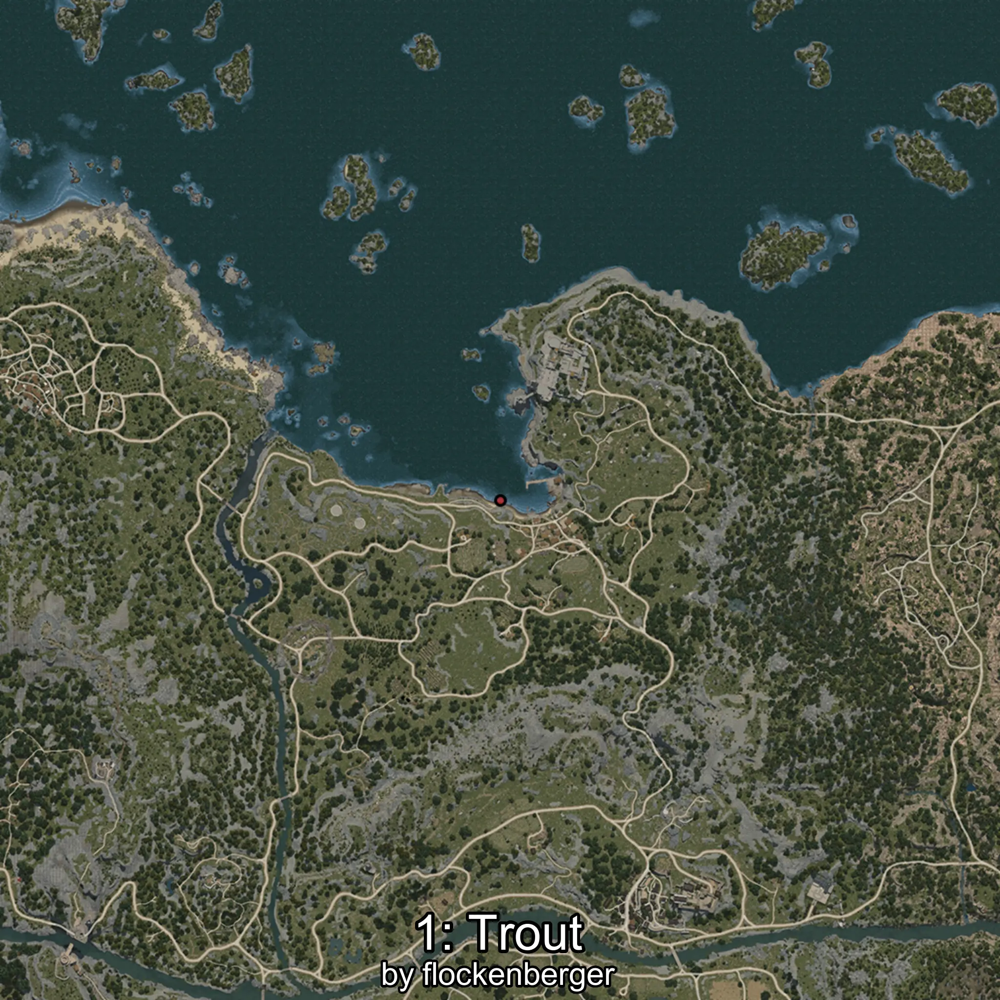
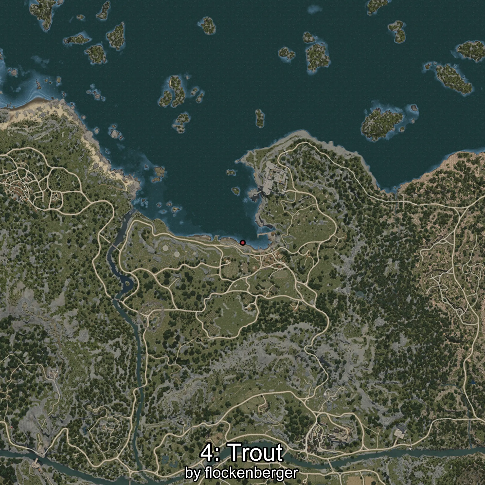

# Trucha
Created by **flockenberger**

## ⚠️ Disclaimer:
Waypoints are generated based on your __**character’s position**__ — __not__ where your fishing float lands.
In ocean spots especially, the direction you cast your rod can place your float in a **different fishing zone**, which may result in catching the wrong type of fish.
This only happens in rare cases — when the position is right on the **edge of a zone** and you cast to the “wrong” side.

- To verify that your float you can use the guide [HERE](https://flockenberger.github.io/bdo-fish-position/)
- Or watch the guide [HERE](https://youtu.be/t-VXcRoNojk)

## Waypoints
```xml
<!--
    Waypoints for: Trucha
    Created by: flockenberger
-->
<WorldmapBookMark>
    <BookMark BookMarkName="0: Trucha" PosX="-220179.0" PosY="-8190.0" PosZ="174061.0" />
    <BookMark BookMarkName="1: Trucha" PosX="-1596.0" PosY="-8177.0" PosZ="87753.0" />
    <BookMark BookMarkName="2: Trucha" PosX="-2395.4946" PosY="-8138.7476" PosZ="87746.74" />
    <BookMark BookMarkName="3: Trucha" PosX="-225940.0" PosY="-8164.0" PosZ="166567.0" />
    <BookMark BookMarkName="4: Trucha" PosX="-3108.0" PosY="-8216.0" PosZ="88077.0" />
</WorldmapBookMark>
```

     