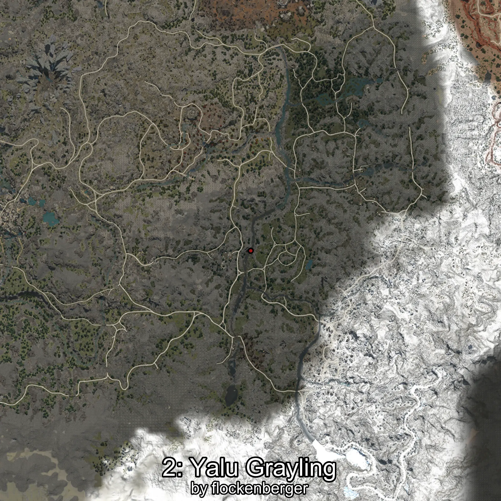
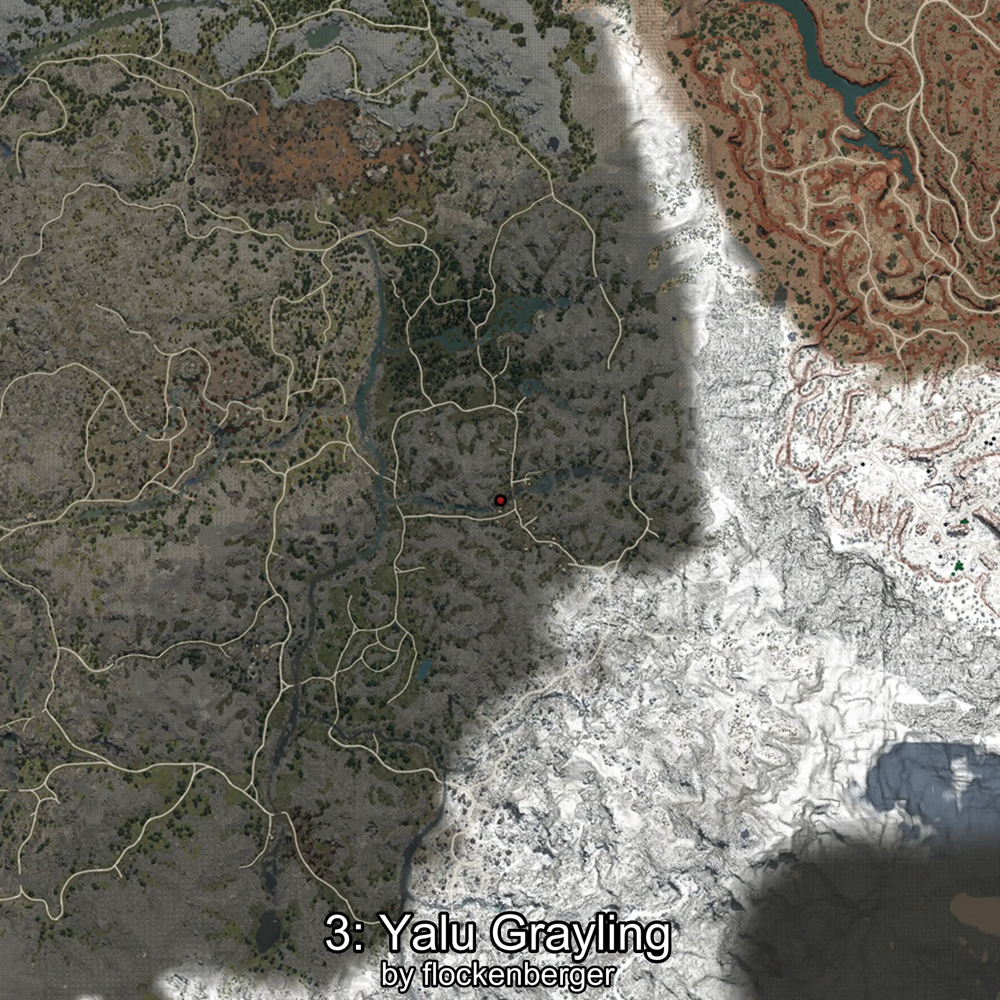
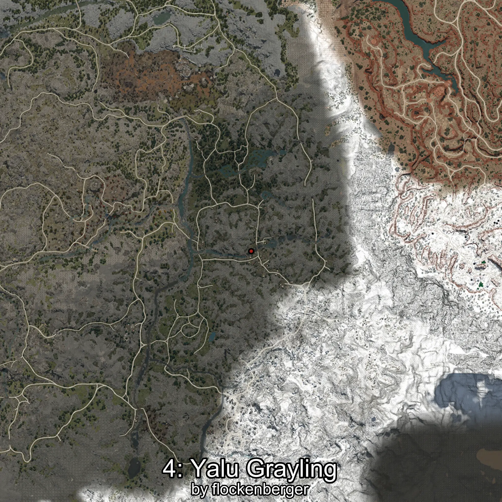

# Tímalo
Created by **flockenberger**

## ⚠️ Disclaimer:
Waypoints are generated based on your __**character’s position**__ — __not__ where your fishing float lands.
In ocean spots especially, the direction you cast your rod can place your float in a **different fishing zone**, which may result in catching the wrong type of fish.
This only happens in rare cases — when the position is right on the **edge of a zone** and you cast to the “wrong” side.

- To verify that your float you can use the guide [HERE](https://flockenberger.github.io/bdo-fish-position/)
- Or watch the guide [HERE](https://youtu.be/t-VXcRoNojk)

## Waypoints
```xml
<!--
    Waypoints for: Tímalo
    Created by: flockenberger
-->
<WorldmapBookMark>
    <BookMark BookMarkName="0: Tímalo" PosX="163484.45" PosY="15942.518" PosZ="-386970.8" />
    <BookMark BookMarkName="1: Tímalo" PosX="163652.0" PosY="15942.0" PosZ="-386914.0" />
    <BookMark BookMarkName="2: Tímalo" PosX="103703.0" PosY="13985.0" PosZ="-430890.0" />
    <BookMark BookMarkName="3: Tímalo" PosX="163331.0" PosY="15942.0" PosZ="-387095.0" />
    <BookMark BookMarkName="4: Tímalo" PosX="163582.84" PosY="15942.146" PosZ="-386933.53" />
</WorldmapBookMark>
```

     