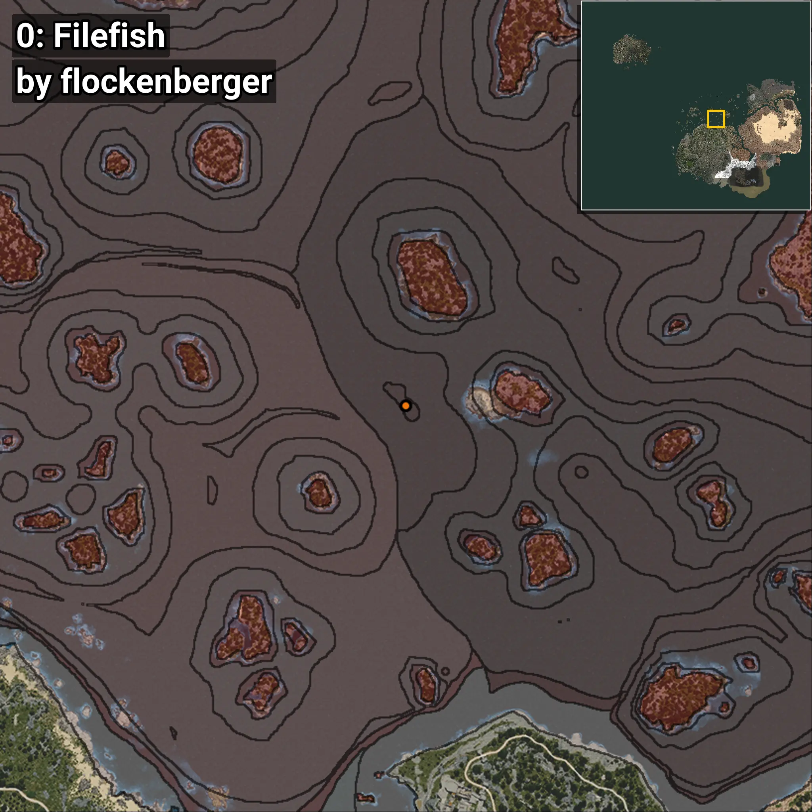
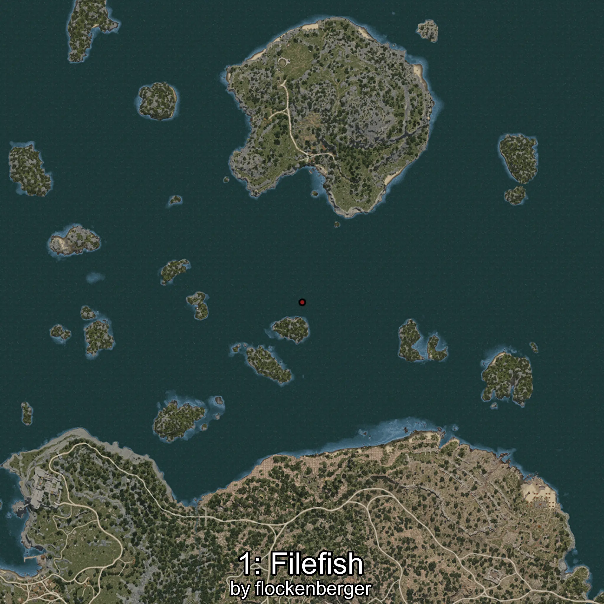
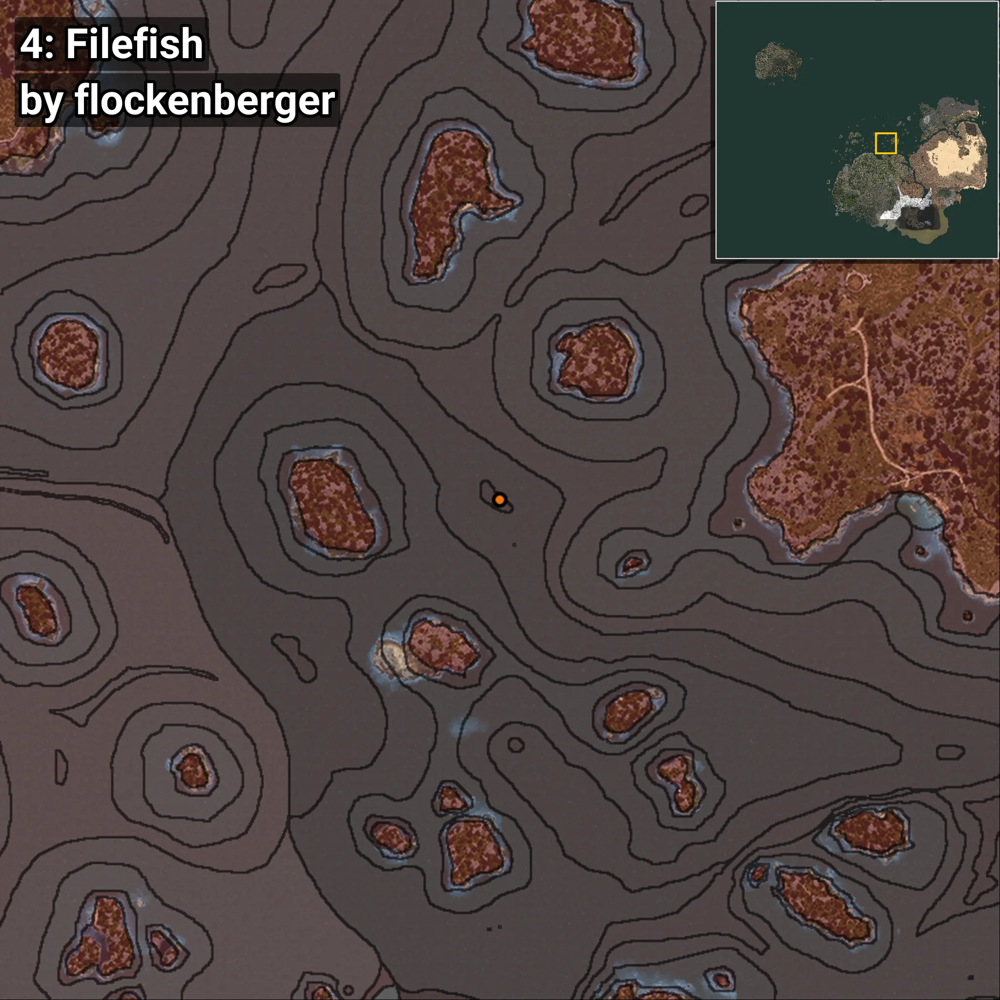

# Filefish
```xml
<!--
    Waypoints for: Filefish
    Created by: flockenberger
-->
<WorldmapBookMark>
    <BookMark BookMarkName="0: Filefish" PosX="921.0" PosY="-7636.0" PosZ="252243.0" />
    <BookMark BookMarkName="1: Filefish" PosX="590.0" PosY="-7443.0" PosZ="252371.0" />
    <BookMark BookMarkName="2: Filefish" PosX="49227.863" PosY="-7907.4" PosZ="292619.44" />
    <BookMark BookMarkName="3: Filefish" PosX="159.46042" PosY="-7755.405" PosZ="252881.94" />
    <BookMark BookMarkName="4: Filefish" PosX="50583.0" PosY="-7514.0" PosZ="292577.0" />
</WorldmapBookMark>
```

## ⚠️ Disclaimer
Waypoints are generated based on the __**character’s position**__ — __not__ where the fishing float landed.
Fish are determined by where your **float** lands!
In ocean spots especially, the direction you cast your rod can place your float in a **different fishing zone**, which may result in catching the wrong type of fish.
Please pay attention to the preview images showing where each location is in relation to the outlined zones.

- You can verify your float’s position using the guide [**HERE**](https://flockenberger.github.io/bdo-fish-position/)
- Or watch the video guide [**HERE**](https://youtu.be/t-VXcRoNojk)

## Previews
      