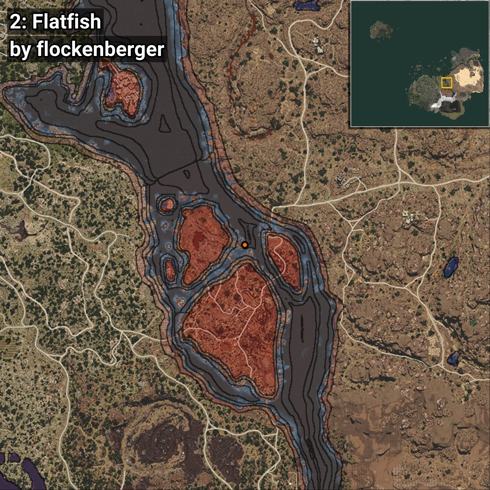
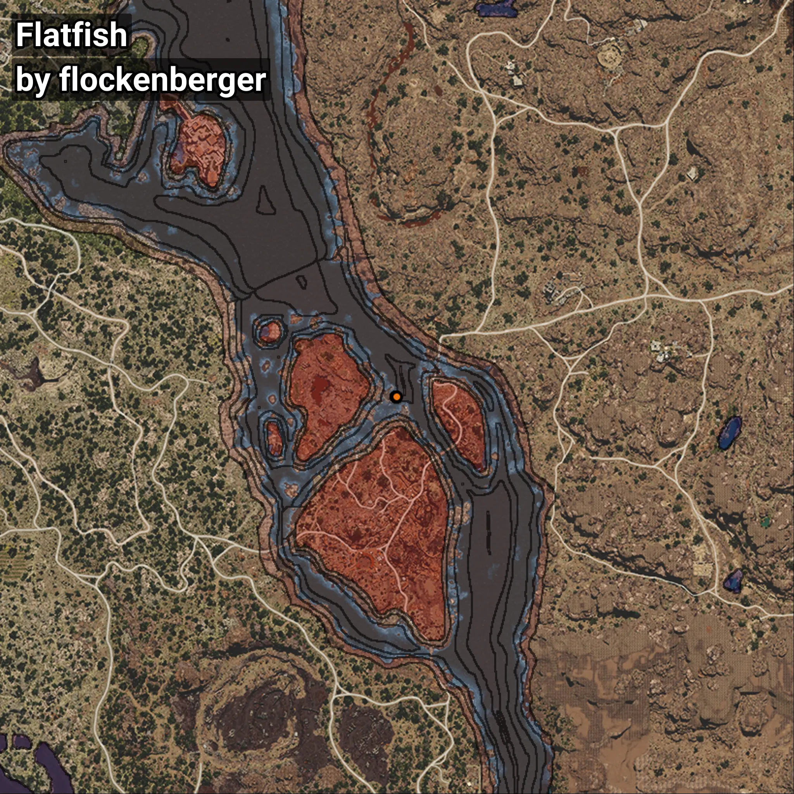

# Flatfish
```xml
<!--
    Waypoints for: Flatfish
    Created by: flockenberger
-->
<WorldmapBookMark>
    <BookMark BookMarkName="0: Flatfish" PosX="369728.0" PosY="-8205.0" PosZ="-23864.0" />
    <BookMark BookMarkName="1: Flatfish" PosX="369776.72" PosY="-8211.535" PosZ="-23856.268" />
    <BookMark BookMarkName="2: Flatfish" PosX="369798.0" PosY="-8206.0" PosZ="-23955.0" />
    <BookMark BookMarkName="3: Flatfish" PosX="369775.44" PosY="-8208.921" PosZ="-23891.365" />
    <BookMark BookMarkName="4: Flatfish" PosX="369873.0" PosY="-8231.0" PosZ="-23862.0" />
</WorldmapBookMark>
```

## ⚠️ Disclaimer
Waypoints are generated based on the __**character’s position**__ — __not__ where the fishing float landed.
Fish are determined by where your **float** lands!
In ocean spots especially, the direction you cast your rod can place your float in a **different fishing zone**, which may result in catching the wrong type of fish.
Please pay attention to the preview images showing where each location is in relation to the outlined zones.

- You can verify your float’s position using the guide [**HERE**](https://flockenberger.github.io/bdo-fish-position/)
- Or watch the video guide [**HERE**](https://youtu.be/t-VXcRoNojk)

## Previews
      