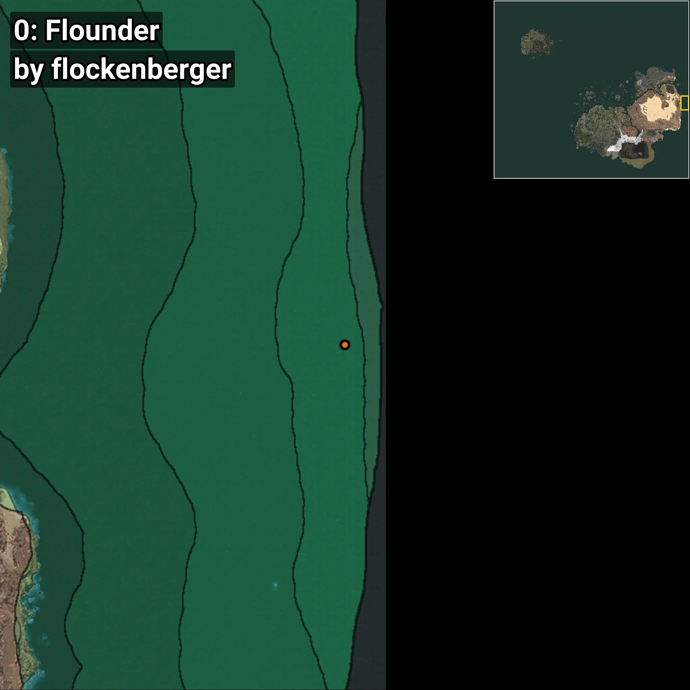
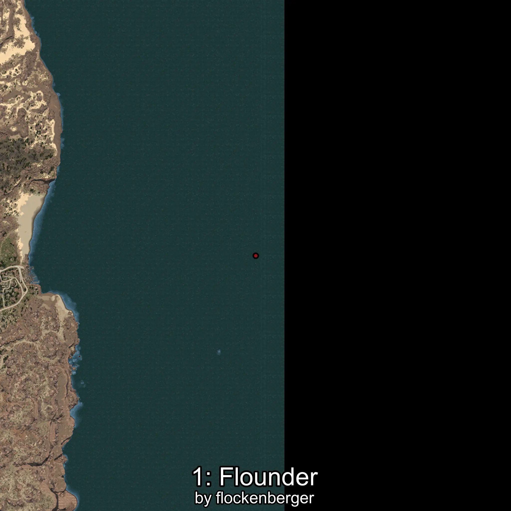
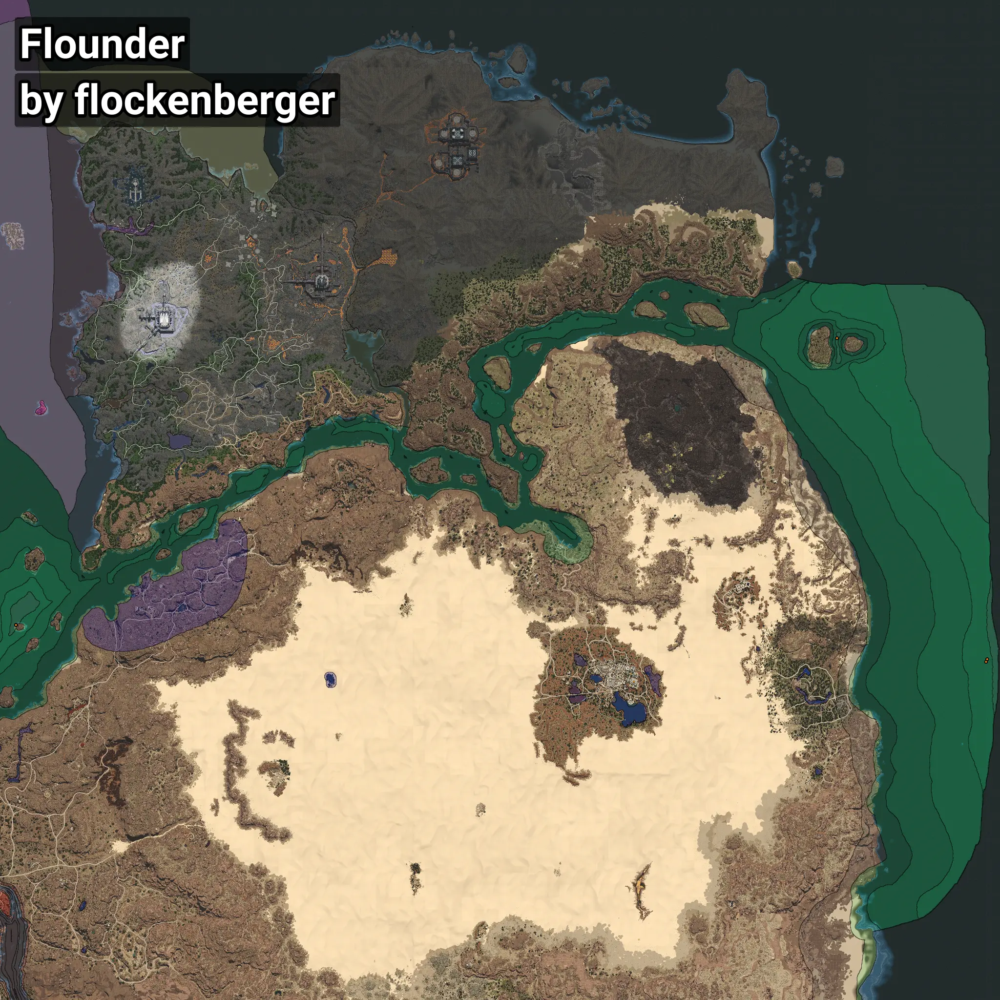

# Flounder
```xml
<!--
    Waypoints for: Flounder
    Created by: flockenberger
-->
<WorldmapBookMark>
    <BookMark BookMarkName="0: Flounder" PosX="1418938.1" PosY="-7858.4253" PosZ="220261.77" />
    <BookMark BookMarkName="1: Flounder" PosX="1420196.0" PosY="-7857.0" PosZ="223137.0" />
    <BookMark BookMarkName="2: Flounder" PosX="403303.0" PosY="-7919.0" PosZ="258872.0" />
    <BookMark BookMarkName="3: Flounder" PosX="403315.0" PosY="-7906.0" PosZ="258857.0" />
    <BookMark BookMarkName="4: Flounder" PosX="1262843.0" PosY="-7752.0" PosZ="558995.0" />
</WorldmapBookMark>
```

## ⚠️ Disclaimer
Waypoints are generated based on the __**character’s position**__ — __not__ where the fishing float landed.
Fish are determined by where your **float** lands!
In ocean spots especially, the direction you cast your rod can place your float in a **different fishing zone**, which may result in catching the wrong type of fish.
Please pay attention to the preview images showing where each location is in relation to the outlined zones.

- You can verify your float’s position using the guide [**HERE**](https://flockenberger.github.io/bdo-fish-position/)
- Or watch the video guide [**HERE**](https://youtu.be/t-VXcRoNojk)

## Previews
      