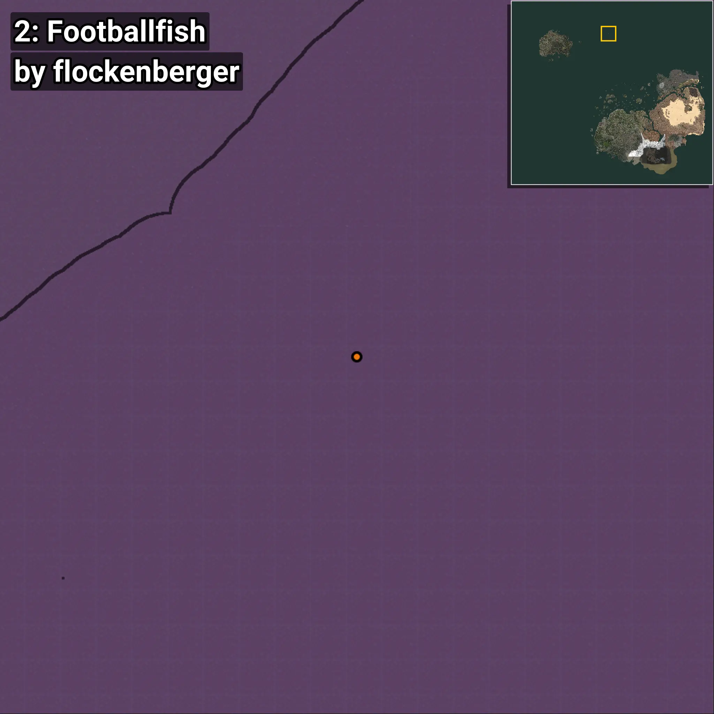
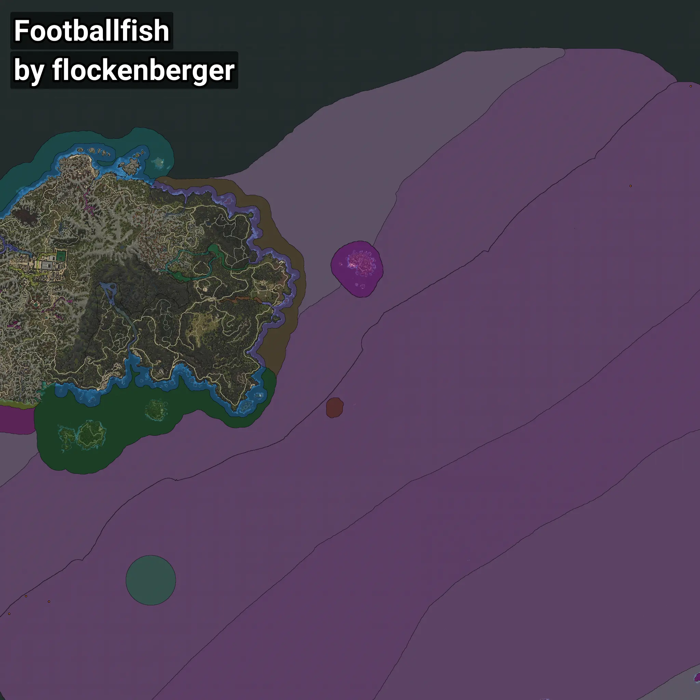

# Footballfish
```xml
<!--
    Waypoints for: Footballfish
    Created by: flockenberger
-->
<WorldmapBookMark>
    <BookMark BookMarkName="0: Footballfish" PosX="-1460095.0" PosY="-7898.0" PosZ="734693.0" />
    <BookMark BookMarkName="1: Footballfish" PosX="-1418333.0" PosY="-7915.0" PosZ="724909.0" />
    <BookMark BookMarkName="2: Footballfish" PosX="-364953.0" PosY="-7896.0" PosZ="1477691.0" />
    <BookMark BookMarkName="3: Footballfish" PosX="-1490355.0" PosY="-7837.0" PosZ="702918.0" />
    <BookMark BookMarkName="4: Footballfish" PosX="-255824.0" PosY="-7220.0" PosZ="1658307.0" />
</WorldmapBookMark>
```

## ⚠️ Disclaimer
Waypoints are generated based on the __**character’s position**__ — __not__ where the fishing float landed.
Fish are determined by where your **float** lands!
In ocean spots especially, the direction you cast your rod can place your float in a **different fishing zone**, which may result in catching the wrong type of fish.
Please pay attention to the preview images showing where each location is in relation to the outlined zones.

- You can verify your float’s position using the guide [**HERE**](https://flockenberger.github.io/bdo-fish-position/)
- Or watch the video guide [**HERE**](https://youtu.be/t-VXcRoNojk)

## Previews
      