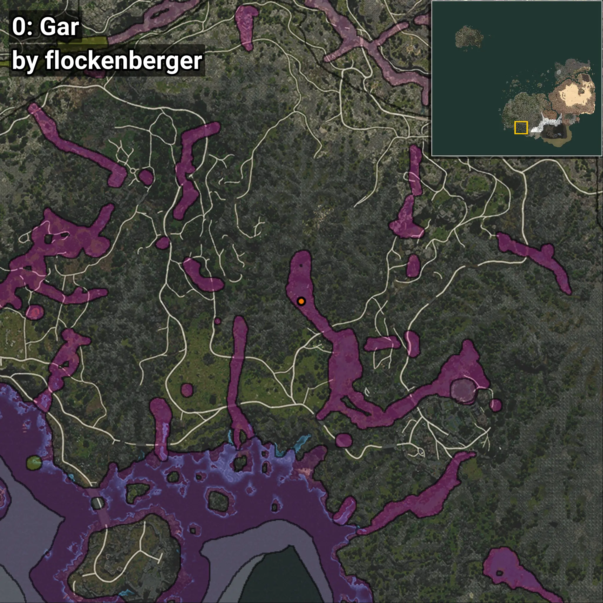
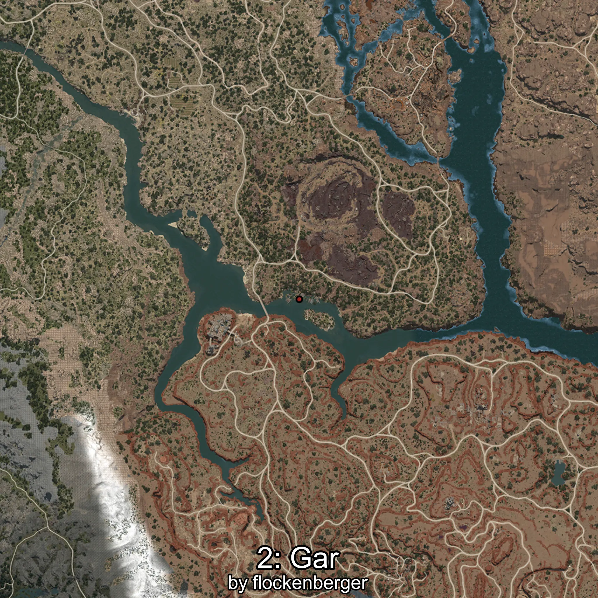
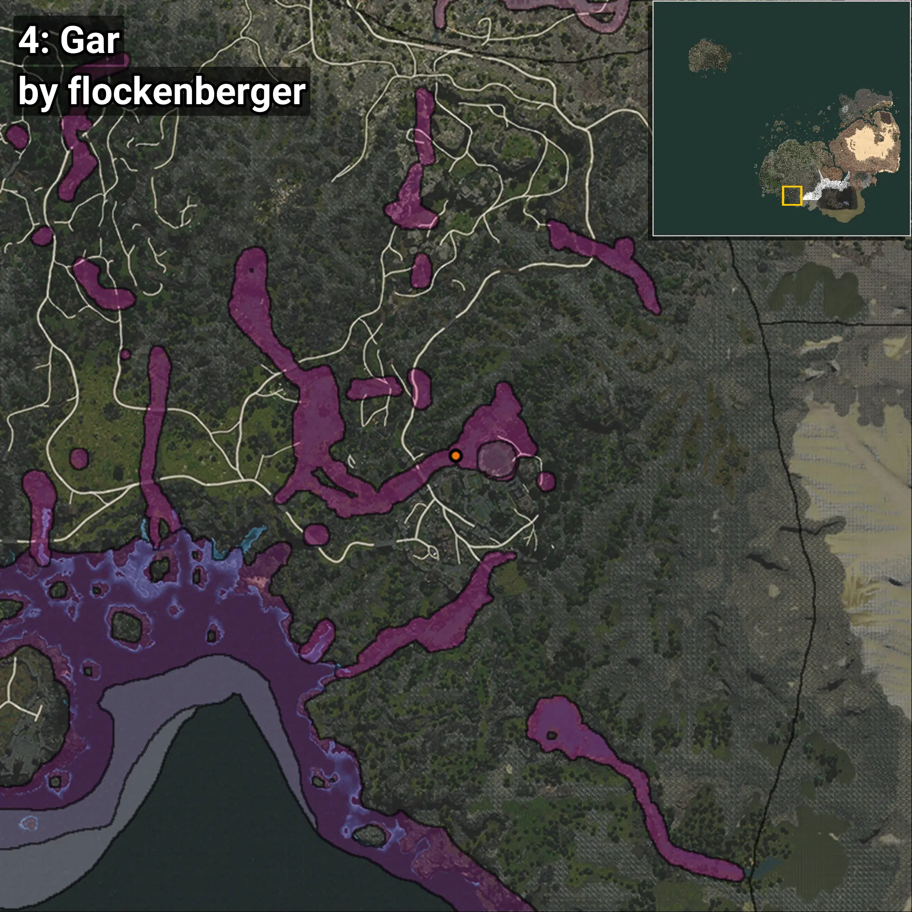

# Gar
```xml
<!--
    Waypoints for: Gar
    Created by: flockenberger
-->
<WorldmapBookMark>
    <BookMark BookMarkName="0: Gar" PosX="-217252.0" PosY="13928.0" PosZ="-551392.0" />
    <BookMark BookMarkName="1: Gar" PosX="-202100.0" PosY="9200.0" PosZ="-570863.0" />
    <BookMark BookMarkName="2: Gar" PosX="-354342.0" PosY="-2935.0" PosZ="-571432.0" />
    <BookMark BookMarkName="3: Gar" PosX="-202452.0" PosY="9649.0" PosZ="-572207.0" />
    <BookMark BookMarkName="4: Gar" PosX="-162058.0" PosY="21950.0" PosZ="-586868.0" />
</WorldmapBookMark>
```

## ⚠️ Disclaimer
Waypoints are generated based on the __**character’s position**__ — __not__ where the fishing float landed.
Fish are determined by where your **float** lands!
In ocean spots especially, the direction you cast your rod can place your float in a **different fishing zone**, which may result in catching the wrong type of fish.
Please pay attention to the preview images showing where each location is in relation to the outlined zones.

- You can verify your float’s position using the guide [**HERE**](https://flockenberger.github.io/bdo-fish-position/)
- Or watch the video guide [**HERE**](https://youtu.be/t-VXcRoNojk)

## Previews
      