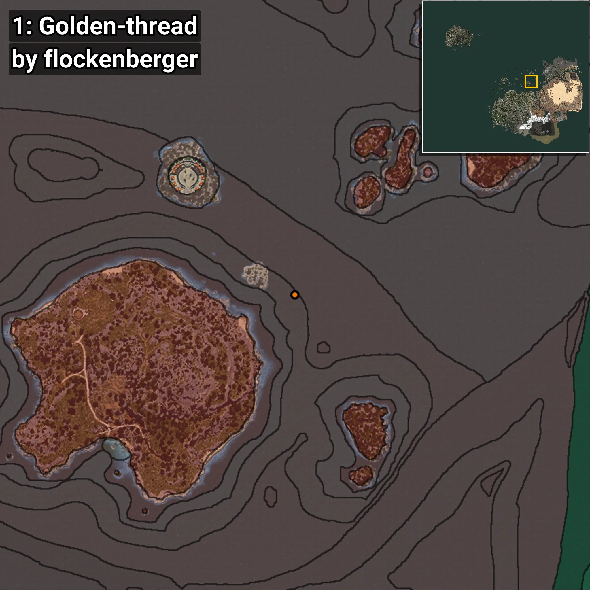

# Golden-thread
```xml
<!--
    Waypoints for: Golden-thread
    Created by: flockenberger
-->
<WorldmapBookMark>
    <BookMark BookMarkName="0: Golden-thread" PosX="236815.0" PosY="-8208.0" PosZ="346377.0" />
    <BookMark BookMarkName="1: Golden-thread" PosX="228800.0" PosY="-8208.0" PosZ="354289.34" />
    <BookMark BookMarkName="2: Golden-thread" PosX="101704.0" PosY="-8208.0" PosZ="262482.0" />
    <BookMark BookMarkName="3: Golden-thread" PosX="241903.1" PosY="-7642.97" PosZ="333482.38" />
    <BookMark BookMarkName="4: Golden-thread" PosX="223018.92" PosY="-8208.0" PosZ="322724.44" />
</WorldmapBookMark>
```

## ⚠️ Disclaimer
Waypoints are generated based on the __**character’s position**__ — __not__ where the fishing float landed.
Fish are determined by where your **float** lands!
In ocean spots especially, the direction you cast your rod can place your float in a **different fishing zone**, which may result in catching the wrong type of fish.
Please pay attention to the preview images showing where each location is in relation to the outlined zones.

- You can verify your float’s position using the guide [**HERE**](https://flockenberger.github.io/bdo-fish-position/)
- Or watch the video guide [**HERE**](https://youtu.be/t-VXcRoNojk)

## Previews
      