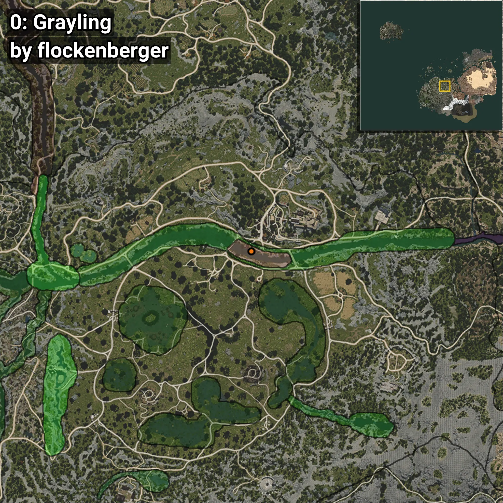
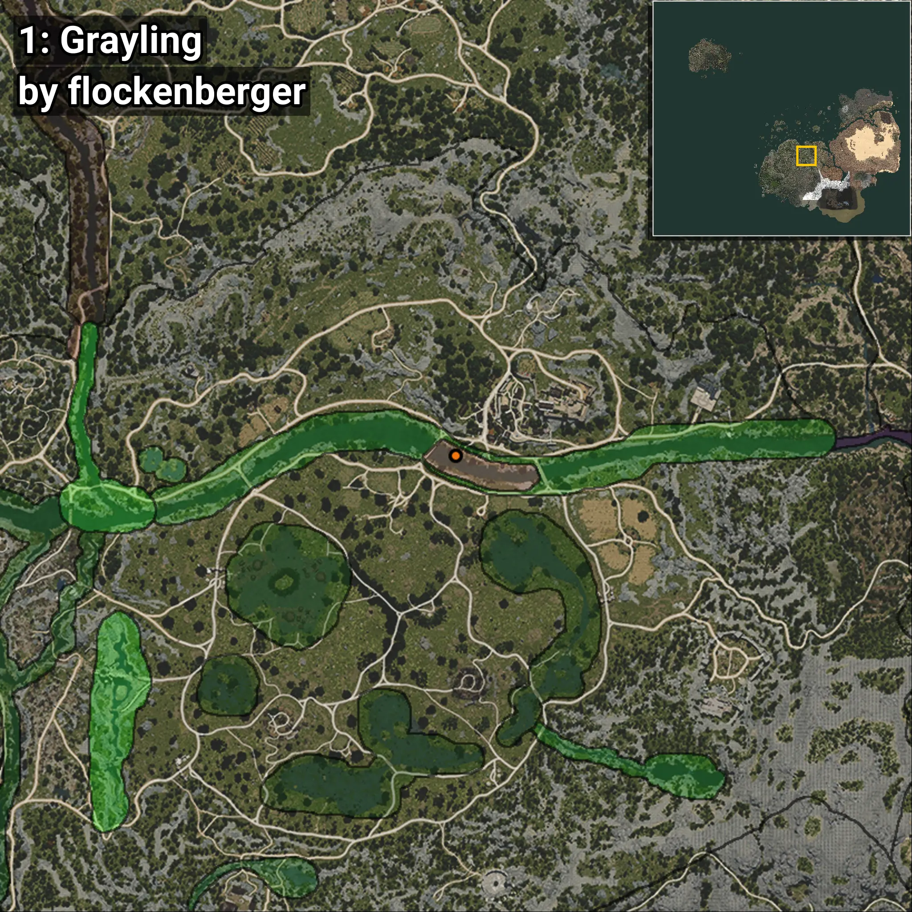
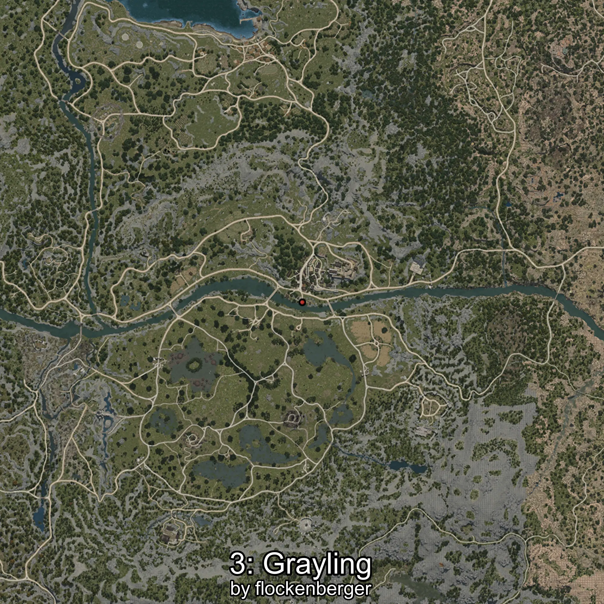

# Grayling
```xml
<!--
    Waypoints for: Grayling
    Created by: flockenberger
-->
<WorldmapBookMark>
    <BookMark BookMarkName="0: Grayling" PosX="32284.0" PosY="-3691.0" PosZ="-50169.0" />
    <BookMark BookMarkName="1: Grayling" PosX="29305.975" PosY="-3267.7295" PosZ="-48568.883" />
    <BookMark BookMarkName="2: Grayling" PosX="38666.0" PosY="-4040.0" PosZ="-50956.0" />
    <BookMark BookMarkName="3: Grayling" PosX="29289.0" PosY="-3265.0" PosZ="-48540.0" />
    <BookMark BookMarkName="4: Grayling" PosX="39644.0" PosY="-4018.0" PosZ="-51265.0" />
</WorldmapBookMark>
```

## ⚠️ Disclaimer
Waypoints are generated based on the __**character’s position**__ — __not__ where the fishing float landed.
Fish are determined by where your **float** lands!
In ocean spots especially, the direction you cast your rod can place your float in a **different fishing zone**, which may result in catching the wrong type of fish.
Please pay attention to the preview images showing where each location is in relation to the outlined zones.

- You can verify your float’s position using the guide [**HERE**](https://flockenberger.github.io/bdo-fish-position/)
- Or watch the video guide [**HERE**](https://youtu.be/t-VXcRoNojk)

## Previews
      