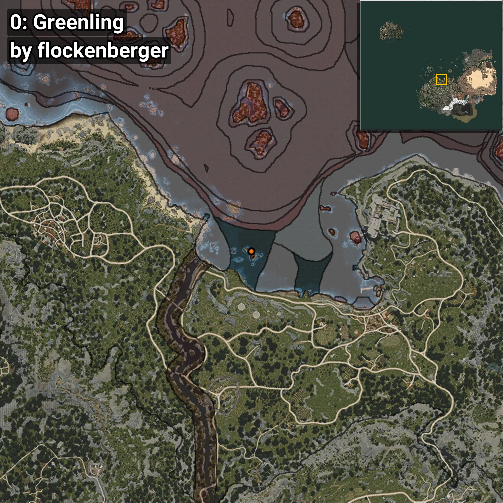
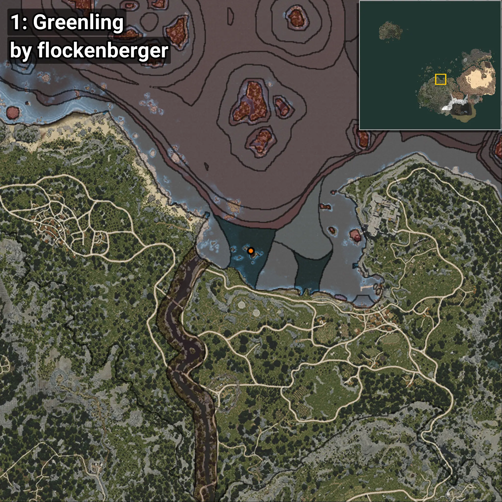
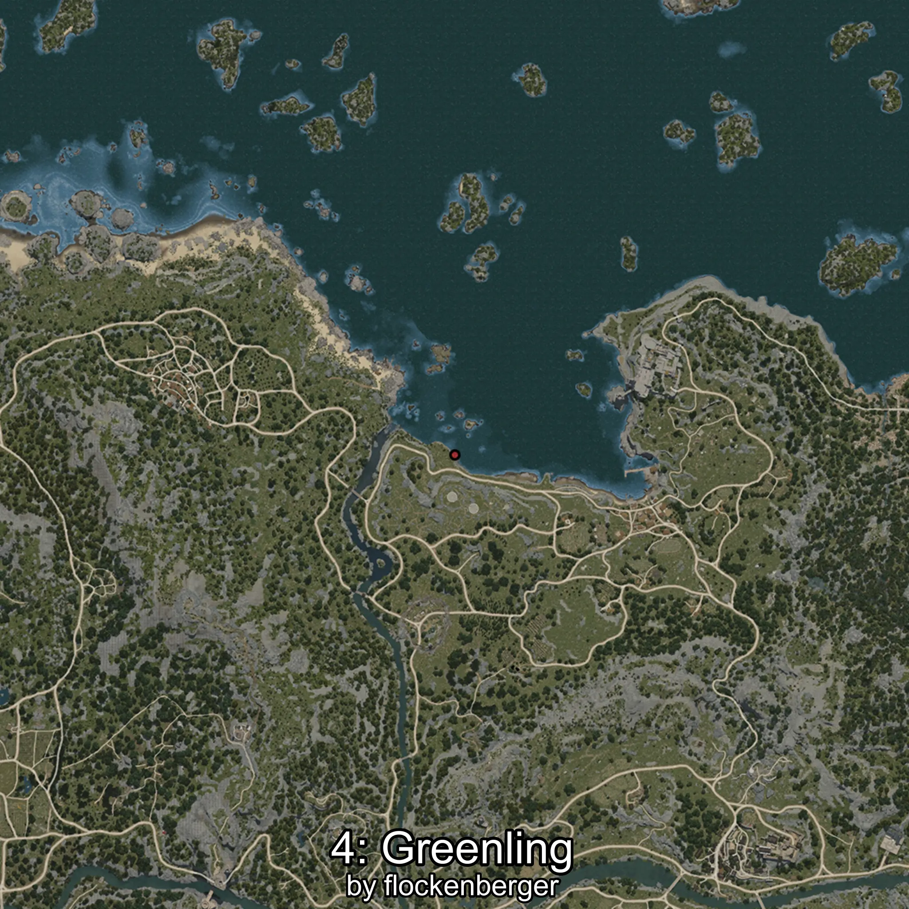

# Greenling
```xml
<!--
    Waypoints for: Greenling
    Created by: flockenberger
-->
<WorldmapBookMark>
    <BookMark BookMarkName="0: Greenling" PosX="-47571.22" PosY="-8186.3467" PosZ="111900.48" />
    <BookMark BookMarkName="1: Greenling" PosX="-47615.0" PosY="-8006.0" PosZ="111223.0" />
    <BookMark BookMarkName="2: Greenling" PosX="-52249.0" PosY="-7995.0" PosZ="98940.0" />
    <BookMark BookMarkName="3: Greenling" PosX="-52308.0" PosY="-7984.0" PosZ="98894.0" />
    <BookMark BookMarkName="4: Greenling" PosX="-44859.812" PosY="-7510.079" PosZ="112533.22" />
</WorldmapBookMark>
```

## ⚠️ Disclaimer
Waypoints are generated based on the __**character’s position**__ — __not__ where the fishing float landed.
Fish are determined by where your **float** lands!
In ocean spots especially, the direction you cast your rod can place your float in a **different fishing zone**, which may result in catching the wrong type of fish.
Please pay attention to the preview images showing where each location is in relation to the outlined zones.

- You can verify your float’s position using the guide [**HERE**](https://flockenberger.github.io/bdo-fish-position/)
- Or watch the video guide [**HERE**](https://youtu.be/t-VXcRoNojk)

## Previews
      