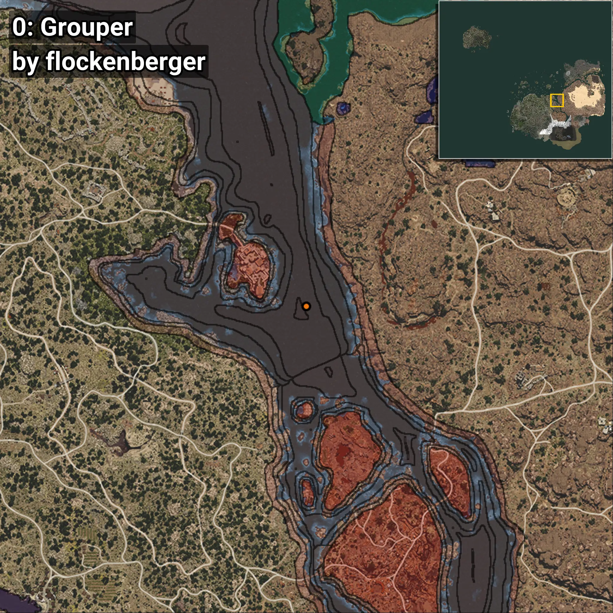
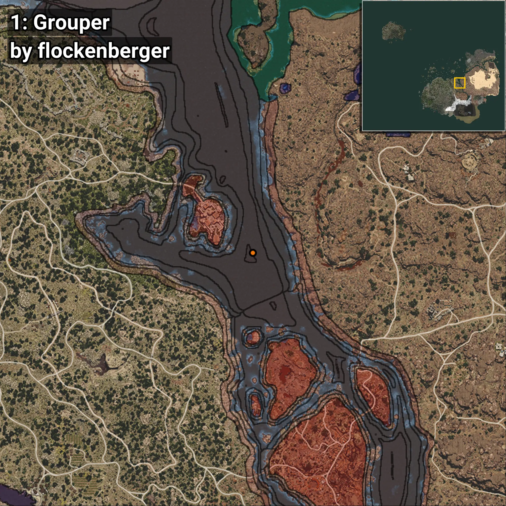
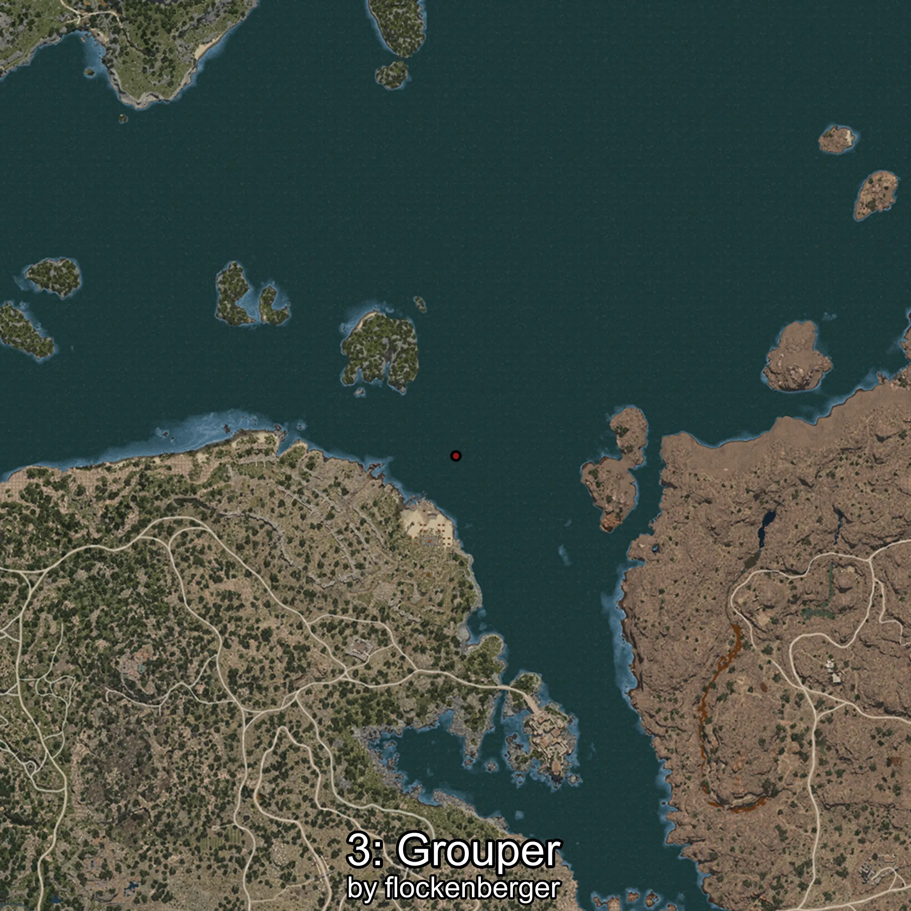
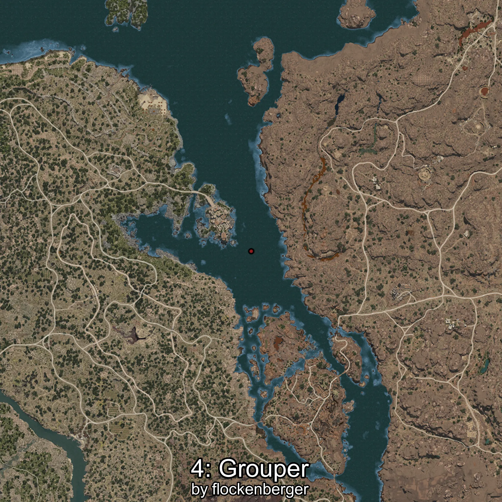
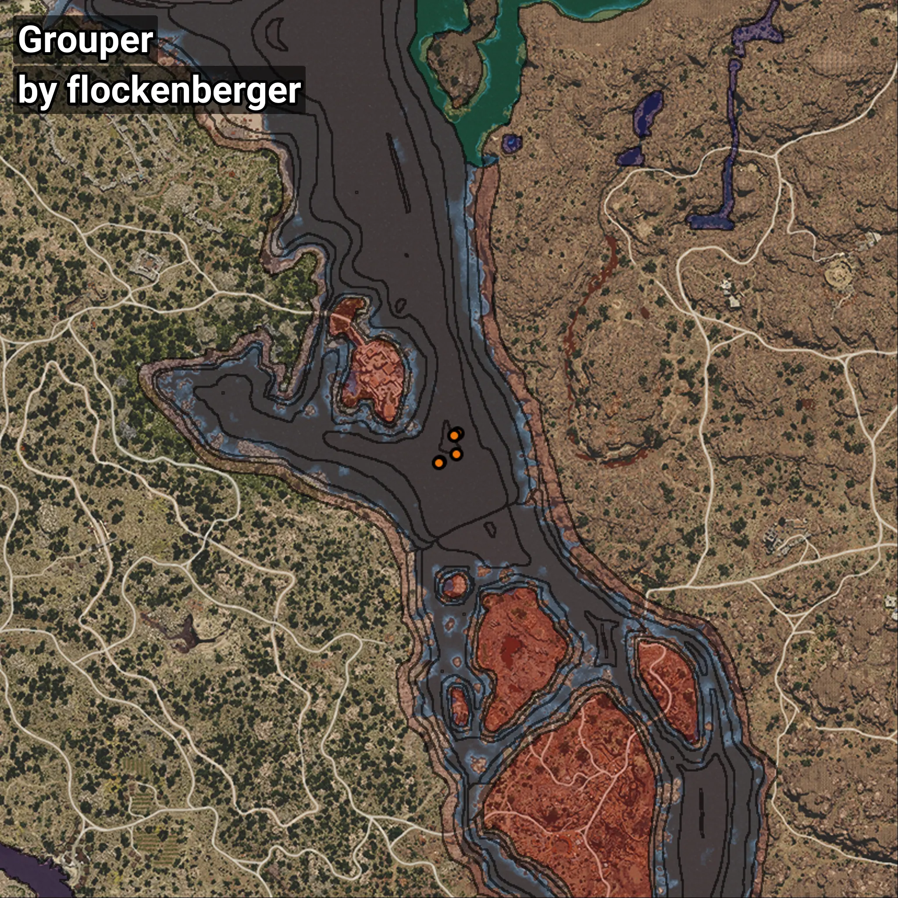

# Grouper
```xml
<!--
    Waypoints for: Grouper
    Created by: flockenberger
-->
<WorldmapBookMark>
    <BookMark BookMarkName="0: Grouper" PosX="331511.8" PosY="-7913.341" PosZ="37979.29" />
    <BookMark BookMarkName="1: Grouper" PosX="330465.0" PosY="-7932.0" PosZ="37384.0" />
    <BookMark BookMarkName="2: Grouper" PosX="326550.0" PosY="-7741.0" PosZ="30215.0" />
    <BookMark BookMarkName="3: Grouper" PosX="326219.0" PosY="-7736.0" PosZ="30025.0" />
    <BookMark BookMarkName="4: Grouper" PosX="331269.0" PosY="-7915.0" PosZ="32306.0" />
</WorldmapBookMark>
```

## ⚠️ Disclaimer
Waypoints are generated based on the __**character’s position**__ — __not__ where the fishing float landed.
Fish are determined by where your **float** lands!
In ocean spots especially, the direction you cast your rod can place your float in a **different fishing zone**, which may result in catching the wrong type of fish.
Please pay attention to the preview images showing where each location is in relation to the outlined zones.

- You can verify your float’s position using the guide [**HERE**](https://flockenberger.github.io/bdo-fish-position/)
- Or watch the video guide [**HERE**](https://youtu.be/t-VXcRoNojk)

## Previews
      