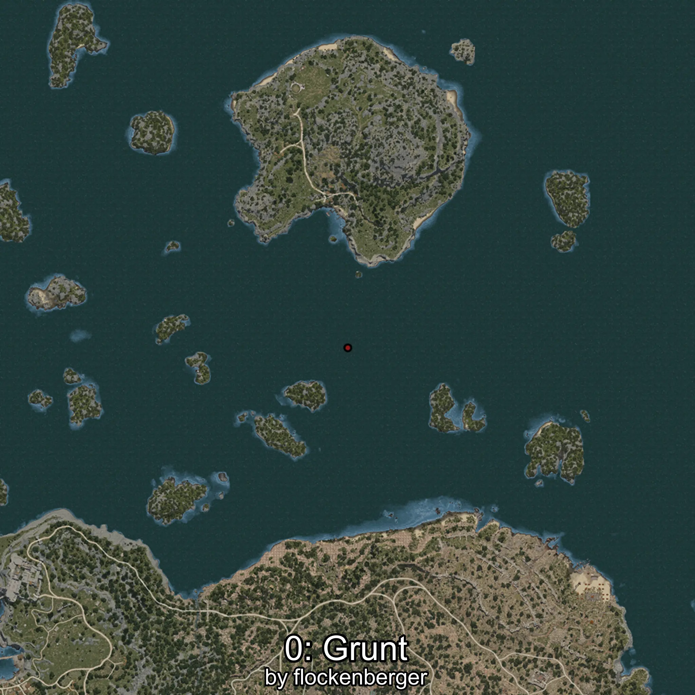
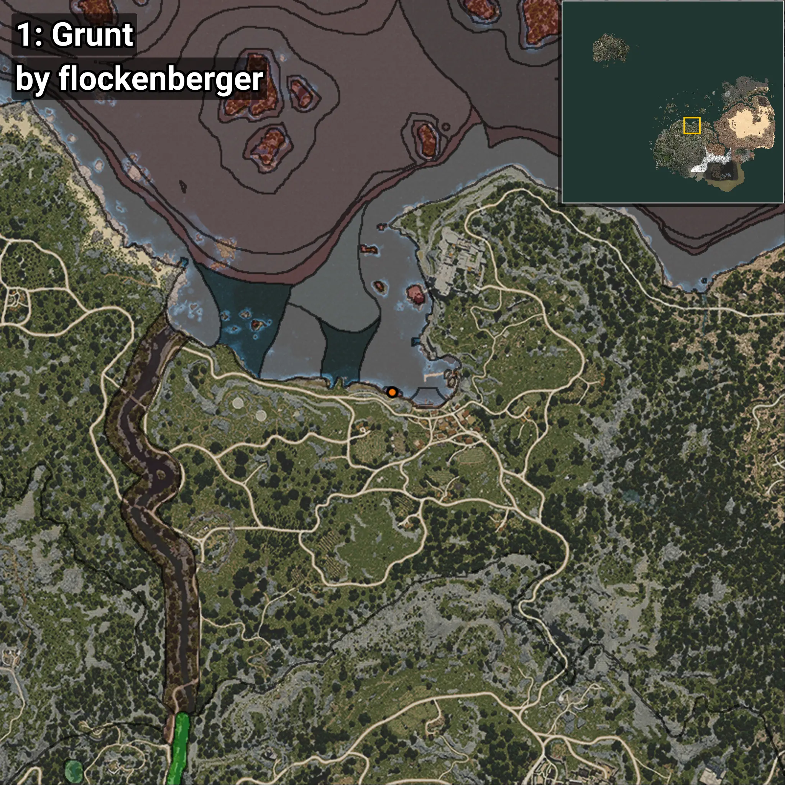
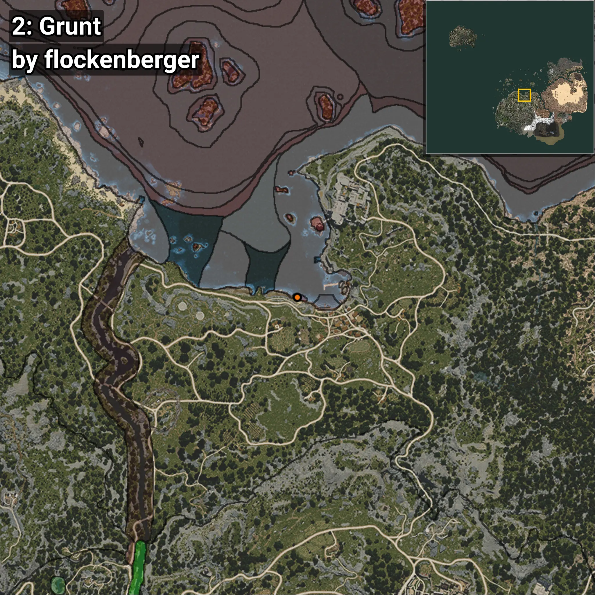
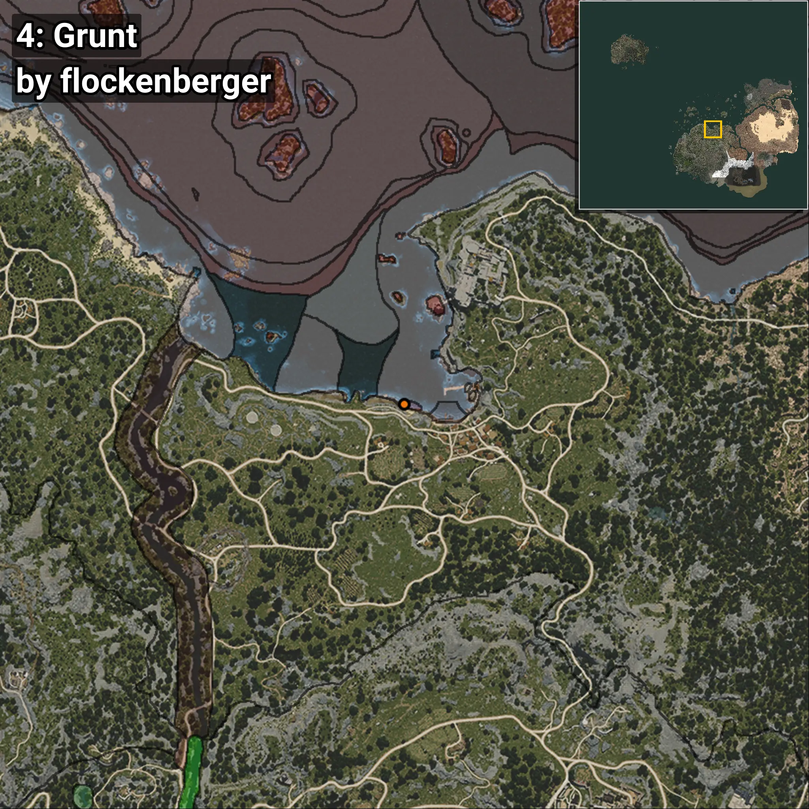

# Grunt
```xml
<!--
    Waypoints for: Grunt
    Created by: flockenberger
-->
<WorldmapBookMark>
    <BookMark BookMarkName="0: Grunt" PosX="-3850.4067" PosY="-8191.3027" PosZ="88050.29" />
    <BookMark BookMarkName="1: Grunt" PosX="-3765.0" PosY="-8217.0" PosZ="88162.0" />
    <BookMark BookMarkName="2: Grunt" PosX="-4558.0" PosY="-8225.0" PosZ="88323.0" />
    <BookMark BookMarkName="3: Grunt" PosX="-4515.0" PosY="-8202.0" PosZ="88194.0" />
    <BookMark BookMarkName="4: Grunt" PosX="-5925.0" PosY="-8232.0" PosZ="88686.0" />
</WorldmapBookMark>
```

## ⚠️ Disclaimer
Waypoints are generated based on the __**character’s position**__ — __not__ where the fishing float landed.
Fish are determined by where your **float** lands!
In ocean spots especially, the direction you cast your rod can place your float in a **different fishing zone**, which may result in catching the wrong type of fish.
Please pay attention to the preview images showing where each location is in relation to the outlined zones.

- You can verify your float’s position using the guide [**HERE**](https://flockenberger.github.io/bdo-fish-position/)
- Or watch the video guide [**HERE**](https://youtu.be/t-VXcRoNojk)

## Previews
      