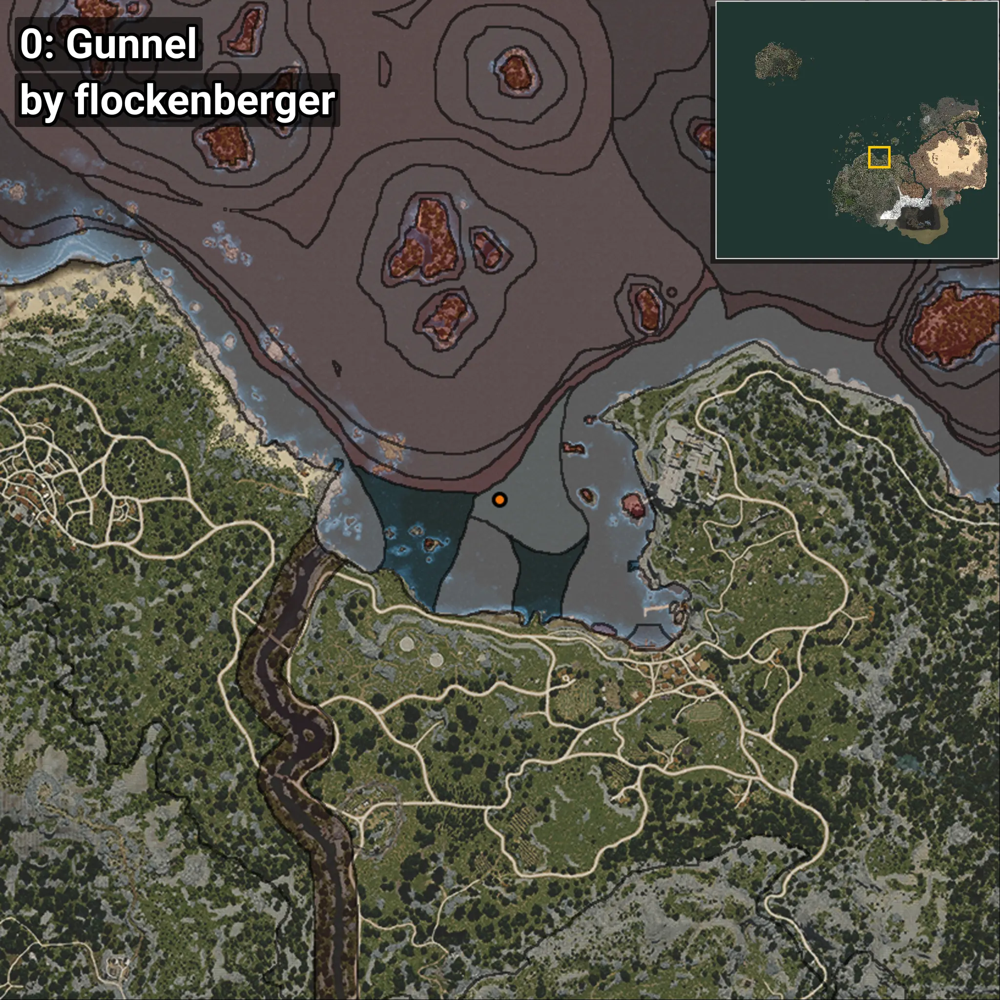
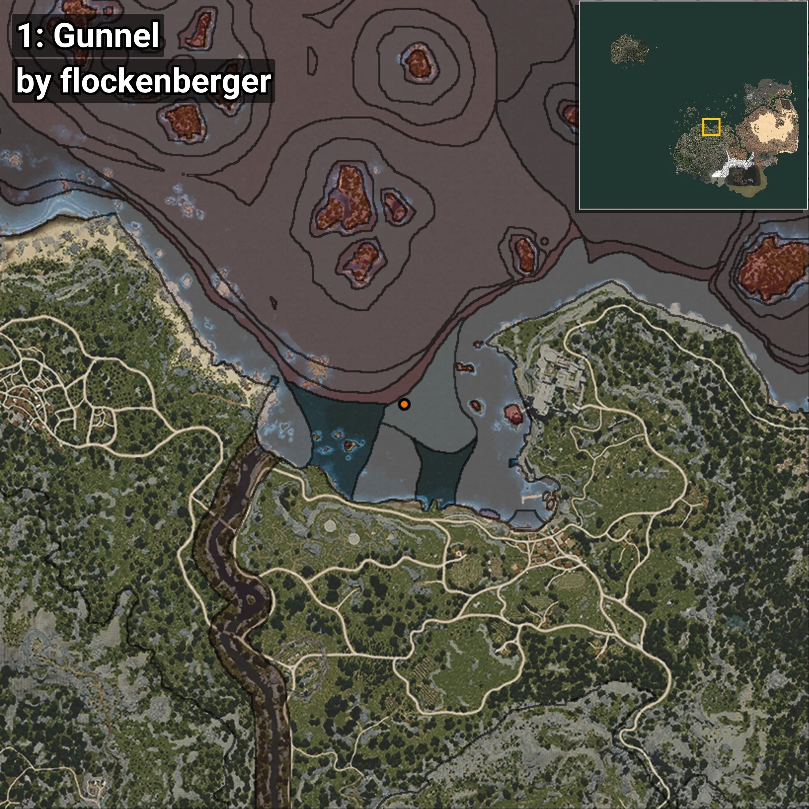
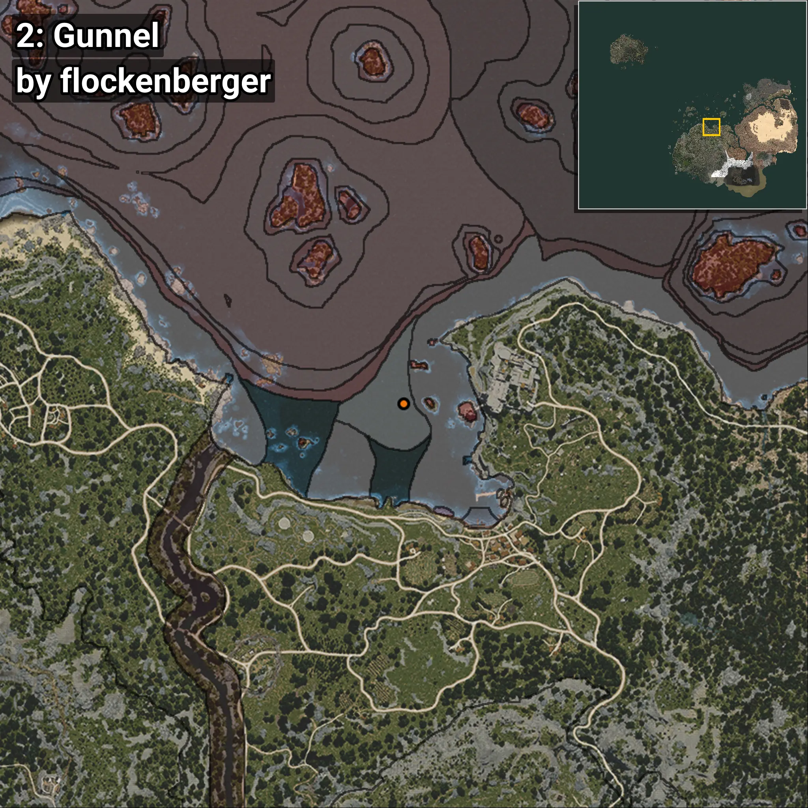
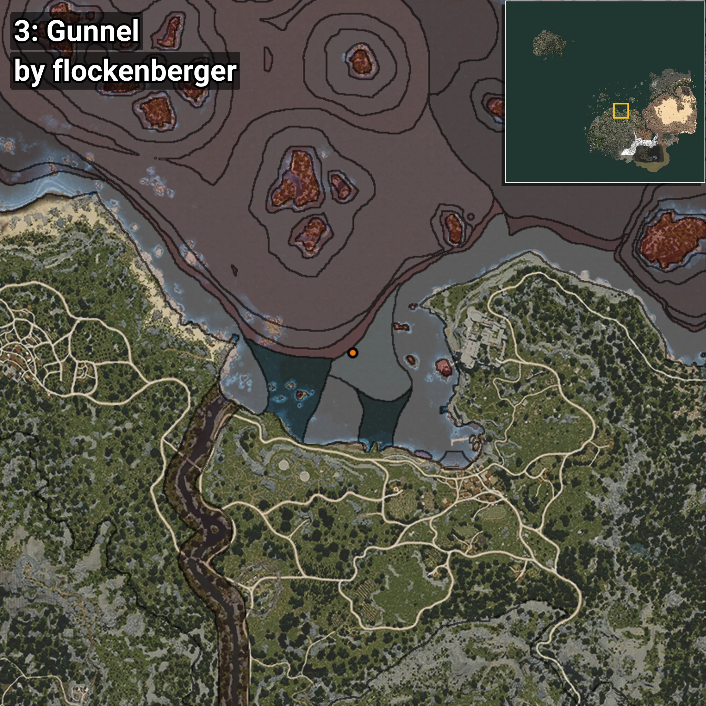

# Gunnel
```xml
<!--
    Waypoints for: Gunnel
    Created by: flockenberger
-->
<WorldmapBookMark>
    <BookMark BookMarkName="0: Gunnel" PosX="-29317.0" PosY="-7904.0" PosZ="120324.0" />
    <BookMark BookMarkName="1: Gunnel" PosX="-29578.0" PosY="-7750.0" PosZ="121885.0" />
    <BookMark BookMarkName="2: Gunnel" PosX="-15856.0" PosY="-7731.0" PosZ="121124.0" />
    <BookMark BookMarkName="3: Gunnel" PosX="-28091.4" PosY="-7887.7153" PosZ="123859.914" />
    <BookMark BookMarkName="4: Gunnel" PosX="-25460.0" PosY="-7754.0" PosZ="127718.0" />
</WorldmapBookMark>
```

## ⚠️ Disclaimer
Waypoints are generated based on the __**character’s position**__ — __not__ where the fishing float landed.
Fish are determined by where your **float** lands!
In ocean spots especially, the direction you cast your rod can place your float in a **different fishing zone**, which may result in catching the wrong type of fish.
Please pay attention to the preview images showing where each location is in relation to the outlined zones.

- You can verify your float’s position using the guide [**HERE**](https://flockenberger.github.io/bdo-fish-position/)
- Or watch the video guide [**HERE**](https://youtu.be/t-VXcRoNojk)

## Previews
      