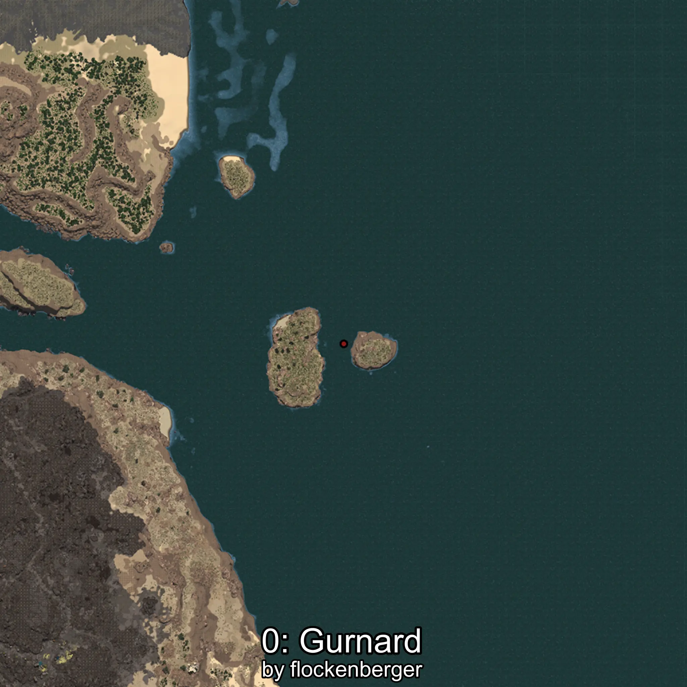
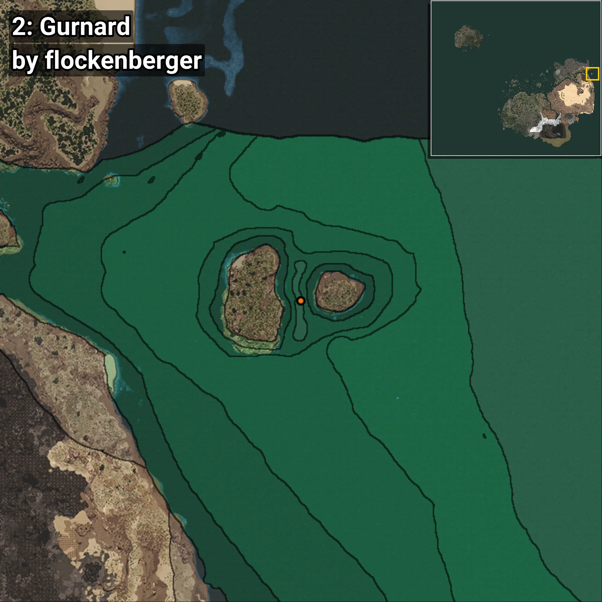
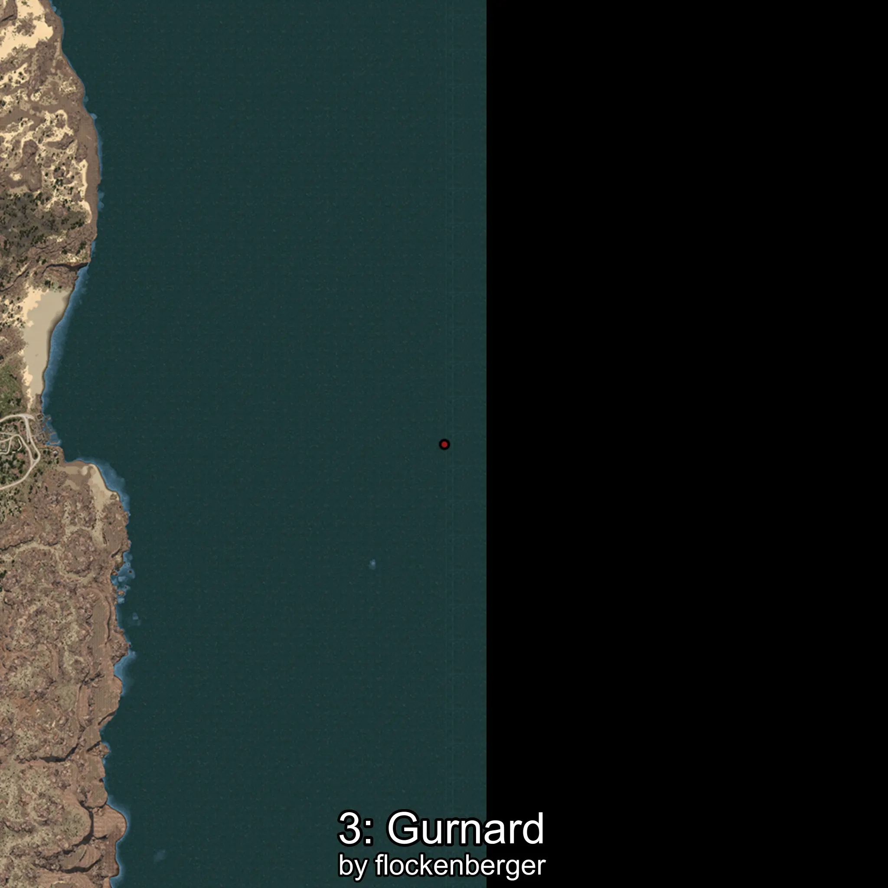
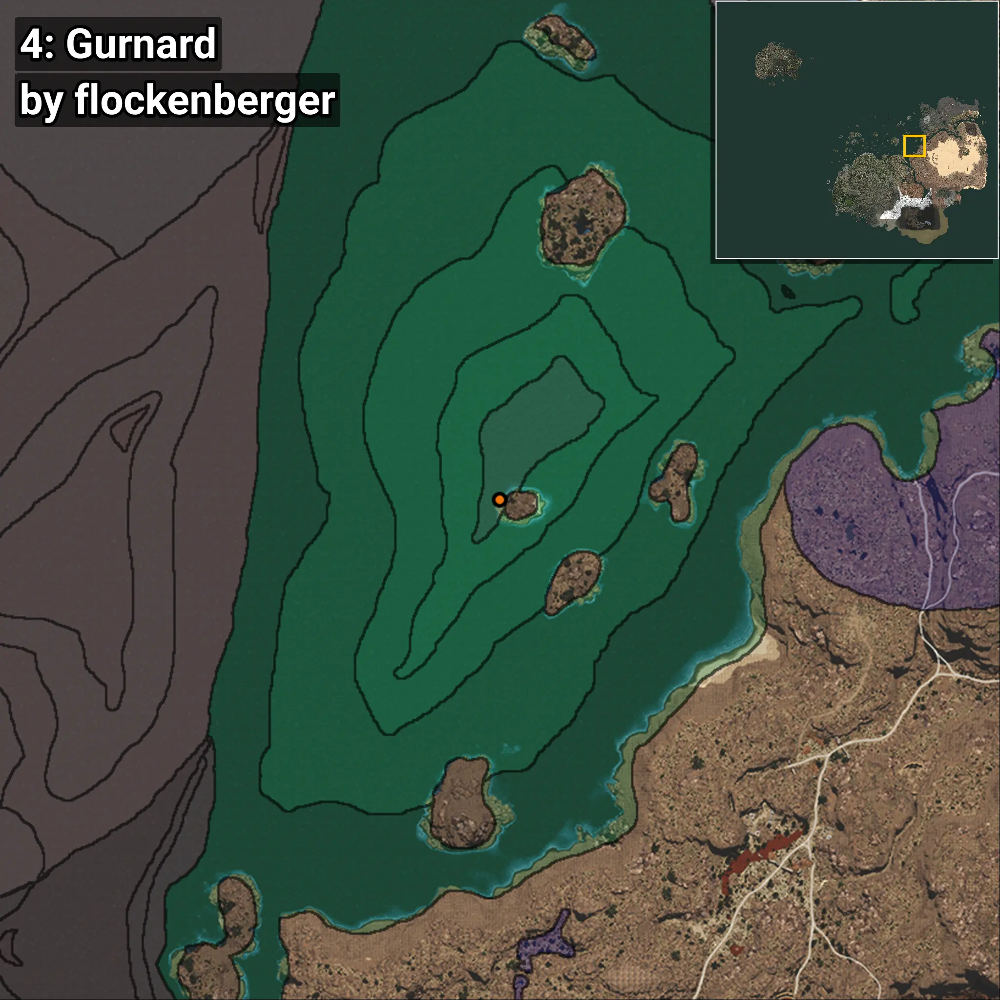
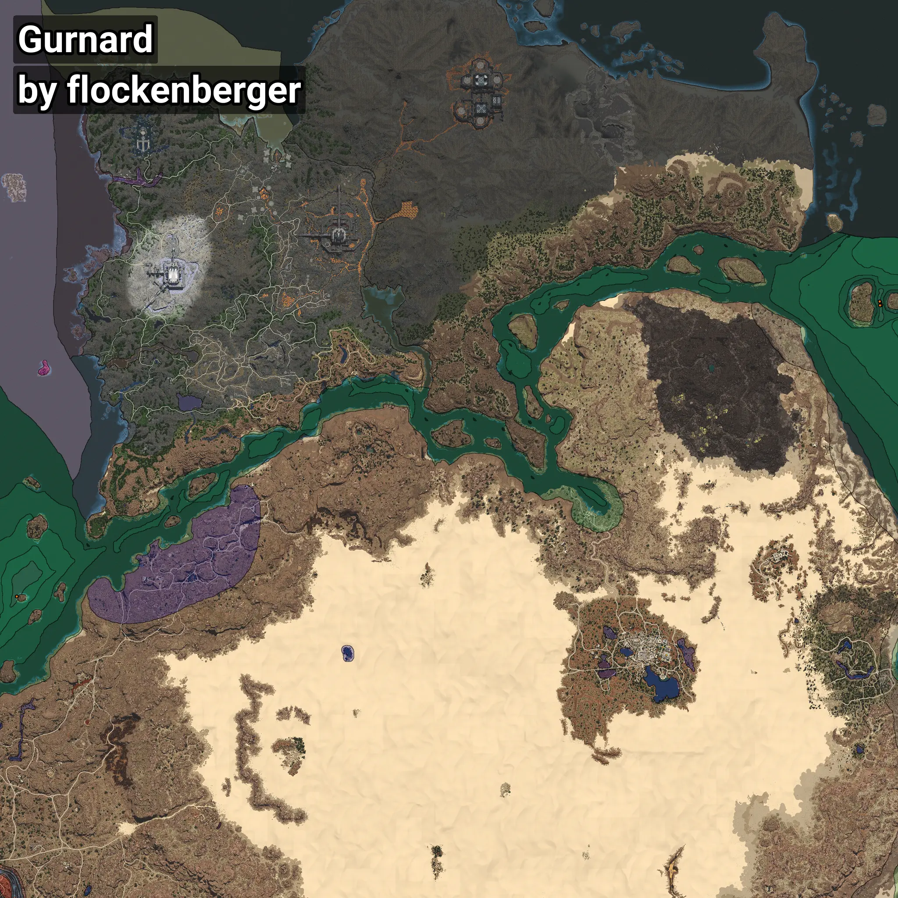

# Gurnard
```xml
<!--
    Waypoints for: Gurnard
    Created by: flockenberger
-->
<WorldmapBookMark>
    <BookMark BookMarkName="0: Gurnard" PosX="1263511.0" PosY="-7915.0" PosZ="551963.0" />
    <BookMark BookMarkName="1: Gurnard" PosX="1263381.0" PosY="-7728.0" PosZ="552470.0" />
    <BookMark BookMarkName="2: Gurnard" PosX="1264767.0" PosY="-7931.0" PosZ="548990.0" />
    <BookMark BookMarkName="3: Gurnard" PosX="1263470.0" PosY="-7838.0" PosZ="548728.0" />
    <BookMark BookMarkName="4: Gurnard" PosX="402465.0" PosY="-7593.0" PosZ="258302.0" />
</WorldmapBookMark>
```

## ⚠️ Disclaimer
Waypoints are generated based on the __**character’s position**__ — __not__ where the fishing float landed.
Fish are determined by where your **float** lands!
In ocean spots especially, the direction you cast your rod can place your float in a **different fishing zone**, which may result in catching the wrong type of fish.
Please pay attention to the preview images showing where each location is in relation to the outlined zones.

- You can verify your float’s position using the guide [**HERE**](https://flockenberger.github.io/bdo-fish-position/)
- Or watch the video guide [**HERE**](https://youtu.be/t-VXcRoNojk)

## Previews
      