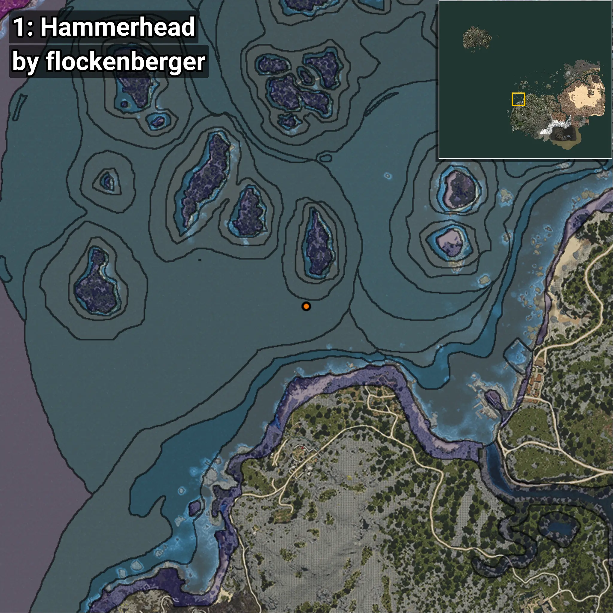
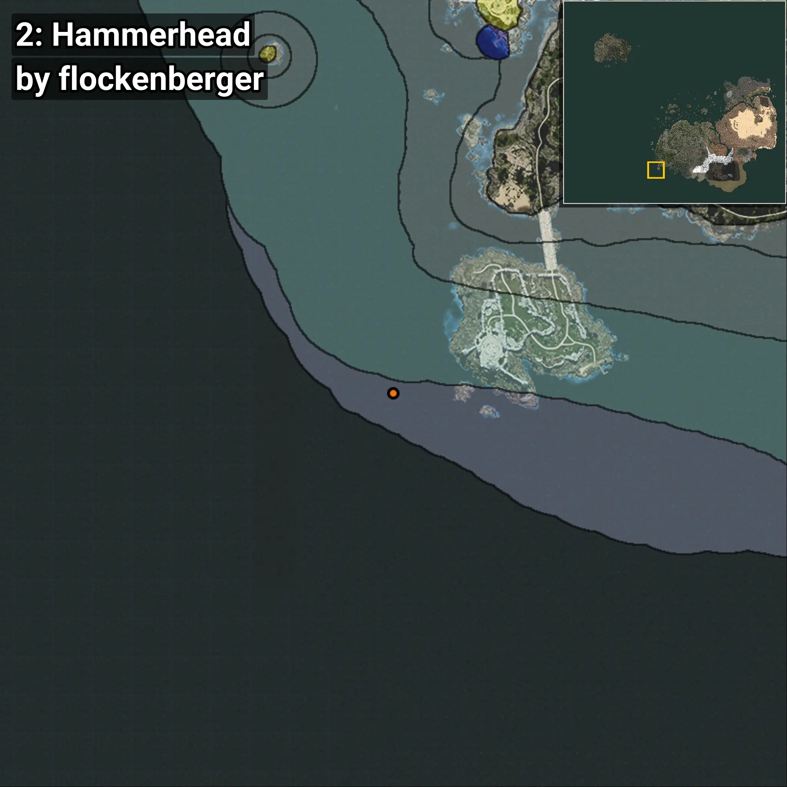
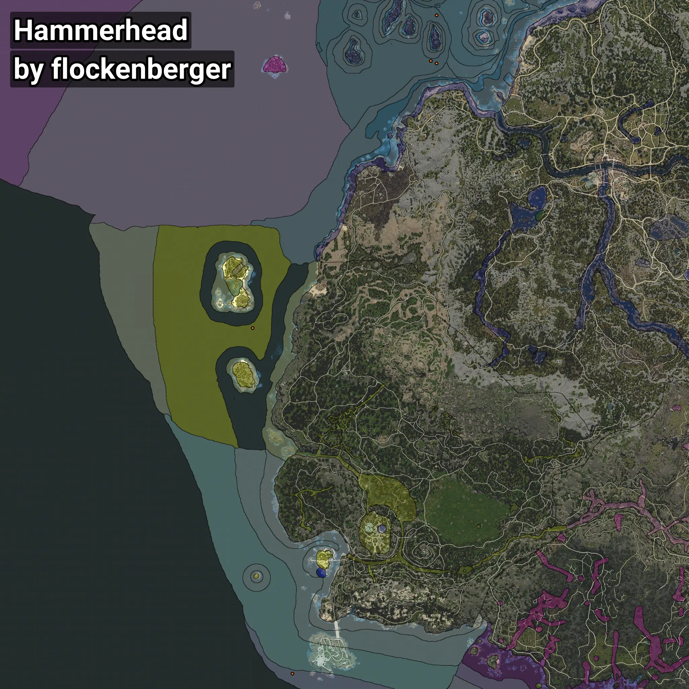

# Hammerhead
```xml
<!--
    Waypoints for: Hammerhead
    Created by: flockenberger
-->
<WorldmapBookMark>
    <BookMark BookMarkName="0: Hammerhead" PosX="-438066.5" PosY="-7915.8735" PosZ="113279.445" />
    <BookMark BookMarkName="1: Hammerhead" PosX="-444271.0" PosY="-8166.0" PosZ="63646.0" />
    <BookMark BookMarkName="2: Hammerhead" PosX="-595318.0" PosY="-7683.0" PosZ="-604169.0" />
    <BookMark BookMarkName="3: Hammerhead" PosX="-438112.0" PosY="-8160.0" PosZ="60871.0" />
    <BookMark BookMarkName="4: Hammerhead" PosX="-638707.0" PosY="-8183.0" PosZ="-227480.0" />
</WorldmapBookMark>
```

## ⚠️ Disclaimer
Waypoints are generated based on the __**character’s position**__ — __not__ where the fishing float landed.
Fish are determined by where your **float** lands!
In ocean spots especially, the direction you cast your rod can place your float in a **different fishing zone**, which may result in catching the wrong type of fish.
Please pay attention to the preview images showing where each location is in relation to the outlined zones.

- You can verify your float’s position using the guide [**HERE**](https://flockenberger.github.io/bdo-fish-position/)
- Or watch the video guide [**HERE**](https://youtu.be/t-VXcRoNojk)

## Previews
      