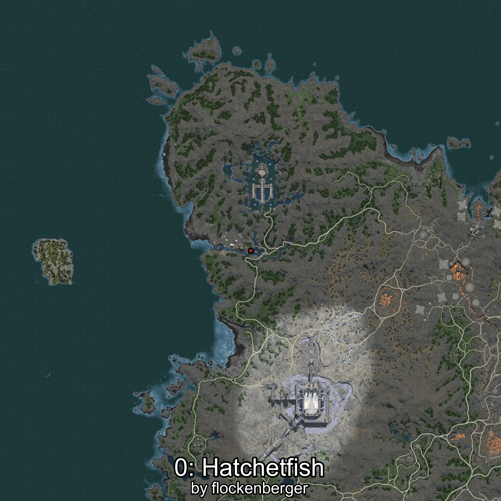
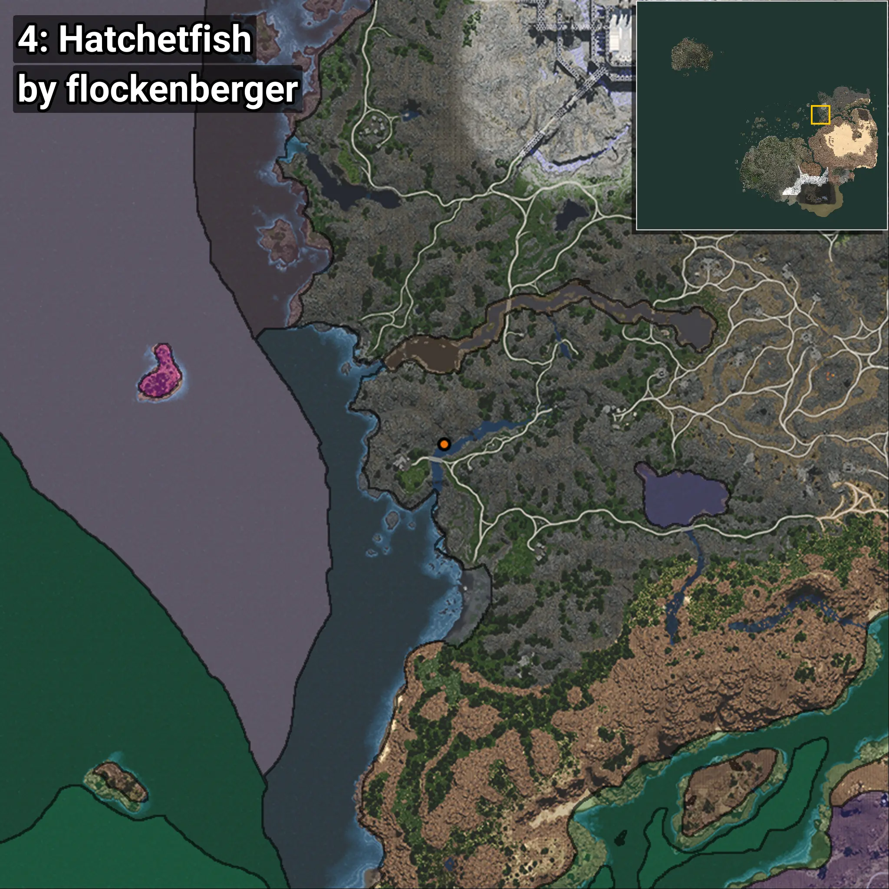

# Hatchetfish
```xml
<!--
    Waypoints for: Hatchetfish
    Created by: flockenberger
-->
<WorldmapBookMark>
    <BookMark BookMarkName="0: Hatchetfish" PosX="526867.2" PosY="-274.3965" PosZ="473352.78" />
    <BookMark BookMarkName="1: Hatchetfish" PosX="525842.6" PosY="-295.2343" PosZ="474460.78" />
    <BookMark BookMarkName="2: Hatchetfish" PosX="525234.7" PosY="-210.25224" PosZ="474266.34" />
    <BookMark BookMarkName="3: Hatchetfish" PosX="525842.6" PosY="-295.2343" PosZ="474460.78" />
    <BookMark BookMarkName="4: Hatchetfish" PosX="508598.0" PosY="-2932.0" PosZ="466221.0" />
</WorldmapBookMark>
```

## ⚠️ Disclaimer
Waypoints are generated based on the __**character’s position**__ — __not__ where the fishing float landed.
Fish are determined by where your **float** lands!
In ocean spots especially, the direction you cast your rod can place your float in a **different fishing zone**, which may result in catching the wrong type of fish.
Please pay attention to the preview images showing where each location is in relation to the outlined zones.

- You can verify your float’s position using the guide [**HERE**](https://flockenberger.github.io/bdo-fish-position/)
- Or watch the video guide [**HERE**](https://youtu.be/t-VXcRoNojk)

## Previews
      