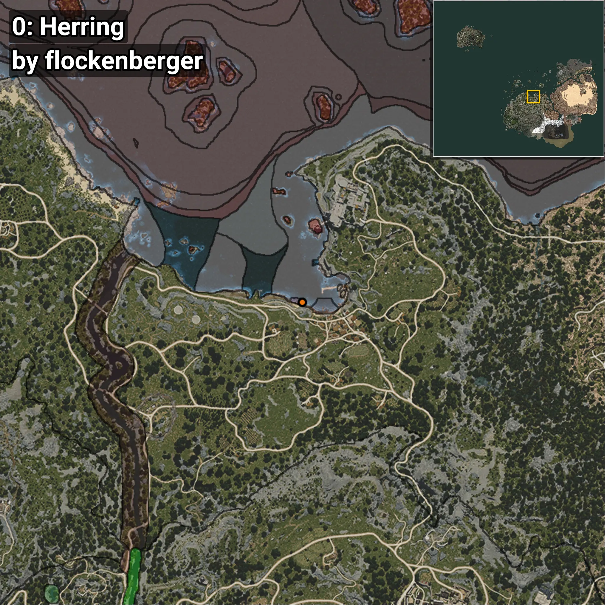
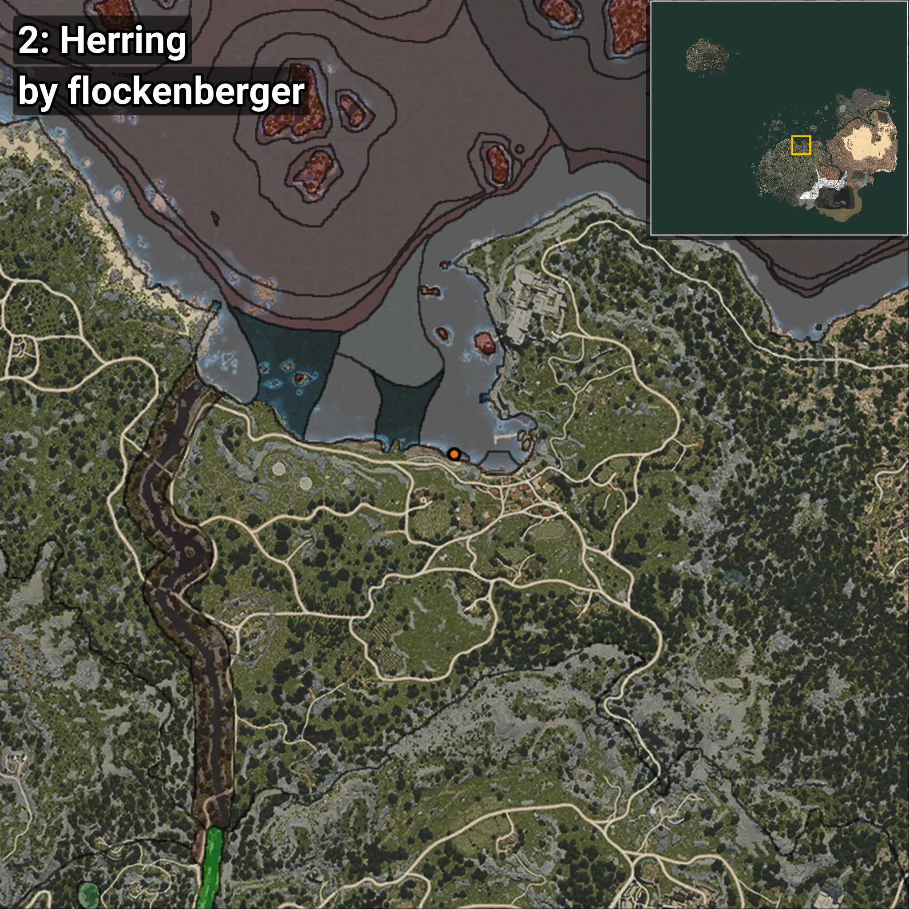
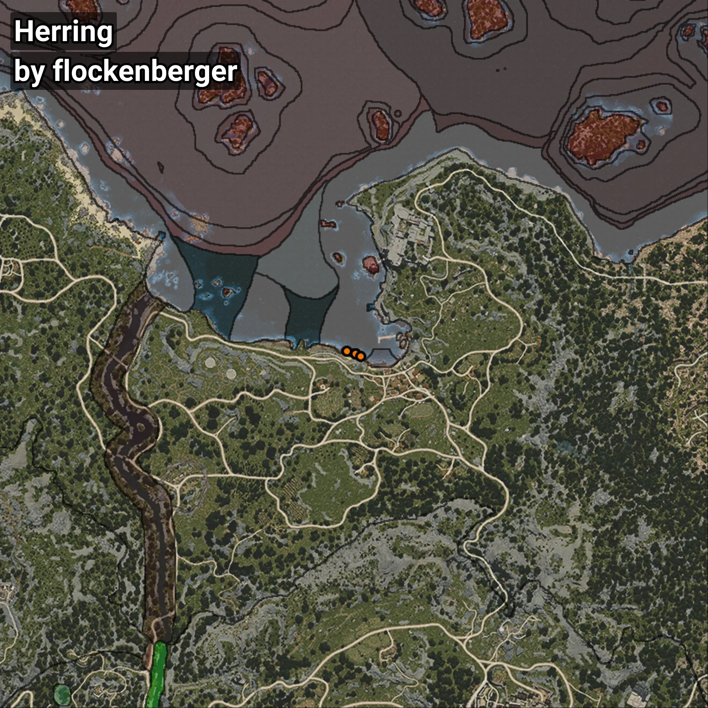

# Herring
```xml
<!--
    Waypoints for: Herring
    Created by: flockenberger
-->
<WorldmapBookMark>
    <BookMark BookMarkName="0: Herring" PosX="-1652.8433" PosY="-8184.597" PosZ="87784.69" />
    <BookMark BookMarkName="1: Herring" PosX="-1717.0" PosY="-8206.0" PosZ="87863.0" />
    <BookMark BookMarkName="2: Herring" PosX="-4630.0" PosY="-8294.0" PosZ="88708.0" />
    <BookMark BookMarkName="3: Herring" PosX="-1764.961" PosY="-8194.429" PosZ="87834.39" />
    <BookMark BookMarkName="4: Herring" PosX="52.0" PosY="-8142.0" PosZ="87011.0" />
</WorldmapBookMark>
```

## ⚠️ Disclaimer
Waypoints are generated based on the __**character’s position**__ — __not__ where the fishing float landed.
Fish are determined by where your **float** lands!
In ocean spots especially, the direction you cast your rod can place your float in a **different fishing zone**, which may result in catching the wrong type of fish.
Please pay attention to the preview images showing where each location is in relation to the outlined zones.

- You can verify your float’s position using the guide [**HERE**](https://flockenberger.github.io/bdo-fish-position/)
- Or watch the video guide [**HERE**](https://youtu.be/t-VXcRoNojk)

## Previews
      