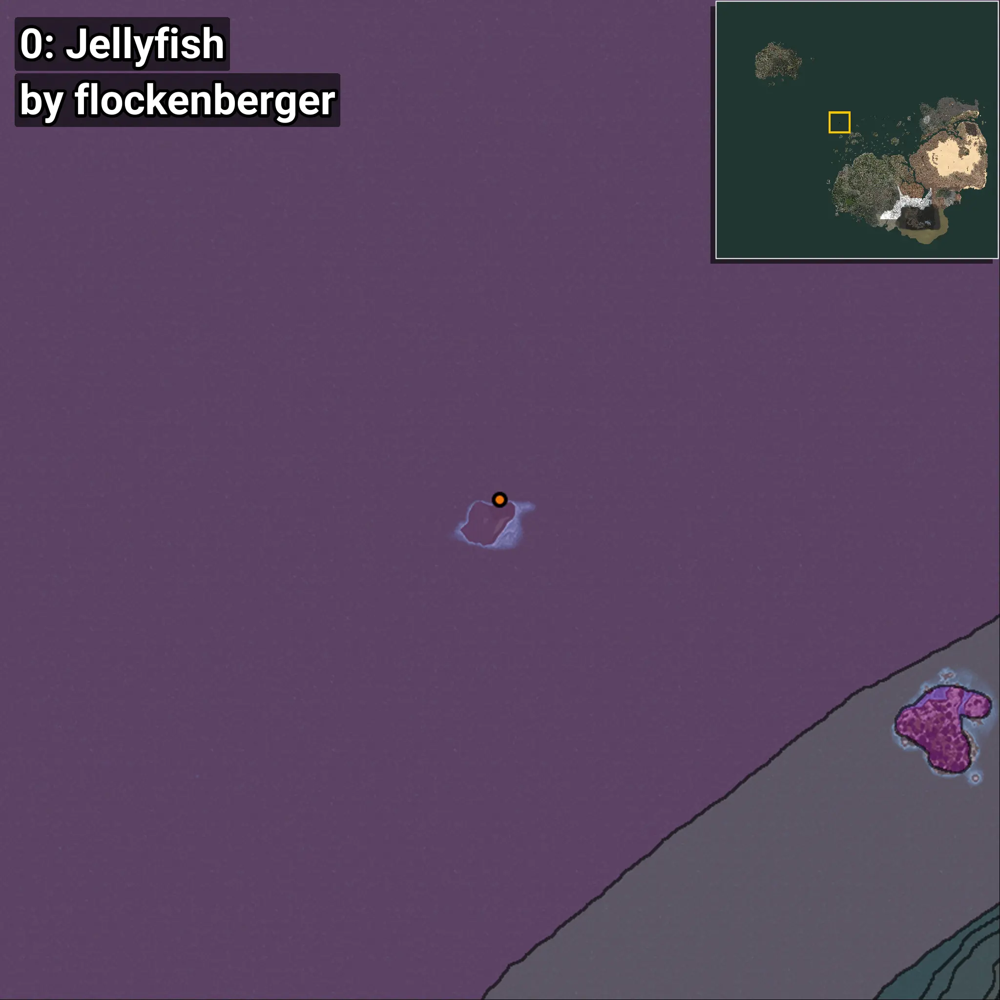
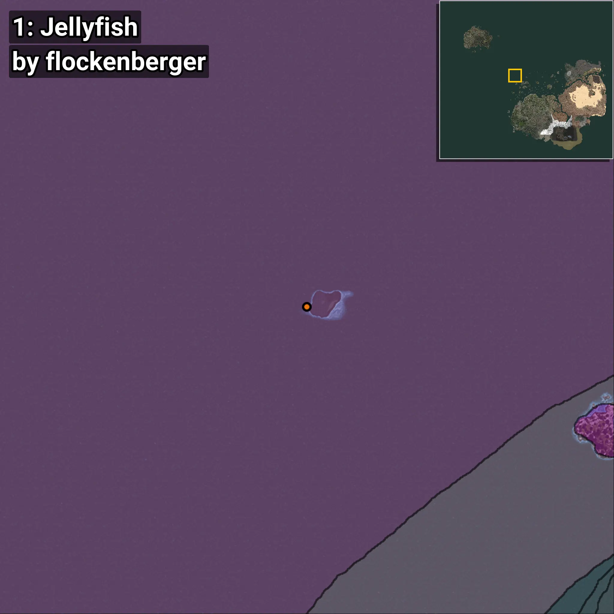
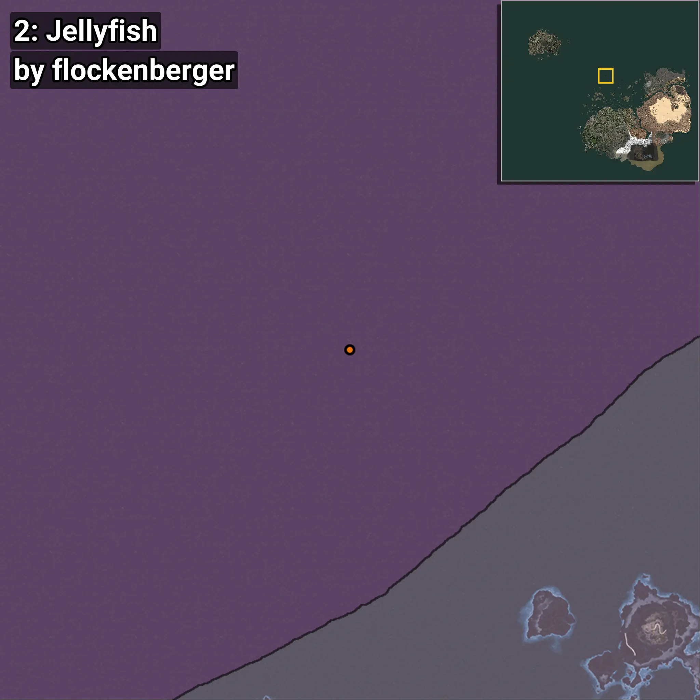
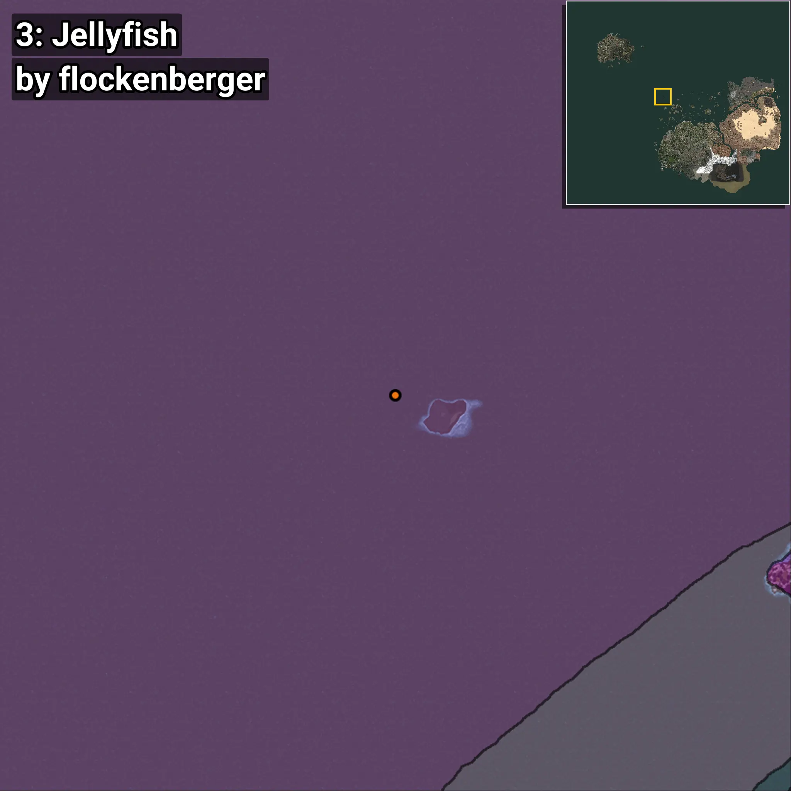

# Jellyfish
```xml
<!--
    Waypoints for: Jellyfish
    Created by: flockenberger
-->
<WorldmapBookMark>
    <BookMark BookMarkName="0: Jellyfish" PosX="-520761.0" PosY="-7973.0" PosZ="549502.0" />
    <BookMark BookMarkName="1: Jellyfish" PosX="-530962.0" PosY="-7844.0" PosZ="542567.0" />
    <BookMark BookMarkName="2: Jellyfish" PosX="-201764.0" PosY="-7791.0" PosZ="723887.0" />
    <BookMark BookMarkName="3: Jellyfish" PosX="-539231.0" PosY="-7725.0" PosZ="550531.0" />
    <BookMark BookMarkName="4: Jellyfish" PosX="-379080.47" PosY="-8208.0" PosZ="572800.0" />
</WorldmapBookMark>
```

## ⚠️ Disclaimer
Waypoints are generated based on the __**character’s position**__ — __not__ where the fishing float landed.
Fish are determined by where your **float** lands!
In ocean spots especially, the direction you cast your rod can place your float in a **different fishing zone**, which may result in catching the wrong type of fish.
Please pay attention to the preview images showing where each location is in relation to the outlined zones.

- You can verify your float’s position using the guide [**HERE**](https://flockenberger.github.io/bdo-fish-position/)
- Or watch the video guide [**HERE**](https://youtu.be/t-VXcRoNojk)

## Previews
      