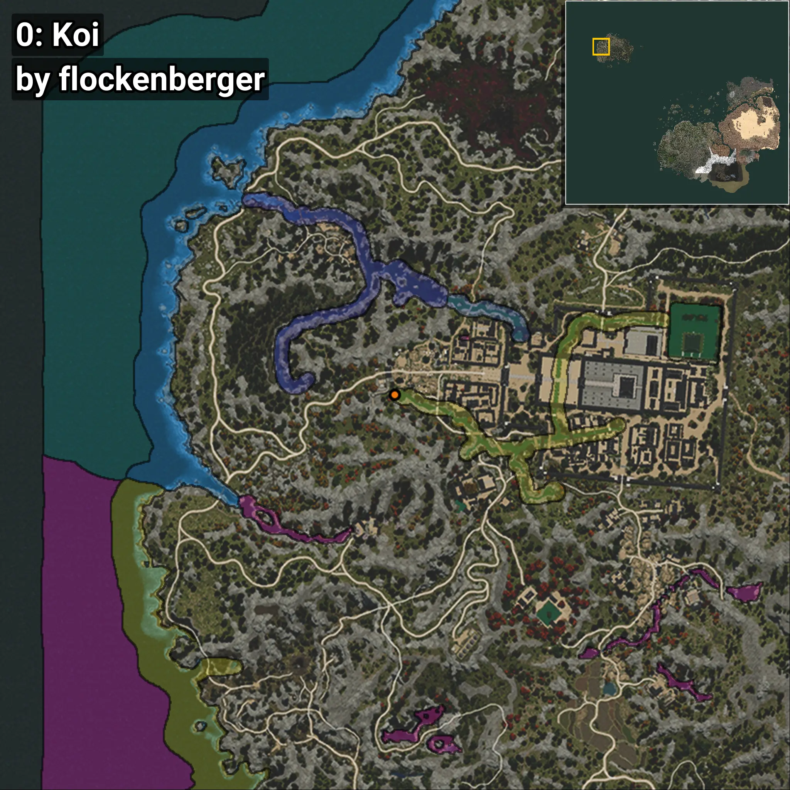
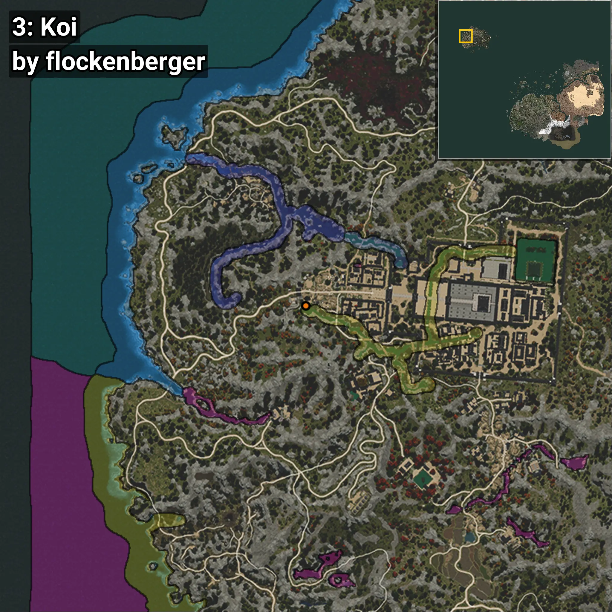
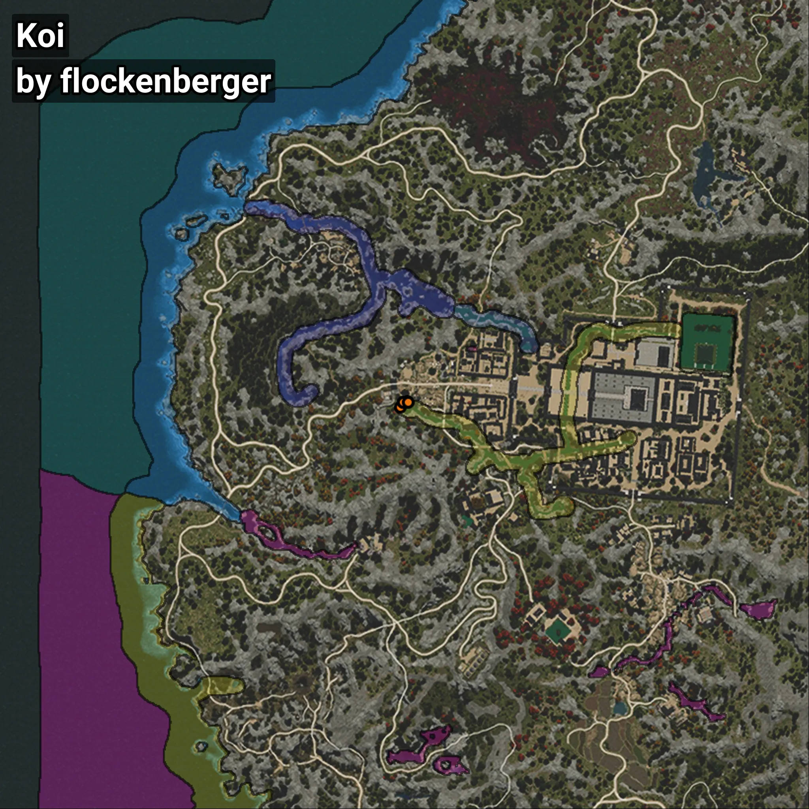

# Koi
```xml
<!--
    Waypoints for: Koi
    Created by: flockenberger
-->
<WorldmapBookMark>
    <BookMark BookMarkName="0: Koi" PosX="-1490024.0" PosY="11069.0" PosZ="1330741.0" />
    <BookMark BookMarkName="1: Koi" PosX="-1489171.0" PosY="11234.0" PosZ="1332290.0" />
    <BookMark BookMarkName="2: Koi" PosX="-1487846.0" PosY="11180.0" PosZ="1332463.0" />
    <BookMark BookMarkName="3: Koi" PosX="-1489132.4" PosY="11231.792" PosZ="1332315.4" />
    <BookMark BookMarkName="4: Koi" PosX="-1487653.0" PosY="11180.0" PosZ="1332358.0" />
</WorldmapBookMark>
```

## ⚠️ Disclaimer
Waypoints are generated based on the __**character’s position**__ — __not__ where the fishing float landed.
Fish are determined by where your **float** lands!
In ocean spots especially, the direction you cast your rod can place your float in a **different fishing zone**, which may result in catching the wrong type of fish.
Please pay attention to the preview images showing where each location is in relation to the outlined zones.

- You can verify your float’s position using the guide [**HERE**](https://flockenberger.github.io/bdo-fish-position/)
- Or watch the video guide [**HERE**](https://youtu.be/t-VXcRoNojk)

## Previews
      