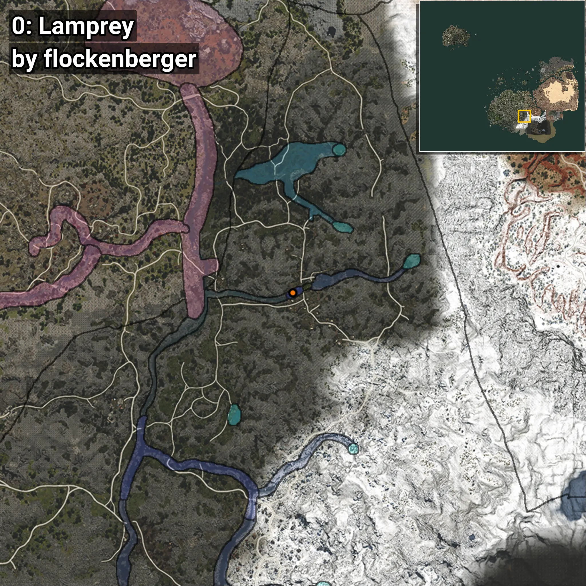
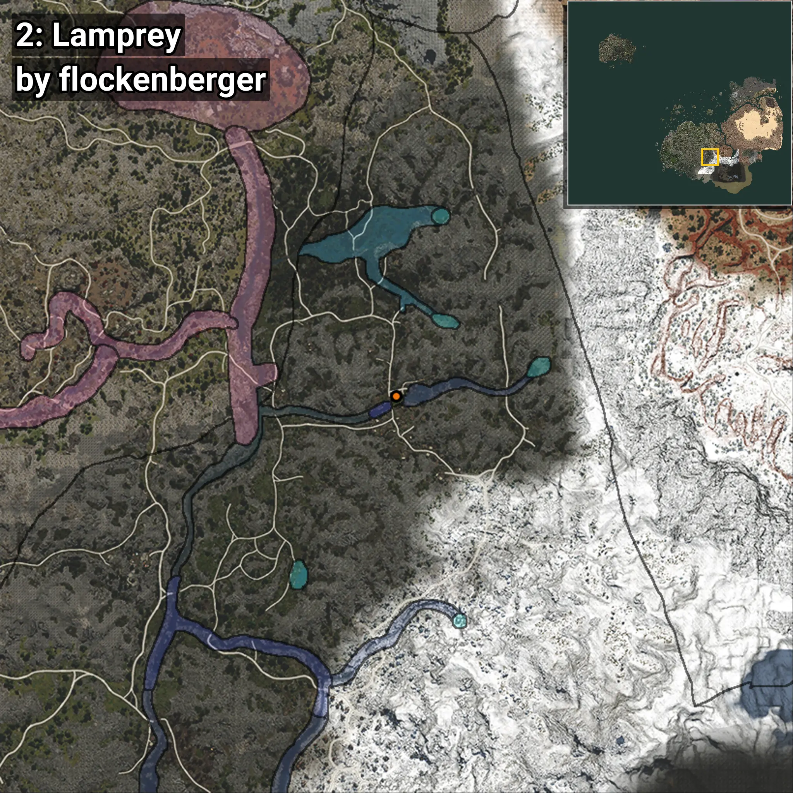
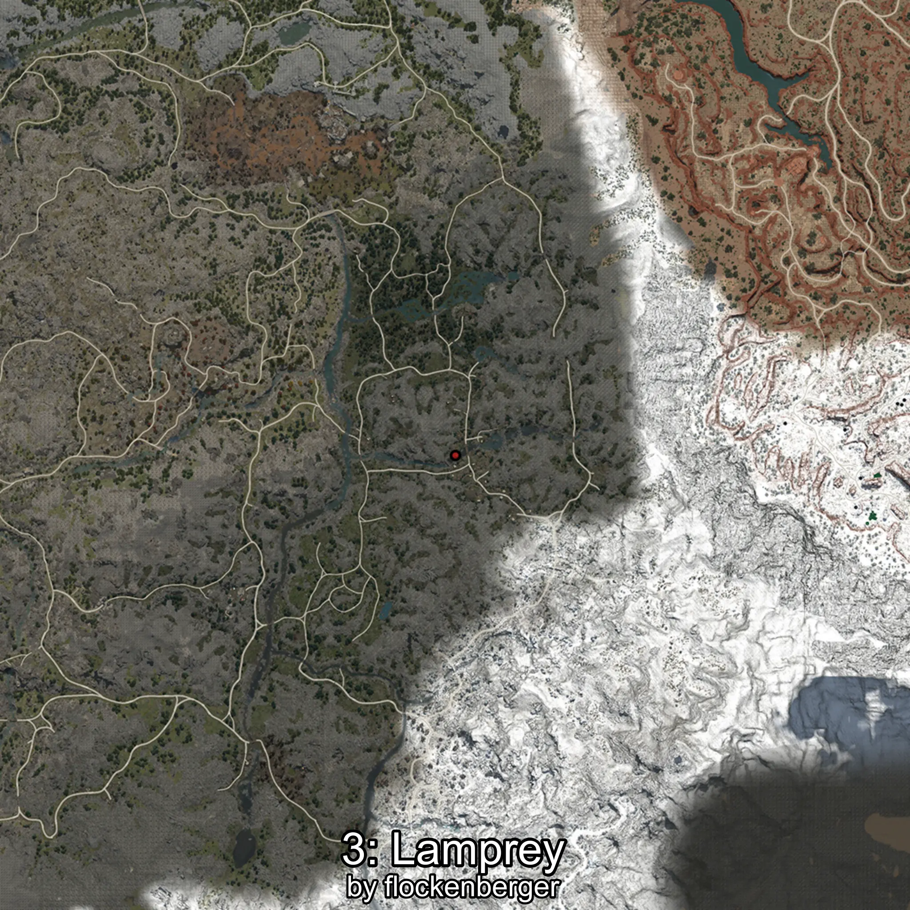
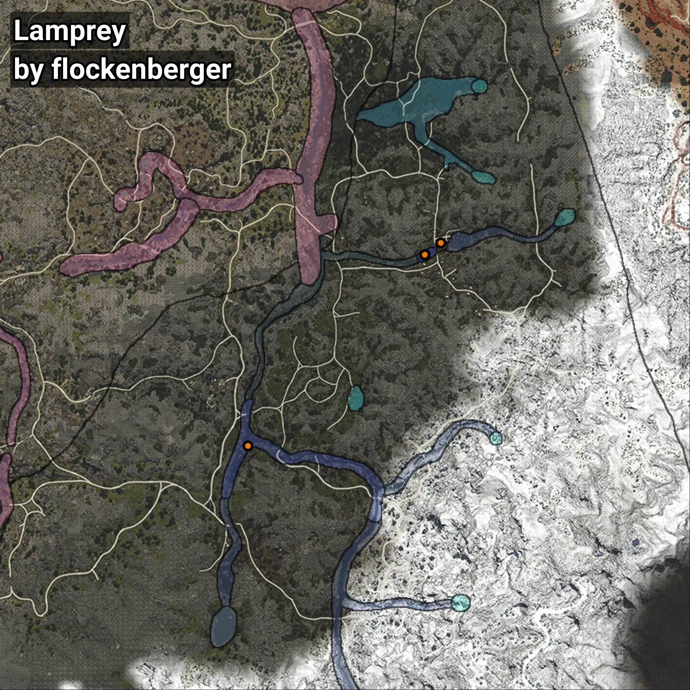

# Lamprey
```xml
<!--
    Waypoints for: Lamprey
    Created by: flockenberger
-->
<WorldmapBookMark>
    <BookMark BookMarkName="0: Lamprey" PosX="163411.25" PosY="15942.57" PosZ="-387065.78" />
    <BookMark BookMarkName="1: Lamprey" PosX="163381.0" PosY="15942.0" PosZ="-387028.0" />
    <BookMark BookMarkName="2: Lamprey" PosX="169227.0" PosY="16027.0" PosZ="-382894.0" />
    <BookMark BookMarkName="3: Lamprey" PosX="163372.0" PosY="15942.0" PosZ="-387032.0" />
    <BookMark BookMarkName="4: Lamprey" PosX="100070.0" PosY="14087.0" PosZ="-455587.0" />
</WorldmapBookMark>
```

## ⚠️ Disclaimer
Waypoints are generated based on the __**character’s position**__ — __not__ where the fishing float landed.
Fish are determined by where your **float** lands!
In ocean spots especially, the direction you cast your rod can place your float in a **different fishing zone**, which may result in catching the wrong type of fish.
Please pay attention to the preview images showing where each location is in relation to the outlined zones.

- You can verify your float’s position using the guide [**HERE**](https://flockenberger.github.io/bdo-fish-position/)
- Or watch the video guide [**HERE**](https://youtu.be/t-VXcRoNojk)

## Previews
      