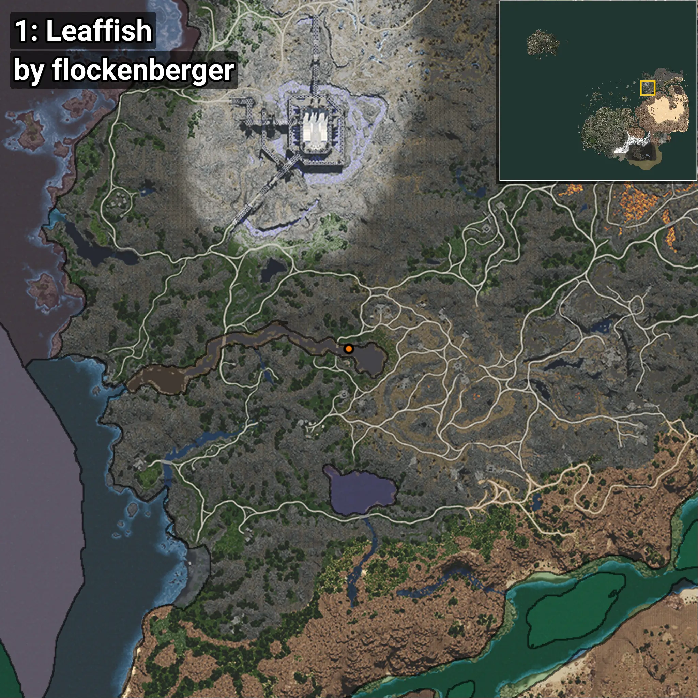
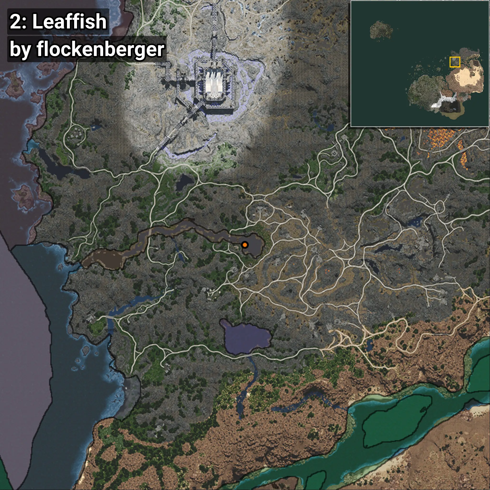
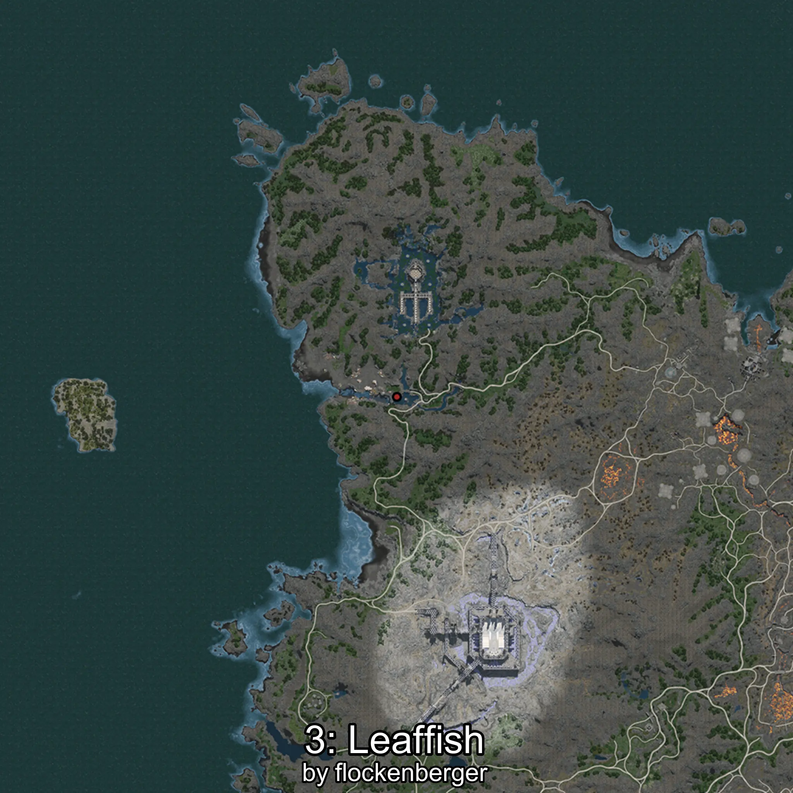
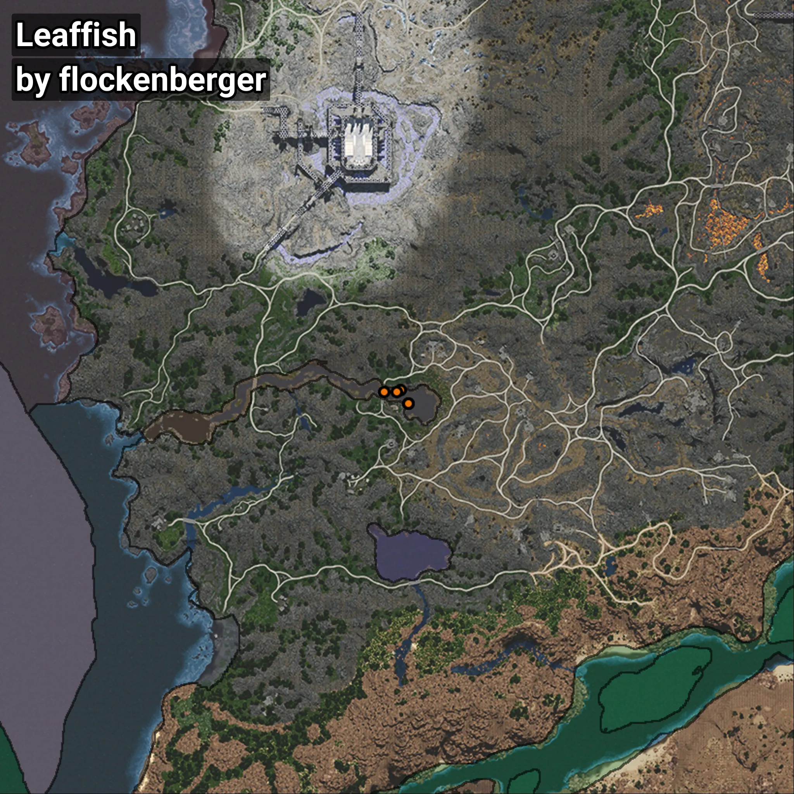

# Leaffish
```xml
<!--
    Waypoints for: Leaffish
    Created by: flockenberger
-->
<WorldmapBookMark>
    <BookMark BookMarkName="0: Leaffish" PosX="571789.2" PosY="908.7968" PosZ="502516.5" />
    <BookMark BookMarkName="1: Leaffish" PosX="570524.7" PosY="1064.9218" PosZ="501910.84" />
    <BookMark BookMarkName="2: Leaffish" PosX="574223.9" PosY="899.29535" PosZ="498282.44" />
    <BookMark BookMarkName="3: Leaffish" PosX="574227.0" PosY="895.0" PosZ="498327.0" />
    <BookMark BookMarkName="4: Leaffish" PosX="566703.0" PosY="907.0" PosZ="501891.0" />
</WorldmapBookMark>
```

## ⚠️ Disclaimer
Waypoints are generated based on the __**character’s position**__ — __not__ where the fishing float landed.
Fish are determined by where your **float** lands!
In ocean spots especially, the direction you cast your rod can place your float in a **different fishing zone**, which may result in catching the wrong type of fish.
Please pay attention to the preview images showing where each location is in relation to the outlined zones.

- You can verify your float’s position using the guide [**HERE**](https://flockenberger.github.io/bdo-fish-position/)
- Or watch the video guide [**HERE**](https://youtu.be/t-VXcRoNojk)

## Previews
      