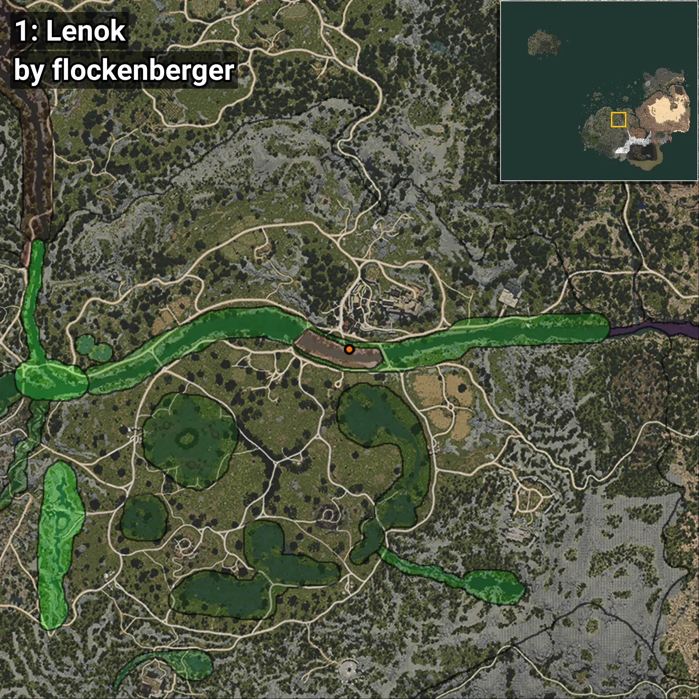
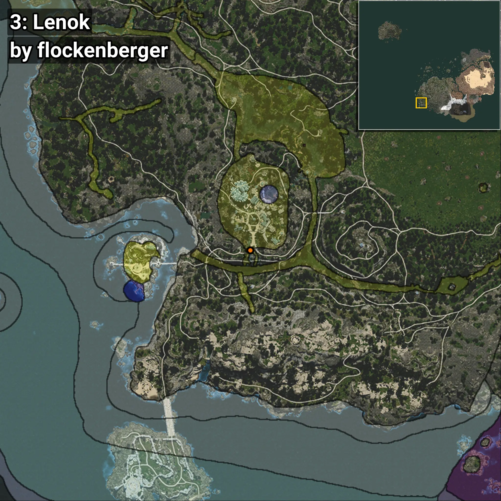
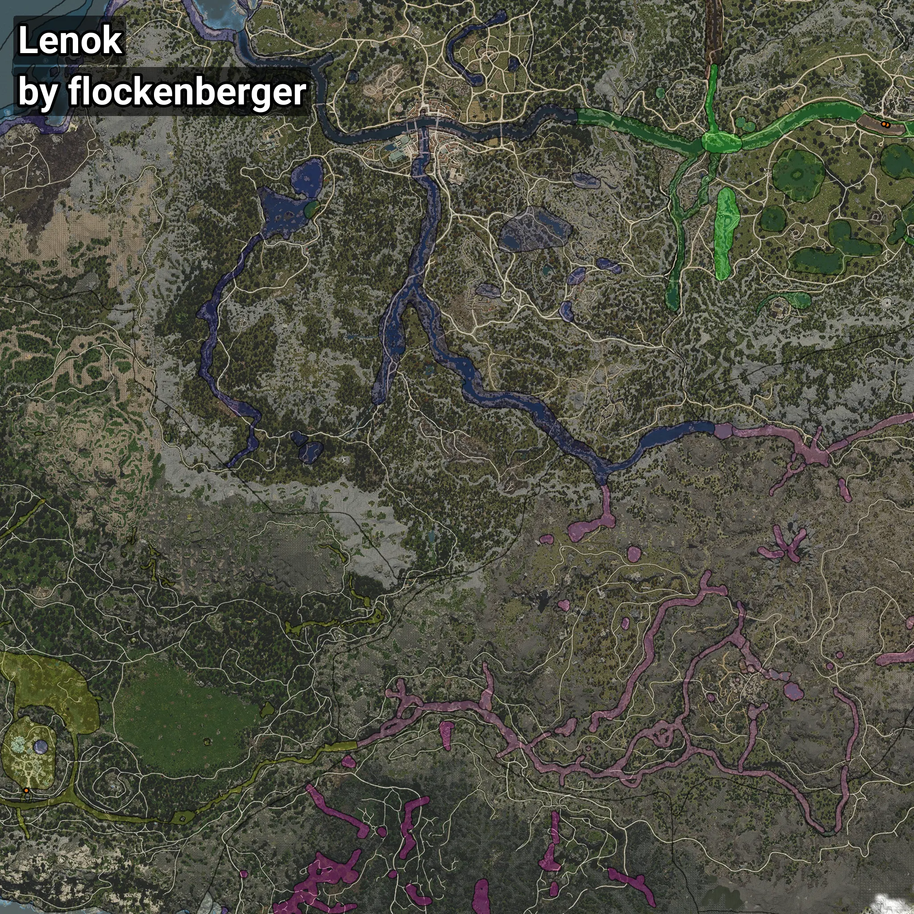

# Lenok
```xml
<!--
    Waypoints for: Lenok
    Created by: flockenberger
-->
<WorldmapBookMark>
    <BookMark BookMarkName="0: Lenok" PosX="40530.0" PosY="-3458.0" PosZ="-51770.0" />
    <BookMark BookMarkName="1: Lenok" PosX="40150.0" PosY="-3900.0" PosZ="-51452.0" />
    <BookMark BookMarkName="2: Lenok" PosX="-506628.8" PosY="5863.095" PosZ="-474296.88" />
    <BookMark BookMarkName="3: Lenok" PosX="-506612.0" PosY="5865.0" PosZ="-474323.0" />
    <BookMark BookMarkName="4: Lenok" PosX="38087.0" PosY="-3993.0" PosZ="-50602.0" />
</WorldmapBookMark>
```

## ⚠️ Disclaimer
Waypoints are generated based on the __**character’s position**__ — __not__ where the fishing float landed.
Fish are determined by where your **float** lands!
In ocean spots especially, the direction you cast your rod can place your float in a **different fishing zone**, which may result in catching the wrong type of fish.
Please pay attention to the preview images showing where each location is in relation to the outlined zones.

- You can verify your float’s position using the guide [**HERE**](https://flockenberger.github.io/bdo-fish-position/)
- Or watch the video guide [**HERE**](https://youtu.be/t-VXcRoNojk)

## Previews
      