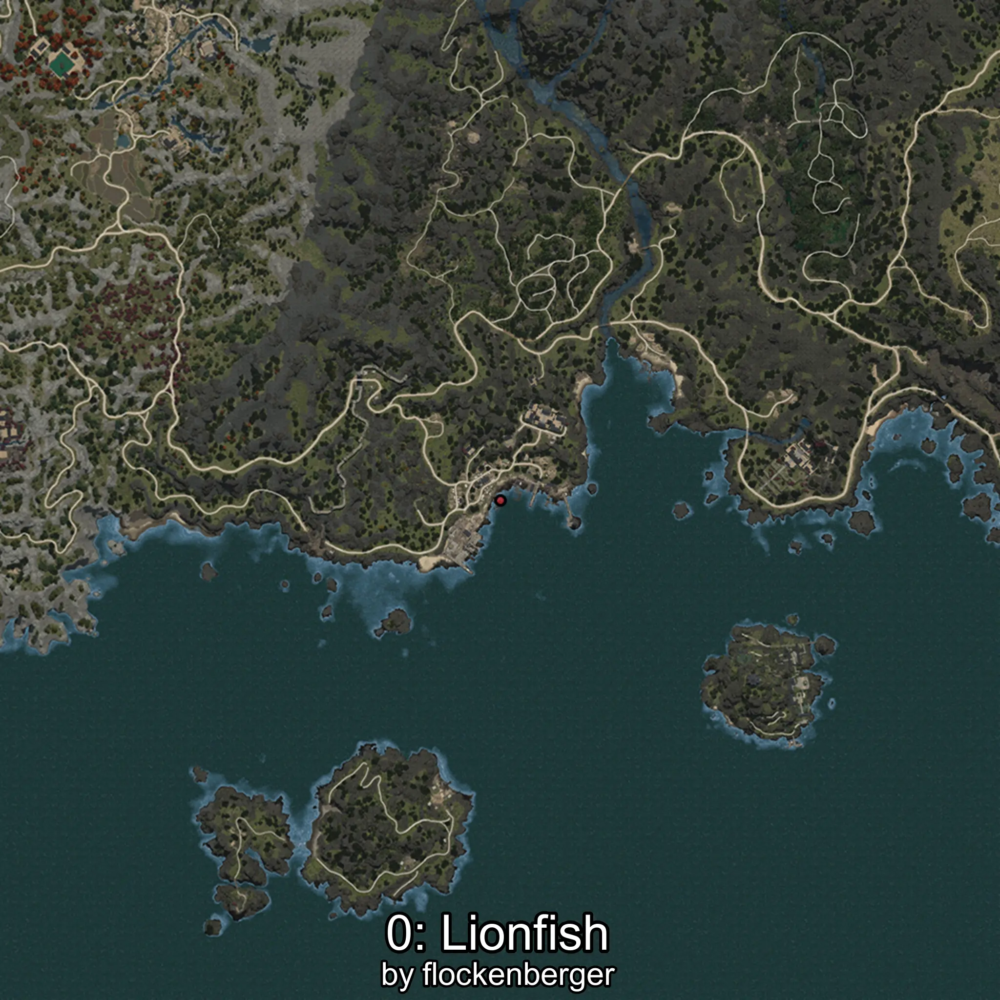
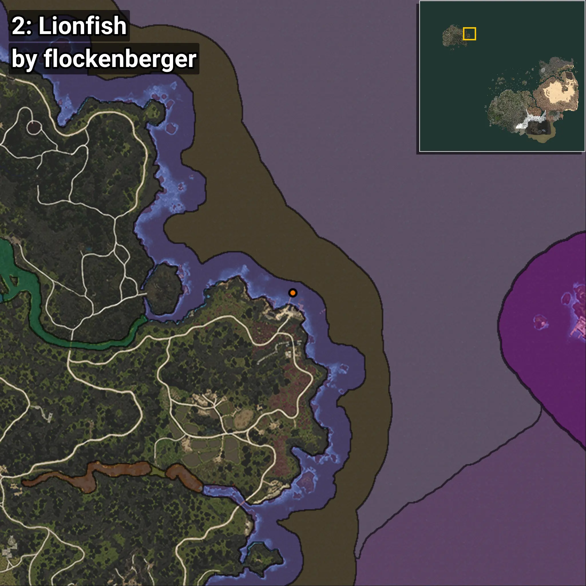

# Lionfish
```xml
<!--
    Waypoints for: Lionfish
    Created by: flockenberger
-->
<WorldmapBookMark>
    <BookMark BookMarkName="0: Lionfish" PosX="-1214665.0" PosY="-7757.0" PosZ="1052727.0" />
    <BookMark BookMarkName="1: Lionfish" PosX="-1214213.0" PosY="-7759.0" PosZ="1052755.0" />
    <BookMark BookMarkName="2: Lionfish" PosX="-994251.0" PosY="-7883.0" PosZ="1348887.0" />
    <BookMark BookMarkName="3: Lionfish" PosX="-994232.0" PosY="-7883.0" PosZ="1348852.0" />
    <BookMark BookMarkName="4: Lionfish" PosX="-1306619.9" PosY="-8101.782" PosZ="1127583.2" />
</WorldmapBookMark>
```

## ⚠️ Disclaimer
Waypoints are generated based on the __**character’s position**__ — __not__ where the fishing float landed.
Fish are determined by where your **float** lands!
In ocean spots especially, the direction you cast your rod can place your float in a **different fishing zone**, which may result in catching the wrong type of fish.
Please pay attention to the preview images showing where each location is in relation to the outlined zones.

- You can verify your float’s position using the guide [**HERE**](https://flockenberger.github.io/bdo-fish-position/)
- Or watch the video guide [**HERE**](https://youtu.be/t-VXcRoNojk)

## Previews
      