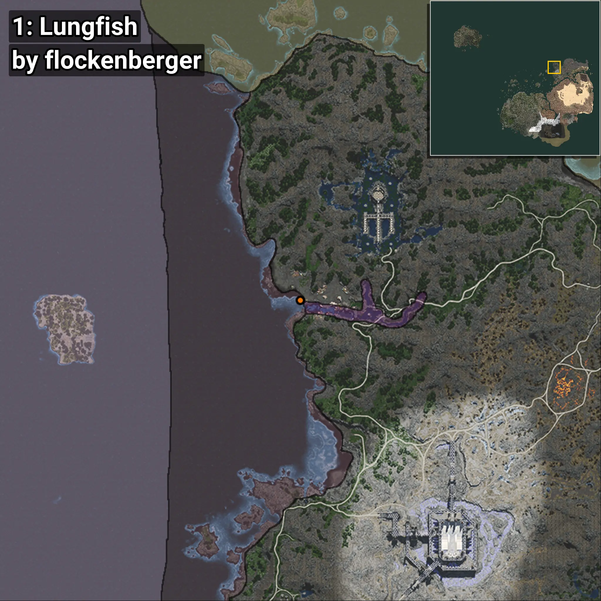
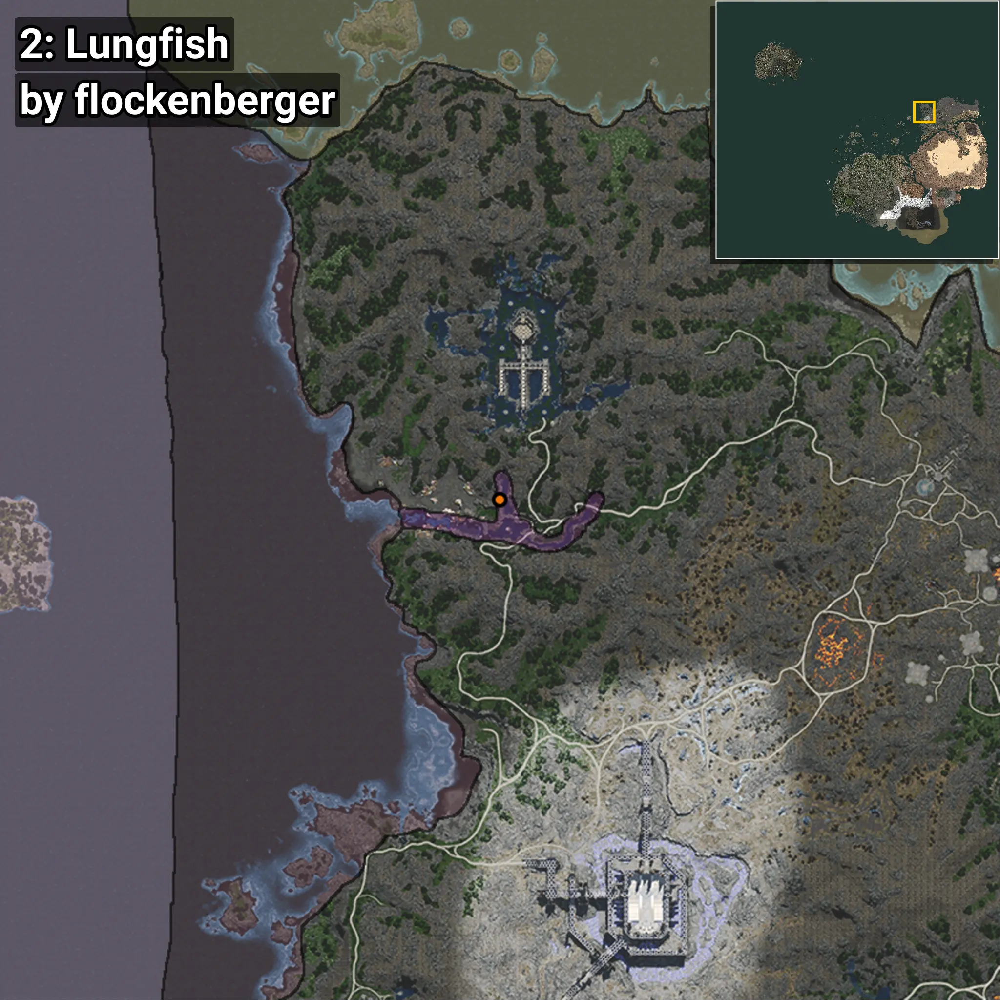

# Lungfish
```xml
<!--
    Waypoints for: Lungfish
    Created by: flockenberger
-->
<WorldmapBookMark>
    <BookMark BookMarkName="0: Lungfish" PosX="495996.38" PosY="-8205.909" PosZ="678292.25" />
    <BookMark BookMarkName="1: Lungfish" PosX="496433.4" PosY="-8201.688" PosZ="677814.6" />
    <BookMark BookMarkName="2: Lungfish" PosX="522803.0" PosY="-4742.0" PosZ="679426.0" />
    <BookMark BookMarkName="3: Lungfish" PosX="496368.25" PosY="-8216.989" PosZ="677746.0" />
    <BookMark BookMarkName="4: Lungfish" PosX="522544.0" PosY="-6154.0" PosZ="673390.0" />
</WorldmapBookMark>
```

## ⚠️ Disclaimer
Waypoints are generated based on the __**character’s position**__ — __not__ where the fishing float landed.
Fish are determined by where your **float** lands!
In ocean spots especially, the direction you cast your rod can place your float in a **different fishing zone**, which may result in catching the wrong type of fish.
Please pay attention to the preview images showing where each location is in relation to the outlined zones.

- You can verify your float’s position using the guide [**HERE**](https://flockenberger.github.io/bdo-fish-position/)
- Or watch the video guide [**HERE**](https://youtu.be/t-VXcRoNojk)

## Previews
      