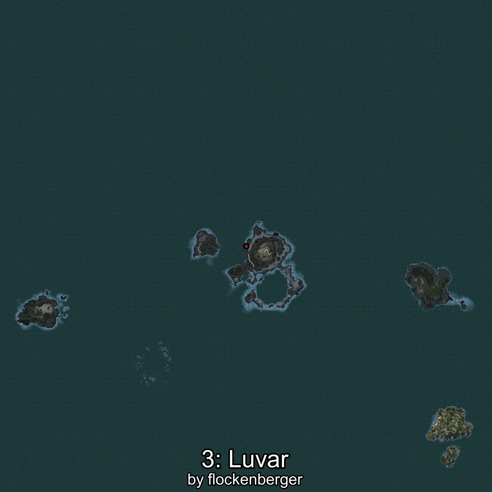
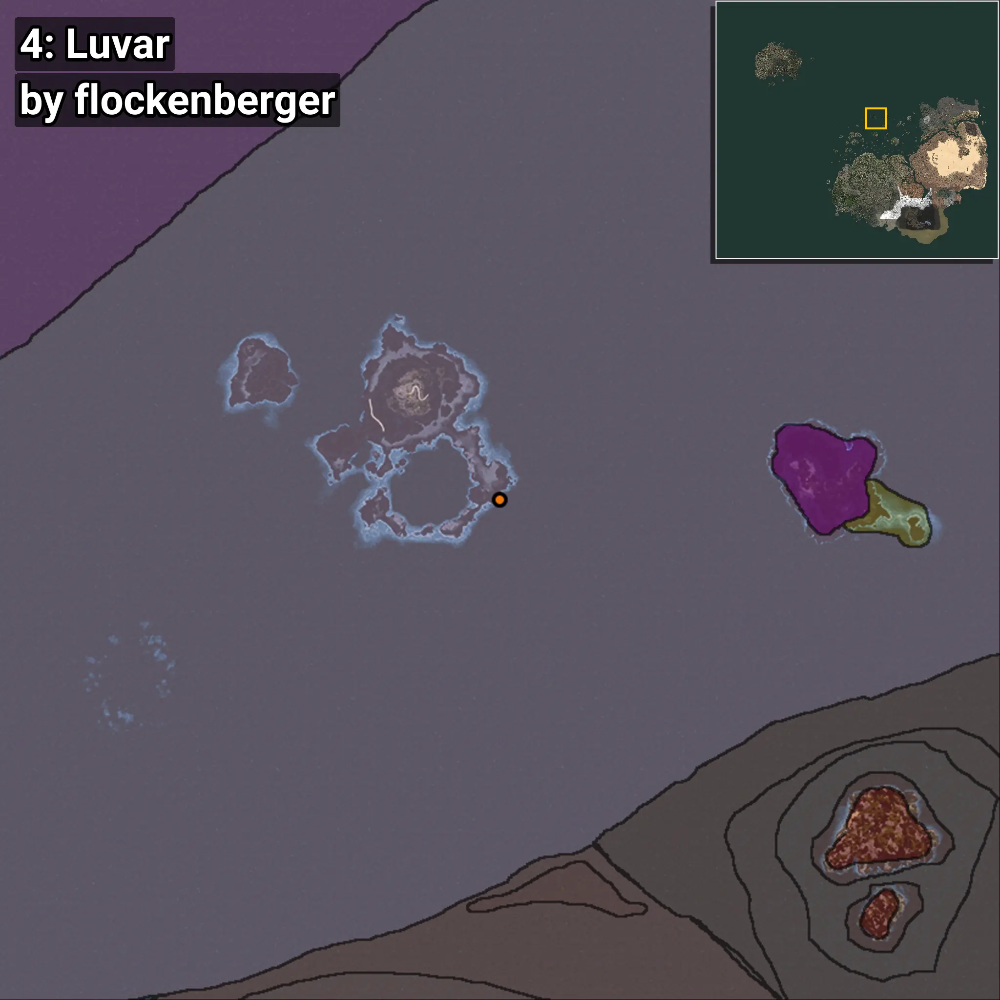
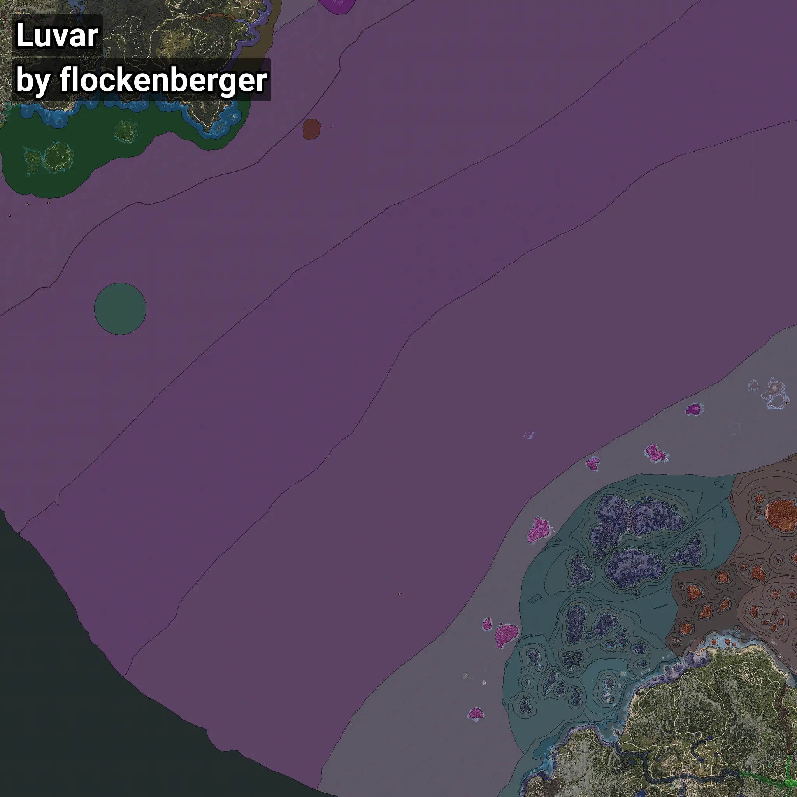

# Luvar
```xml
<!--
    Waypoints for: Luvar
    Created by: flockenberger
-->
<WorldmapBookMark>
    <BookMark BookMarkName="0: Luvar" PosX="-1394637.2" PosY="-7453.5225" PosZ="945050.0" />
    <BookMark BookMarkName="1: Luvar" PosX="-1358752.0" PosY="-7622.0" PosZ="948026.0" />
    <BookMark BookMarkName="2: Luvar" PosX="-747966.0" PosY="-7614.0" PosZ="266734.0" />
    <BookMark BookMarkName="3: Luvar" PosX="-1426508.2" PosY="-7620.55" PosZ="925430.06" />
    <BookMark BookMarkName="4: Luvar" PosX="-72567.88" PosY="-8056.3906" PosZ="599223.75" />
</WorldmapBookMark>
```

## ⚠️ Disclaimer
Waypoints are generated based on the __**character’s position**__ — __not__ where the fishing float landed.
Fish are determined by where your **float** lands!
In ocean spots especially, the direction you cast your rod can place your float in a **different fishing zone**, which may result in catching the wrong type of fish.
Please pay attention to the preview images showing where each location is in relation to the outlined zones.

- You can verify your float’s position using the guide [**HERE**](https://flockenberger.github.io/bdo-fish-position/)
- Or watch the video guide [**HERE**](https://youtu.be/t-VXcRoNojk)

## Previews
      