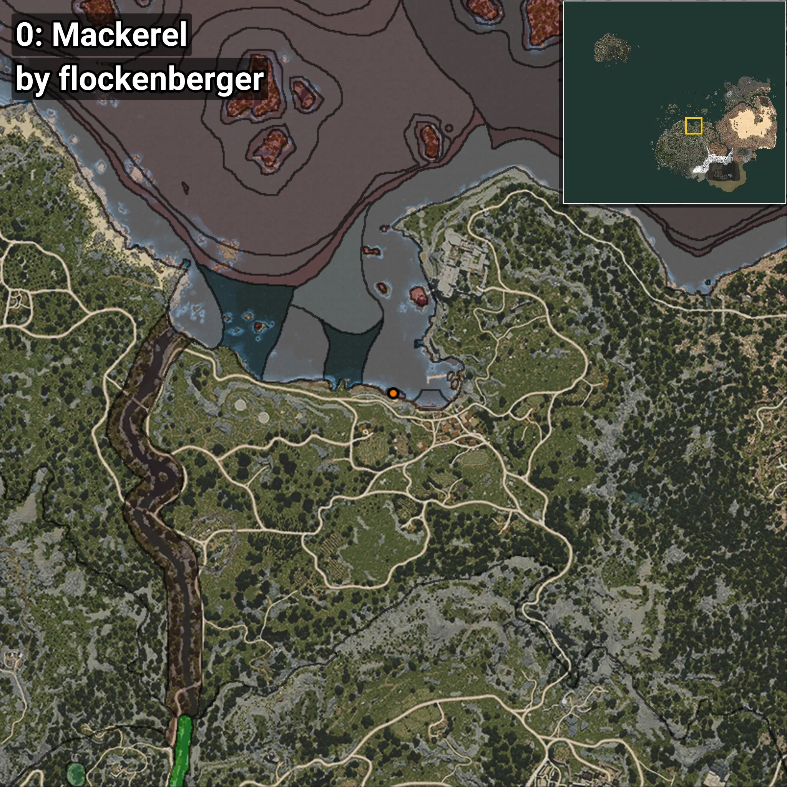
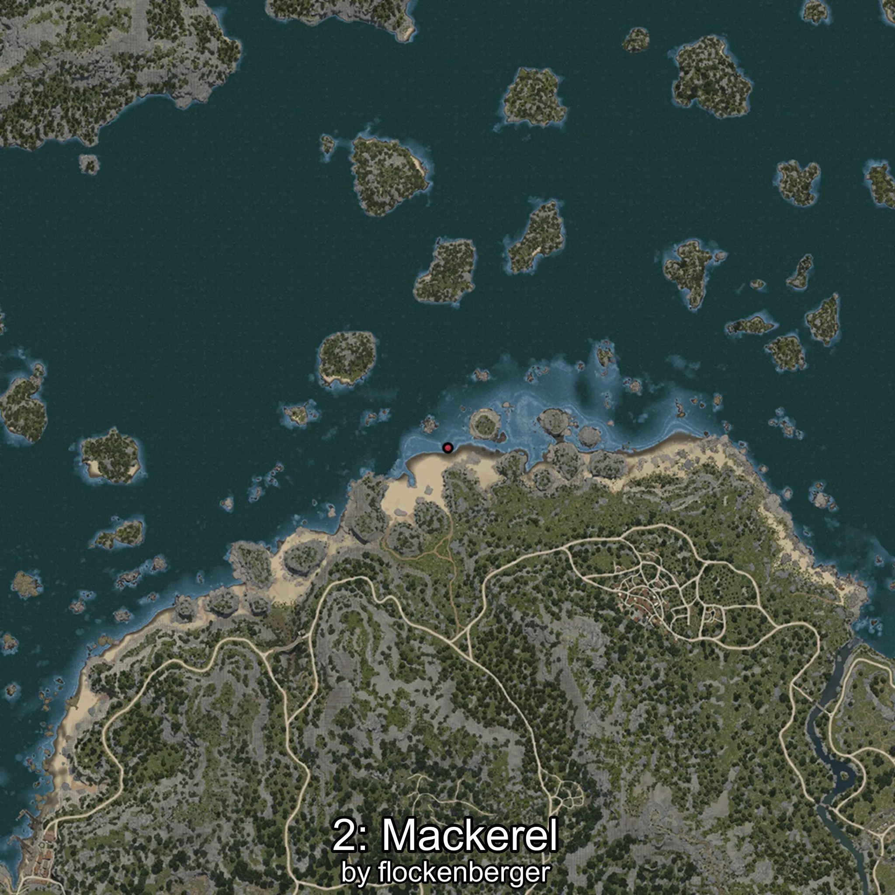

# Mackerel
```xml
<!--
    Waypoints for: Mackerel
    Created by: flockenberger
-->
<WorldmapBookMark>
    <BookMark BookMarkName="0: Mackerel" PosX="-4502.0" PosY="-8242.0" PosZ="88403.0" />
    <BookMark BookMarkName="1: Mackerel" PosX="-4526.5703" PosY="-8256.327" PosZ="88480.31" />
    <BookMark BookMarkName="2: Mackerel" PosX="-2735.992" PosY="-8193.472" PosZ="87969.7" />
    <BookMark BookMarkName="3: Mackerel" PosX="-2730.6006" PosY="-8194.088" PosZ="87972.68" />
    <BookMark BookMarkName="4: Mackerel" PosX="-3048.0" PosY="-8297.0" PosZ="88426.0" />
</WorldmapBookMark>
```

## ⚠️ Disclaimer
Waypoints are generated based on the __**character’s position**__ — __not__ where the fishing float landed.
Fish are determined by where your **float** lands!
In ocean spots especially, the direction you cast your rod can place your float in a **different fishing zone**, which may result in catching the wrong type of fish.
Please pay attention to the preview images showing where each location is in relation to the outlined zones.

- You can verify your float’s position using the guide [**HERE**](https://flockenberger.github.io/bdo-fish-position/)
- Or watch the video guide [**HERE**](https://youtu.be/t-VXcRoNojk)

## Previews
      