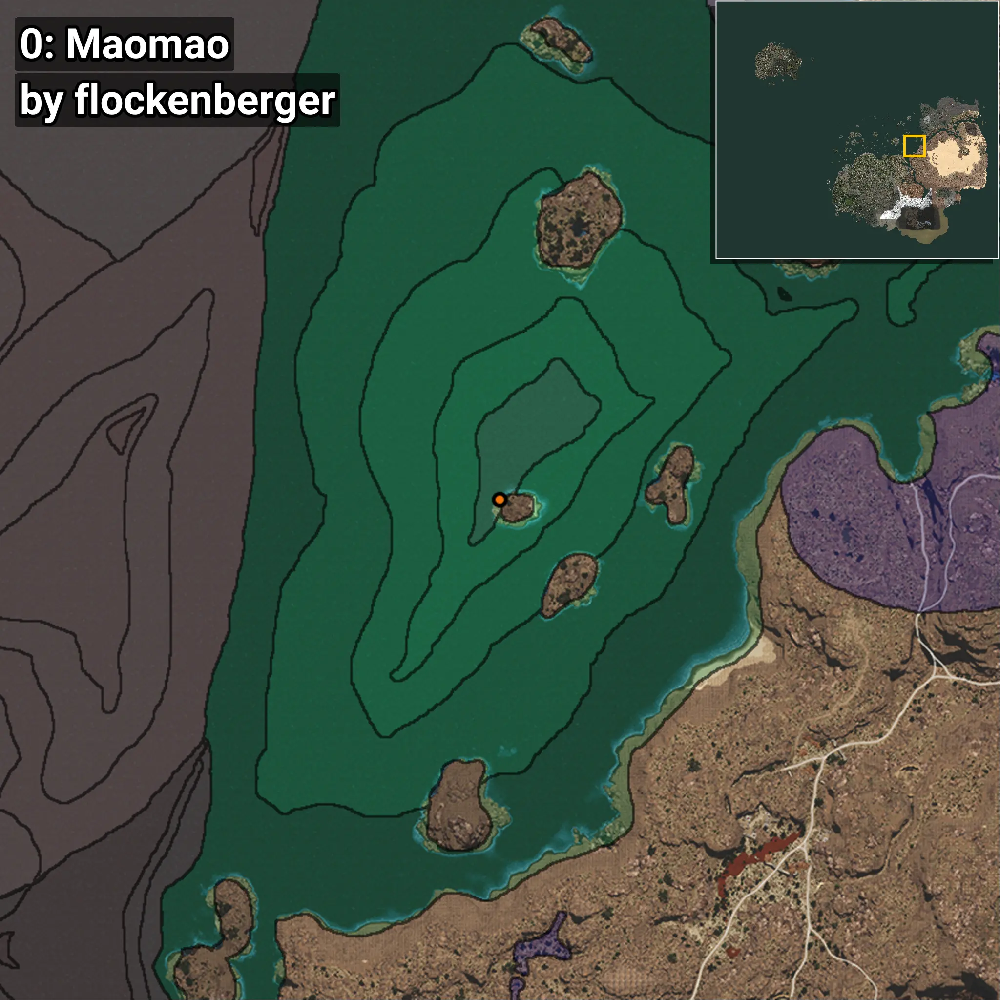
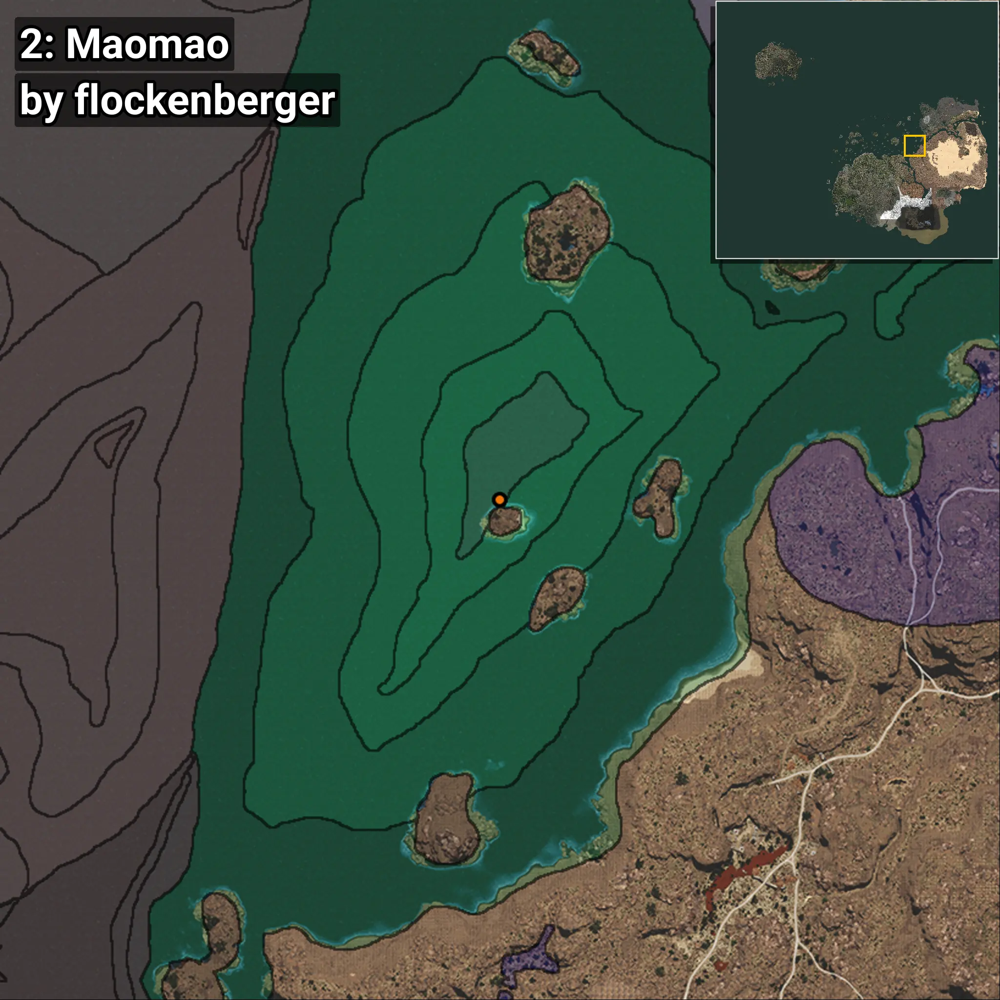

# Maomao
```xml
<!--
    Waypoints for: Maomao
    Created by: flockenberger
-->
<WorldmapBookMark>
    <BookMark BookMarkName="0: Maomao" PosX="403424.0" PosY="-7911.0" PosZ="258994.0" />
    <BookMark BookMarkName="1: Maomao" PosX="403488.0" PosY="-7902.0" PosZ="259046.0" />
    <BookMark BookMarkName="2: Maomao" PosX="406438.0" PosY="-8190.0" PosZ="262032.0" />
    <BookMark BookMarkName="3: Maomao" PosX="403489.0" PosY="-7922.0" PosZ="259101.0" />
    <BookMark BookMarkName="4: Maomao" PosX="403026.0" PosY="-7987.0" PosZ="258659.0" />
</WorldmapBookMark>
```

## ⚠️ Disclaimer
Waypoints are generated based on the __**character’s position**__ — __not__ where the fishing float landed.
Fish are determined by where your **float** lands!
In ocean spots especially, the direction you cast your rod can place your float in a **different fishing zone**, which may result in catching the wrong type of fish.
Please pay attention to the preview images showing where each location is in relation to the outlined zones.

- You can verify your float’s position using the guide [**HERE**](https://flockenberger.github.io/bdo-fish-position/)
- Or watch the video guide [**HERE**](https://youtu.be/t-VXcRoNojk)

## Previews
      