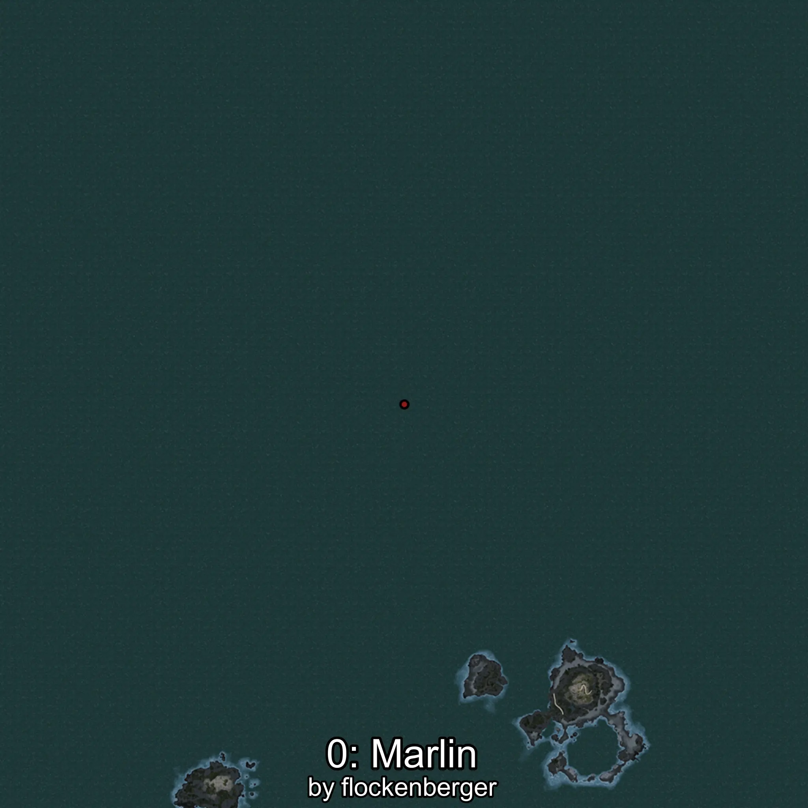
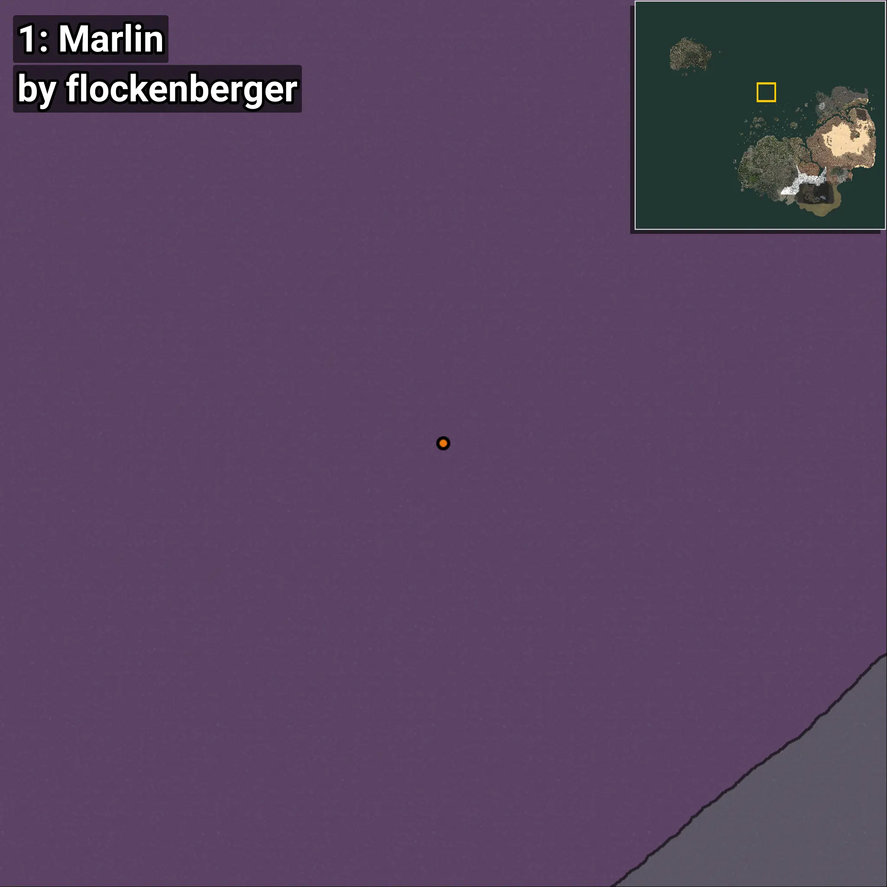
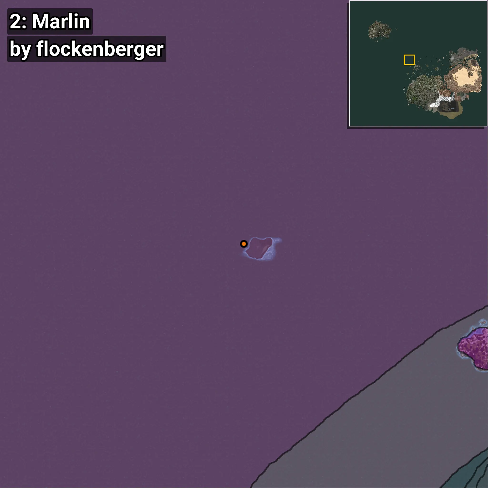

# Marlin
```xml
<!--
    Waypoints for: Marlin
    Created by: flockenberger
-->
<WorldmapBookMark>
    <BookMark BookMarkName="0: Marlin" PosX="-208205.0" PosY="-7622.0" PosZ="750837.0" />
    <BookMark BookMarkName="1: Marlin" PosX="-218985.0" PosY="-8208.0" PosZ="776210.0" />
    <BookMark BookMarkName="2: Marlin" PosX="-531323.0" PosY="-7736.0" PosZ="545967.0" />
    <BookMark BookMarkName="3: Marlin" PosX="-240260.0" PosY="-7732.0" PosZ="754019.0" />
    <BookMark BookMarkName="4: Marlin" PosX="-659875.0" PosY="-8141.0" PosZ="801395.0" />
</WorldmapBookMark>
```

## ⚠️ Disclaimer
Waypoints are generated based on the __**character’s position**__ — __not__ where the fishing float landed.
Fish are determined by where your **float** lands!
In ocean spots especially, the direction you cast your rod can place your float in a **different fishing zone**, which may result in catching the wrong type of fish.
Please pay attention to the preview images showing where each location is in relation to the outlined zones.

- You can verify your float’s position using the guide [**HERE**](https://flockenberger.github.io/bdo-fish-position/)
- Or watch the video guide [**HERE**](https://youtu.be/t-VXcRoNojk)

## Previews
      