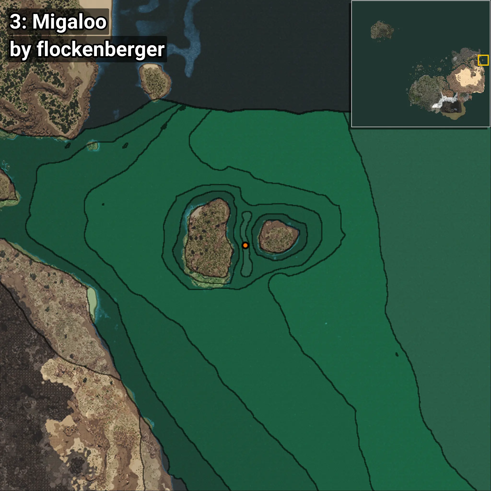
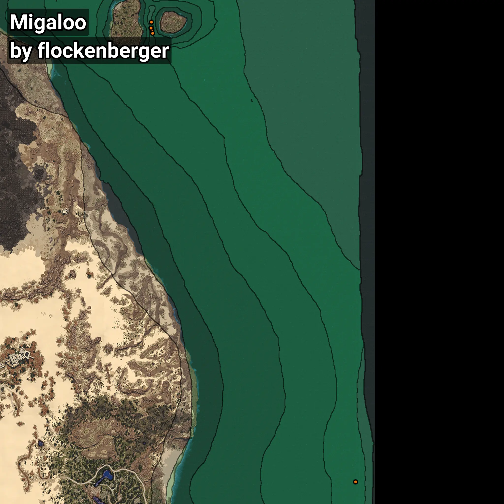

# Migaloo
```xml
<!--
    Waypoints for: Migaloo
    Created by: flockenberger
-->
<WorldmapBookMark>
    <BookMark BookMarkName="0: Migaloo" PosX="1264951.0" PosY="-7930.0" PosZ="544334.0" />
    <BookMark BookMarkName="1: Migaloo" PosX="1264506.0" PosY="-7500.0" PosZ="547207.0" />
    <BookMark BookMarkName="2: Migaloo" PosX="1418589.0" PosY="-7643.0" PosZ="204968.0" />
    <BookMark BookMarkName="3: Migaloo" PosX="1263905.0" PosY="-7653.0" PosZ="548175.0" />
    <BookMark BookMarkName="4: Migaloo" PosX="1264234.0" PosY="-7897.0" PosZ="552753.0" />
</WorldmapBookMark>
```

## ⚠️ Disclaimer
Waypoints are generated based on the __**character’s position**__ — __not__ where the fishing float landed.
Fish are determined by where your **float** lands!
In ocean spots especially, the direction you cast your rod can place your float in a **different fishing zone**, which may result in catching the wrong type of fish.
Please pay attention to the preview images showing where each location is in relation to the outlined zones.

- You can verify your float’s position using the guide [**HERE**](https://flockenberger.github.io/bdo-fish-position/)
- Or watch the video guide [**HERE**](https://youtu.be/t-VXcRoNojk)

## Previews
      