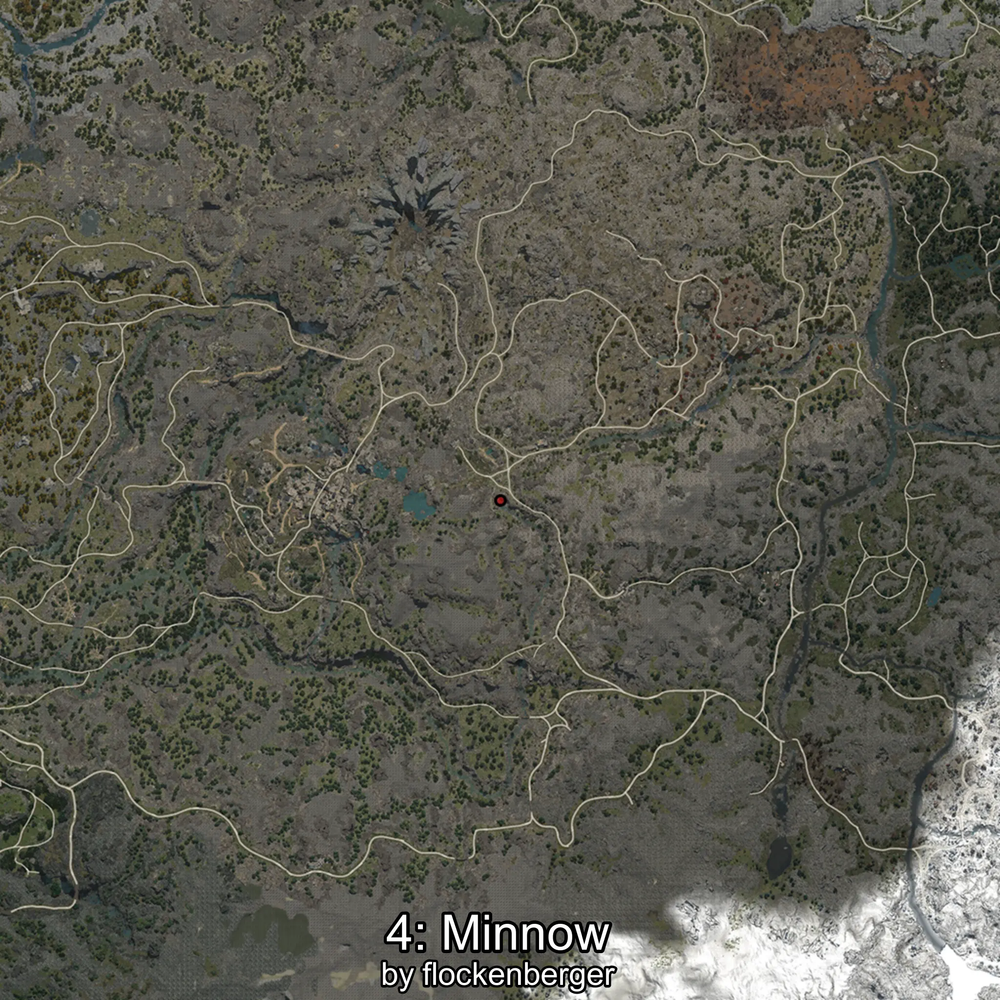

# Minnow
```xml
<!--
    Waypoints for: Minnow
    Created by: flockenberger
-->
<WorldmapBookMark>
    <BookMark BookMarkName="0: Minnow" PosX="105887.0" PosY="6111.0" PosZ="-246248.0" />
    <BookMark BookMarkName="1: Minnow" PosX="105871.0" PosY="6139.0" PosZ="-246211.0" />
    <BookMark BookMarkName="2: Minnow" PosX="101456.0" PosY="3245.0" PosZ="-272099.0" />
    <BookMark BookMarkName="3: Minnow" PosX="105922.0" PosY="6165.0" PosZ="-246606.0" />
    <BookMark BookMarkName="4: Minnow" PosX="105358.0" PosY="6216.0" PosZ="-247958.0" />
</WorldmapBookMark>
```

## ⚠️ Disclaimer
Waypoints are generated based on the __**character’s position**__ — __not__ where the fishing float landed.
Fish are determined by where your **float** lands!
In ocean spots especially, the direction you cast your rod can place your float in a **different fishing zone**, which may result in catching the wrong type of fish.
Please pay attention to the preview images showing where each location is in relation to the outlined zones.

- You can verify your float’s position using the guide [**HERE**](https://flockenberger.github.io/bdo-fish-position/)
- Or watch the video guide [**HERE**](https://youtu.be/t-VXcRoNojk)

## Previews
      