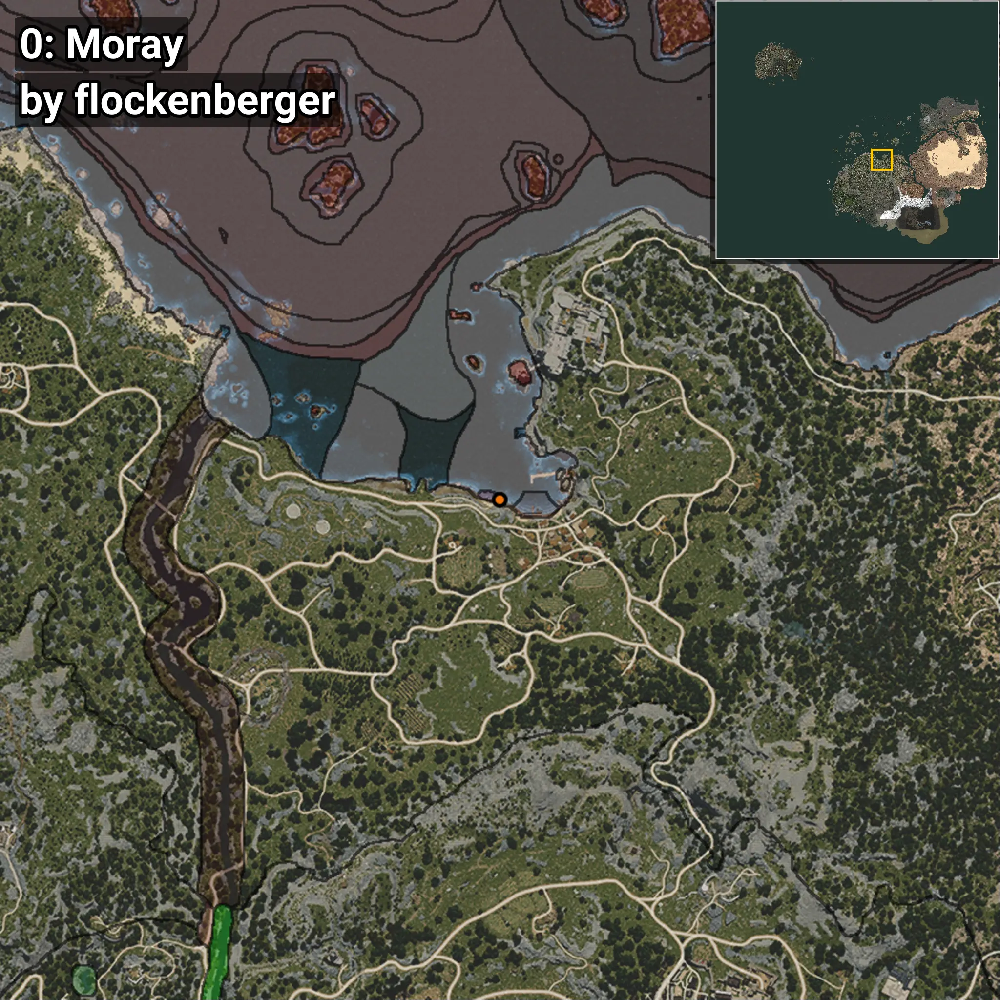
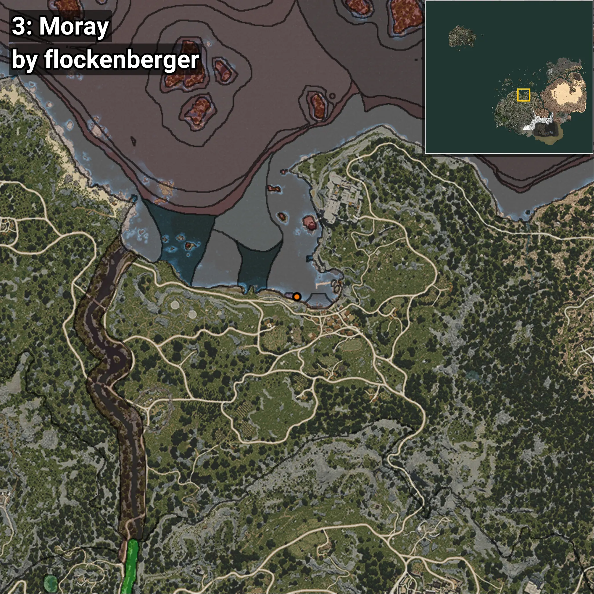
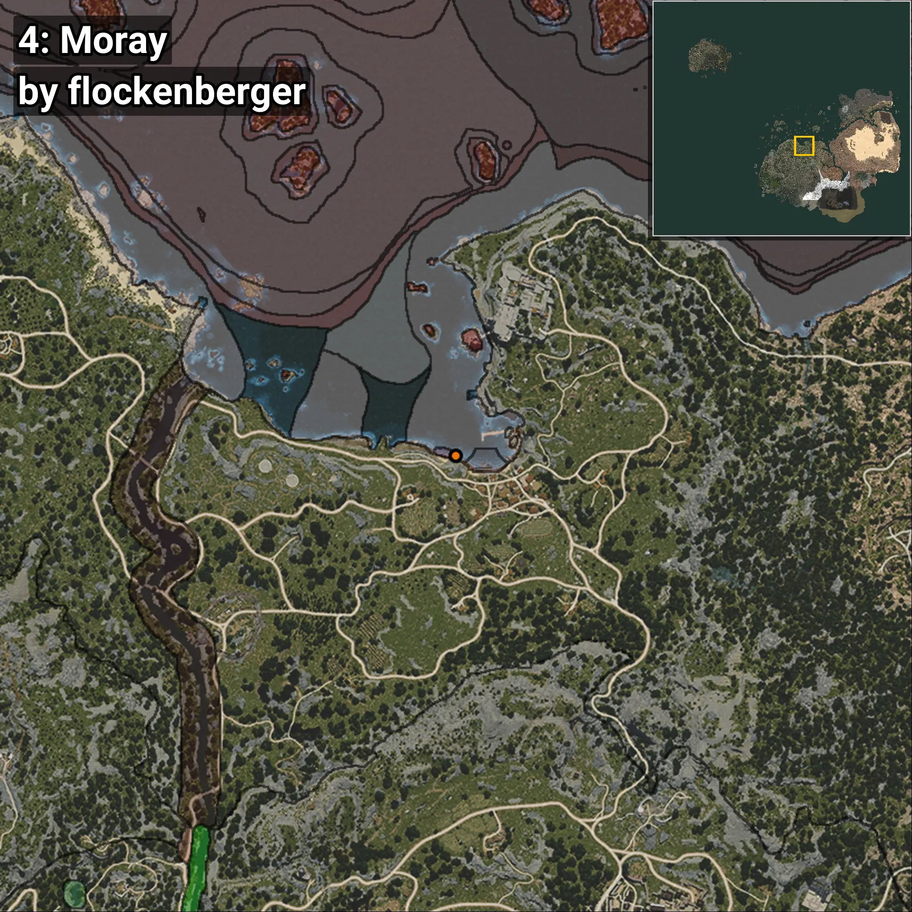
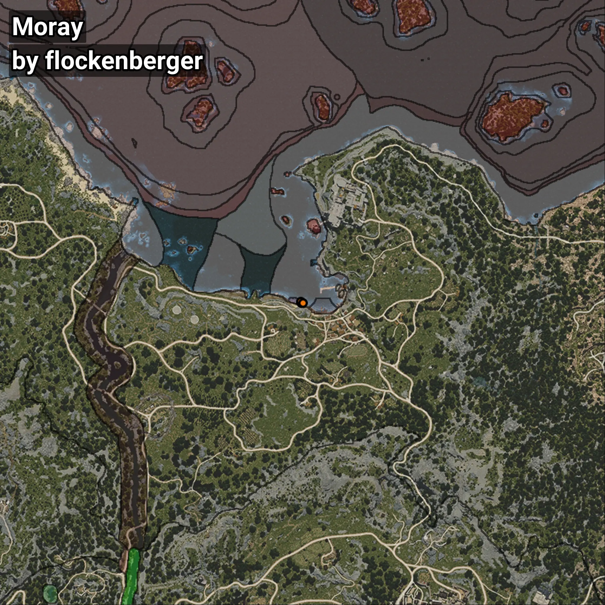

# Moray
```xml
<!--
    Waypoints for: Moray
    Created by: flockenberger
-->
<WorldmapBookMark>
    <BookMark BookMarkName="0: Moray" PosX="-1314.0" PosY="-8166.0" PosZ="87597.0" />
    <BookMark BookMarkName="1: Moray" PosX="-1369.5415" PosY="-8143.5776" PosZ="87512.96" />
    <BookMark BookMarkName="2: Moray" PosX="-1606.5715" PosY="-8227.212" PosZ="87909.43" />
    <BookMark BookMarkName="3: Moray" PosX="-1525.0" PosY="-8246.0" PosZ="87945.0" />
    <BookMark BookMarkName="4: Moray" PosX="-899.0" PosY="-8213.0" PosZ="87556.0" />
</WorldmapBookMark>
```

## ⚠️ Disclaimer
Waypoints are generated based on the __**character’s position**__ — __not__ where the fishing float landed.
Fish are determined by where your **float** lands!
In ocean spots especially, the direction you cast your rod can place your float in a **different fishing zone**, which may result in catching the wrong type of fish.
Please pay attention to the preview images showing where each location is in relation to the outlined zones.

- You can verify your float’s position using the guide [**HERE**](https://flockenberger.github.io/bdo-fish-position/)
- Or watch the video guide [**HERE**](https://youtu.be/t-VXcRoNojk)

## Previews
      