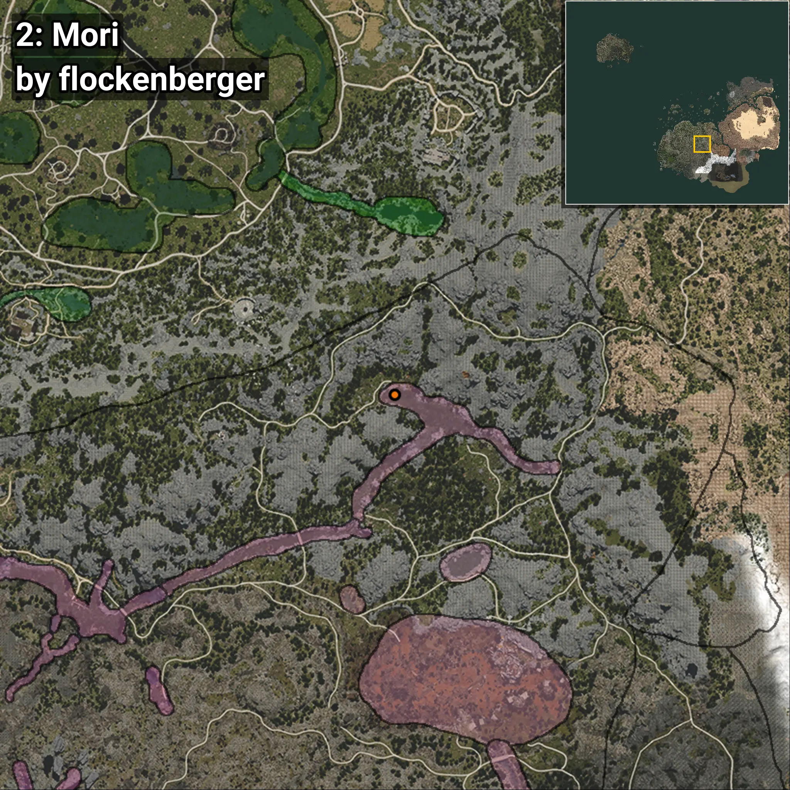
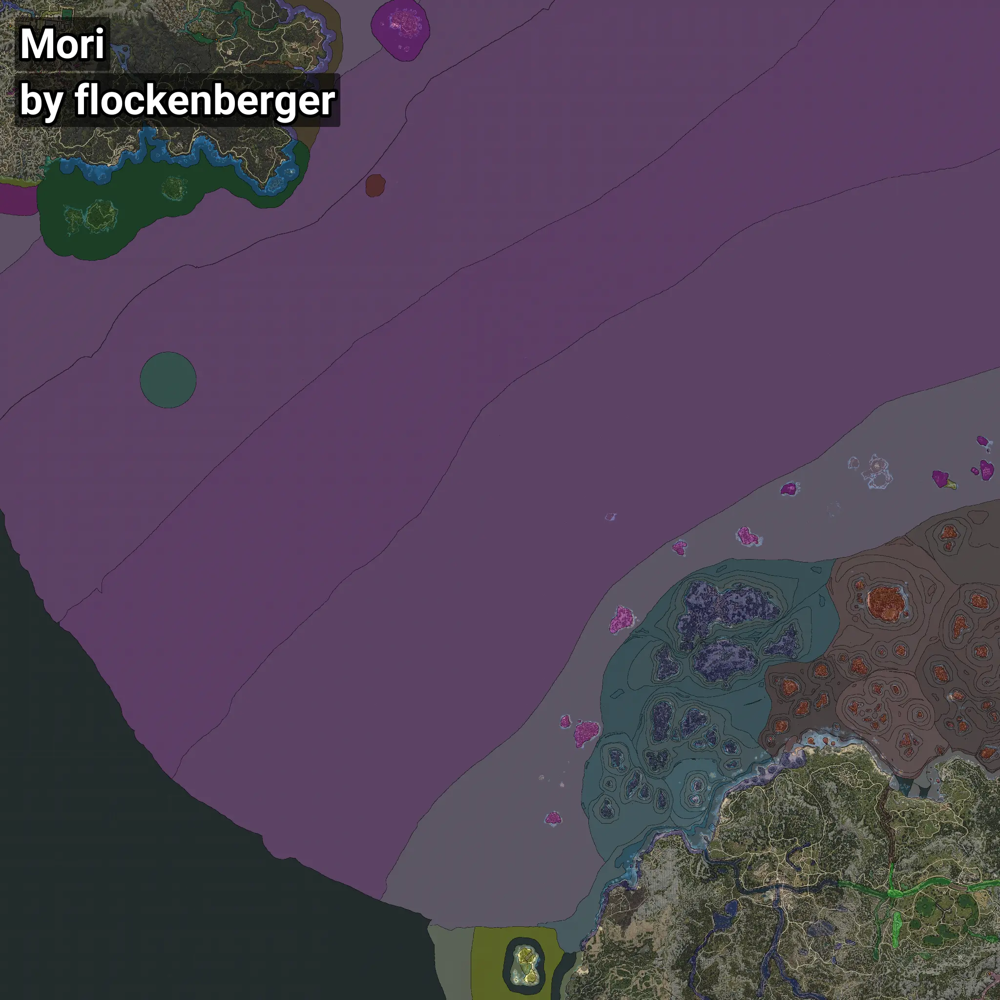

# Mori
```xml
<!--
    Waypoints for: Mori
    Created by: flockenberger
-->
<WorldmapBookMark>
    <BookMark BookMarkName="0: Mori" PosX="-1179056.0" PosY="23065.0" PosZ="1319430.0" />
    <BookMark BookMarkName="1: Mori" PosX="-1156816.0" PosY="18104.0" PosZ="1310528.0" />
    <BookMark BookMarkName="2: Mori" PosX="86932.64" PosY="9753.457" PosZ="-190952.77" />
    <BookMark BookMarkName="3: Mori" PosX="-1152324.0" PosY="18086.0" PosZ="1308583.0" />
    <BookMark BookMarkName="4: Mori" PosX="-1487734.9" PosY="11180.324" PosZ="1332415.9" />
</WorldmapBookMark>
```

## ⚠️ Disclaimer
Waypoints are generated based on the __**character’s position**__ — __not__ where the fishing float landed.
Fish are determined by where your **float** lands!
In ocean spots especially, the direction you cast your rod can place your float in a **different fishing zone**, which may result in catching the wrong type of fish.
Please pay attention to the preview images showing where each location is in relation to the outlined zones.

- You can verify your float’s position using the guide [**HERE**](https://flockenberger.github.io/bdo-fish-position/)
- Or watch the video guide [**HERE**](https://youtu.be/t-VXcRoNojk)

## Previews
      