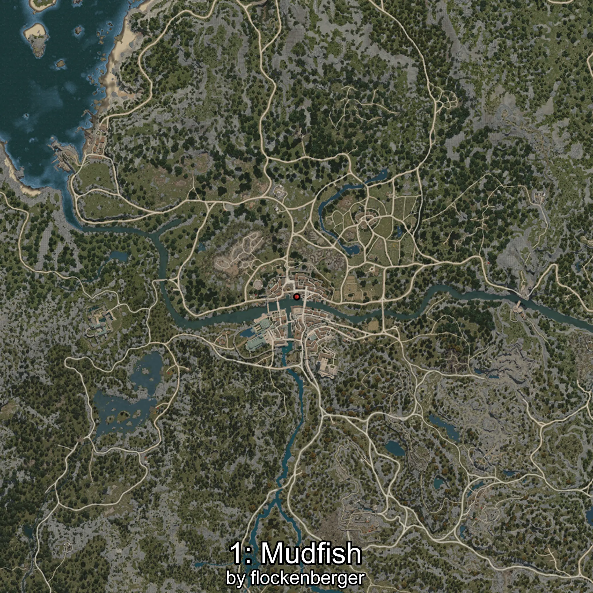
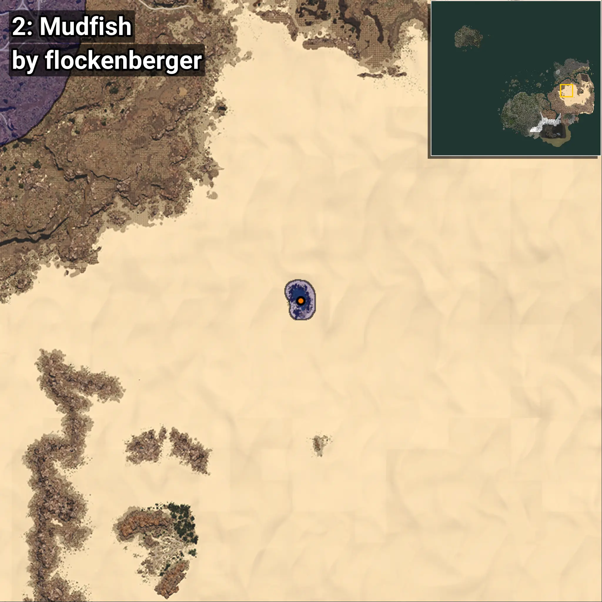
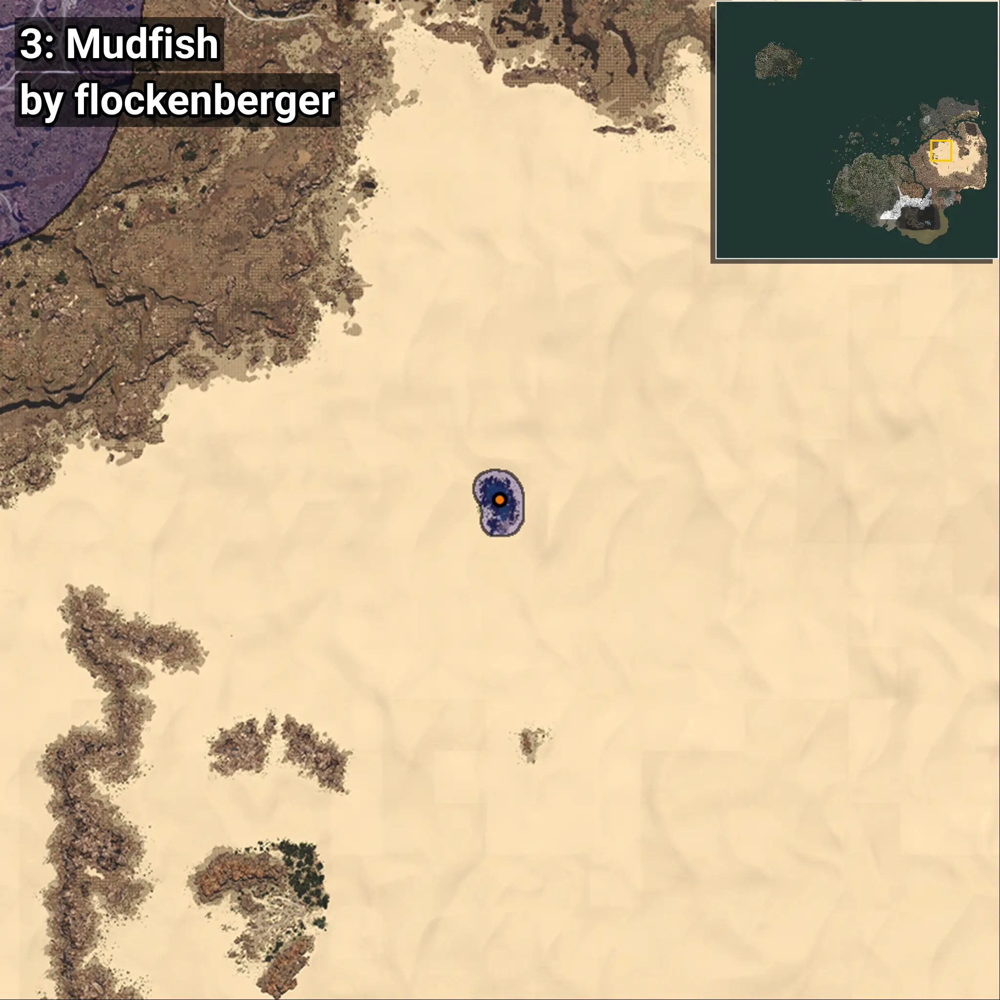

# Mudfish
```xml
<!--
    Waypoints for: Mudfish
    Created by: flockenberger
-->
<WorldmapBookMark>
    <BookMark BookMarkName="0: Mudfish" PosX="735258.0" PosY="3306.0" PosZ="200656.0" />
    <BookMark BookMarkName="1: Mudfish" PosX="735217.5" PosY="3281.8477" PosZ="202141.16" />
    <BookMark BookMarkName="2: Mudfish" PosX="733045.06" PosY="3234.0876" PosZ="201096.7" />
    <BookMark BookMarkName="3: Mudfish" PosX="732916.0" PosY="3404.0" PosZ="202284.0" />
    <BookMark BookMarkName="4: Mudfish" PosX="-249973.0" PosY="-4059.0" PosZ="-47166.0" />
</WorldmapBookMark>
```

## ⚠️ Disclaimer
Waypoints are generated based on the __**character’s position**__ — __not__ where the fishing float landed.
Fish are determined by where your **float** lands!
In ocean spots especially, the direction you cast your rod can place your float in a **different fishing zone**, which may result in catching the wrong type of fish.
Please pay attention to the preview images showing where each location is in relation to the outlined zones.

- You can verify your float’s position using the guide [**HERE**](https://flockenberger.github.io/bdo-fish-position/)
- Or watch the video guide [**HERE**](https://youtu.be/t-VXcRoNojk)

## Previews
      